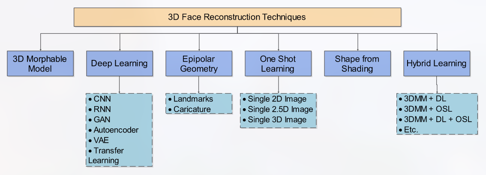
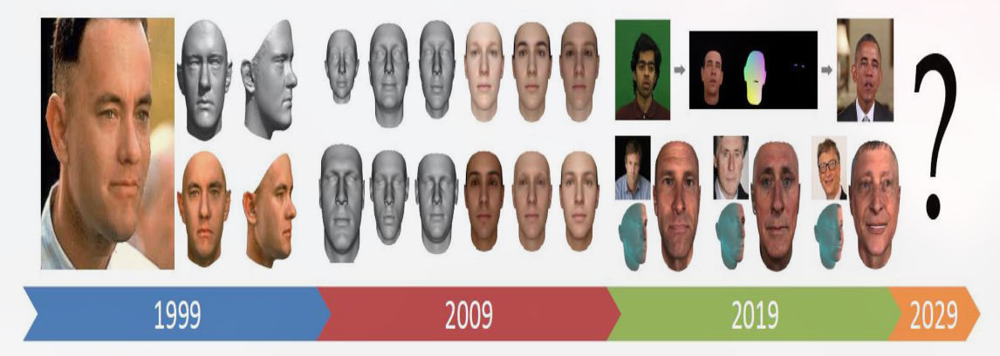
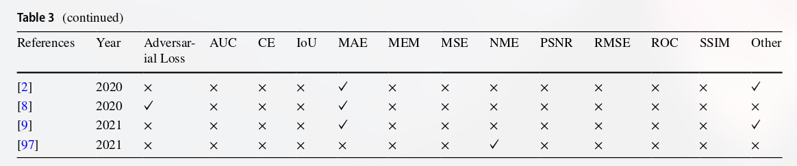

# 几个方向
1. 精细的面部特征，纹理，牙齿...(可能要添加额外的传感器)
2. 让表情更和谐(GCN)?
3. 侧面角度图片重建
4. 任意角度小序列输入重建

# 3D face reconstruction 技术分类
1. 3D morphable model(3DMM)
2. deeplearning
3. epipolar geometry(EG)(极线几何学)
4. one-shot learning(OSL)
5. shape from shading
6. hybird face reconstruction(混合人脸重建)

## 3DMM

## Deep Learning

## ...

## 评估指标

## 数据集

