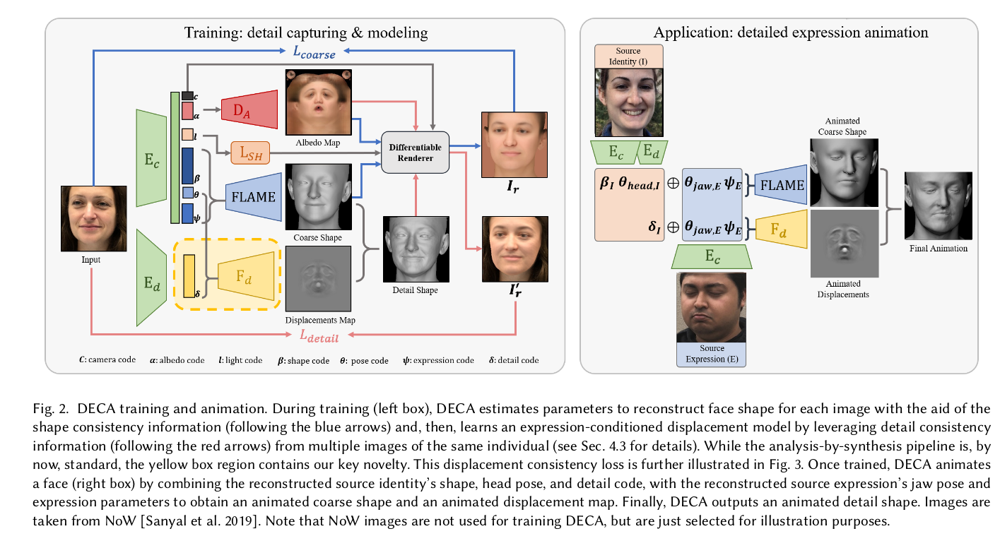

# 基于3DMM

### INORig 

- CVPR2021: Riggable 3D Face Reconstruction via In-Network Optimization
- 无训练代码，https://github.com/zqbai-jeremy/INORig
- 提供的思路：
- 自监督，面部重建，侧重于纹理
- dataset:
- 输入：单张图片
- 损失函数：

    $L = L_{pose}+L_{recon_geo}+L_{ns\_geo}+\lambda_1L_{recon\_pho}+\lambda_2 L_\beta + \lambda_3L_{ns\_con}$

- 提出的问题：

    - 大部分专注于静态重建而不是个性化的face rig

- 贡献：

    - 将深度学习，网络内优化 和 face rig结合。

    - 提出了一种基于单目图像的face rig重建方法。(支持视频输入)

    - 通过估计个性化的face rig，使得本方法比静态重建(static reconstructions)表现要好，并且实现了下游应用，如视频重定向。

    - 与之前直接回归Rig参数的方法不同，本文的in-network optimization 迭代求解rig参数，并受到第一原则(first-principles) 的约束(e.g. multi-view consistency, landmark alignment, and photo-metric reconstruction)。获得了更好的几何精度和泛化能力

### GANFit

- CVPR2019: GANFIT: Generative Adversarial Network Fitting for High Fidelity 3D Face Reconstruction
- TPAMI 2021: Fast-GANFIT: Generative Adversarial Network for High Fidelity 3D Face Reconstruction 
- 无代码，https://github.com/barisgecer/GANFit
- 提供的思路：
- 自监督，面部重建，侧重于纹理
- dataset:
- 输入：单张图片
- 损失函数：
- 提出的问题：
- 贡献：

### 3D-FACE-GCN

#### 相关信息
- CVPR2020: Towards High-Fidelity 3D Face Reconstruction from In-the-Wild Images Using Graph Convolutional Networks
- 有代码，tensorflow，https://github.com/FuxiCV/3D-Face-GCNs
- 提供的思路： GCN，顶点颜色
- 自监督，面部重建，侧重于纹理
- dataset:
- 输入：单张图片
- 损失函数：
    $$
    L = \sigma_1 (L_{pix}(I,R') + \sigma_2L_{id}(I,R')+ \sigma_3L_{adv}) + \sigma_4(L_{vert}(T,T') + L_{vert}(T_p,\tilde{T}'))\\
    \quad \\
    fixed:\quad \sigma_2 = 0.2, \sigma_3 = 0.001 \\
    Initially:\quad \sigma_1 =0, \sigma_4=1  \\
    gradually:\quad \sigma_1 =1, \sigma_4=0
    $$
- 提出的问题：
    - 基于3DMM的方法在面部纹理的重建上缺乏缺乏细节，这是因为从3DMM计算的纹理无法捕捉输入图像的面部细节

- 贡献：
    - 第一个使用图卷积网络从单个图像生成高保真人脸纹理的工作,在3DMM的基础之上，单视图重建具有高保真纹理的三维人脸，无需大规模人脸数据集

#### 网络结构

由粗糙到精细，结合了3DMM和GCN，利用输入图像中的面部细节，将其他方法得到的3DMM模型输入到GCN进行细化，重建3DMM网格顶点颜色(detailed colors)， 而不是重建UV图。

- 一个CNN用于从2D图像回归出3DMM的参数。将参数输入到PCA模型，计算形状和纹理，随后送入GCN

- 使用预训练的CNN从图像中提取人脸特征，随后送入GCN

- 使用3个GCN模型来细化面部纹理

- 采用了**可微渲染层**来实现自监督训练，并在使用**GAN损失**的情况下进一步改进了结果

- 3D重建结果投影到2D，与原图比较。

##### 预训练的模型
是预训练好的模型，其中

- *Regressor*: 

  - 用于回归`3DMM系数`(送入GCN)，`面部姿势，照明参数`(用于渲染2D图片)

  - 回归出一个257维向量 $(c_i^{80},c_e^{64},c_t^{64},p^{6},l^{27}) \in  \mathbb{R}^{257}$

  - 分别表示3DMM的shape, expression, texture; pose, lighting

  - 使用公式生成S和T(点集)：
    $$
    S = S_{mean} + c_iI_{base} + c_eE_{base} \\
    T = T_{mean} + c_tT_{base} \\ 
    \quad \\
    S_{mean}, T_{mean}, I_{base}, T_{base} \in BFM \\
    E_{base} \in FaceWarehouse
    $$
    其中$S_{mean},T_{mean}$是数据库中人脸的平均形状和平均纹理，$I_{base}, E_{base}, T_{base}$是人脸数据库中的人脸基(类似向量空间的基)，理论上通过这些人脸基的加权和可以得到任何人脸。

- *FaceNet*: 

    - 提取图像的特征向量

##### PCA

不可学习，用于将3DMM参数转化为面部形状S和粗糙的面部纹理T

##### 纹理细化(Texture Refinement, GCN)

与使用UV作为面部纹理表示的工作不同，本文直接操作网格顶点上的反射率RGB值

$$
M = (V,A),\\
V \in \mathbb{R}^{n \times 3}, \\
A \in \{0,1\}^{n\times n} \\
$$

**GCN Refiner GCN Decoder**

- Refiner就是一个图卷积，输入的是图结构，输出也是图结构

- Decoder中，输入是FaceNet得到的特征向量，输出是每个顶点的RGB值。

  > feature怎么转化成图的结构？

- 都用了残差块

**Combine Net**

把Refiner 和 Decoder的两个图结构在channel维度上拼起来，送到一个新的图卷积中。

##### 渲染器(Rendering)

- 输入S，T，姿态，反射率颜色，光照。渲染出2D图像。

##### 判别器(discriminator)

#### 损失函数

- Pixel-wise Loss: 

    最小化输入图像和渲染图像之间的差异，由于可能有遮挡问题，所以只计算部分面部区域$M_{face}$的欧氏距离。这个面部区域是由预训练的面部分割网络获得的。

- Identity-Preserving Loss: 

    重建的3D人脸可能**看起来不像**输入的2D人脸，特别是在某些**极端**情况下。因此定义了面部特征级别下的 LOSS。

    >使用FaceNet，获得输入图像和渲染的2D图像的$feature$，计算余弦距离。

- Vertex-wise Loss: 
  - 训练GCN时，由于遮挡，可能无法正确的学习到顶点上的RGB值。
  - 在GCN模块训练的早期阶段，构造顶点级别的损失函数，然后逐渐减少这个这个损失项的权重
  - 包含两组：
    1. regressor+pca生成的T，和GCN生成的T'
    2. regressor+pca生成的T，映射回输入图像的颜色Tp，和GCN生成的T'在光照渲染下的颜色 $\tilde{T'}$(为了获得更多的面部细节)

- Adversarial LOSS
    - 对抗损失

#### 结果

### DECA
#### 相关信息
- SIGGRAPH2021: Learning an Animatable Detailed 3D Face ModTTel from In-The-Wild Images
- 有代码，https://github.com/YadiraF/DECA
- 提供的思路：几何细节与表情有关
- 自监督，头部重建，侧重于几何形状
- dataset:
    - VGGFace2 [Cao et al. 2018b]

    - BUPT-Balancedface [Wang et al. 2019] 

    - VoxCeleb2 [Chung et al. 2018a]

    - 在两百万张图片(224\*224)上训练

- 输入：同一个人多张图片
- 损失函数：
    $$
    LOSS : L_{coarse} = +L_{lmk}+L_{eye}+L_{pho}+L_{id}+L_{sc}+L_{reg} \\
    loss : L_{ detail } = L_{phoD}+L_{mrf}+L_{sym}+L_{dc}+L_{regD}
    $$

- 提出的问题：

    提出了动态细节和静态细节的概念

- 贡献：

    - 改变表情参数，可以合成合理的几何细节(表情迁移)

    - 使用一种**细节一致性损失**来将**身份相关的细节**和**表情相关的细节**分开

    - 因为重建的是几何细节，对于遮挡，光照变化，姿势变化有鲁棒性

#### 使用的模型

##### 几何模型
- FLAME

- $M(\vec\beta,\vec\theta,\vec\psi)=W(T_P(\vec\beta,\vec\theta,\vec\psi),\mathrm J(\vec\beta),\vec\theta,\mathcal W)$

##### 外观模型
- 由于 FLAME 没有外观模型，所以把 BFM 的外观模型搬过来，用在 FLAME 上

- BFM's linear albedo subspace -> FLAME UV layout

- 外观模型输出一个UV 反照率图：$A(\alpha) \in \mathbb R^{d\times d\times 3},\alpha\in \mathbb R^{|\alpha|}$

##### 相机模型
- 将 3d mesh 投影到图片空间

- $v = s\Pi(M_i)+t,\quad \Pi\in\mathbb R^{2\times3},\quad M_i\in\mathbb R^3, \quad s\in\mathbb R(scale),\quad t\in\mathbb R^2(translation)$

- 用 $c$ 表示 $s,t$

##### 照明模型
- 基于球谐函数 (Spherical Harmonics, SH, [Ramamoorthi and Hanrahan 2001])

- 有阴影的面部图像计算方法：$B(\alpha,\mathrm l,N_{uv})_{i,j} = A(\alpha)_{i,j}\odot\sum_{k=1}^9\mathrm l_kH_K(N)_{i,j}$

- $A$ 是外观模型生成的UV反照率图，$N$ 是法线，$B$ 是有阴影的纹理，哈达马积后面的部分是 HS 的东西

##### 纹理渲染
- 输入：$\mathrm{(\beta,\theta,\psi),\alpha,l,c}$ 分别是FLAME参数，反照率参数，照明参数，相机参数

- $I_r = \mathcal R(M,B,\mathrm c)$

#### 方法

- 发现：一些面部细节(皱纹)取决于表情，但是一些其他属性不随表情变化。

- 将面部细节分为两部分

    - **静态面部细节**因人而异。

    - **动态面部细节**依赖于表情，在同一个人上也会有差异。

- 重建流程分为两部分，分别是粗糙重建和细节重建

#### 粗糙重建

首先学习一个粗糙的重建(在flame的模型空间里)

LOSS : $L_{coarse} = +L_{lmk}+L_{eye}+L_{pho}+L_{id}+L_{sc}+L_{reg}$

- 关键点投影损失(landmark re-projection loss)

    - 比较**2D输入图像的关键点坐标**和**3D mesh 投影到图片空间的坐标**，是绝对位置误差

    - $L_{lmk}=\sum_{i=1}^{68}||k_i-s\Pi(M_i)+t||_1$ 

- 眼部闭合损失(eye closure loss)

    - 这部分损失是平移不变的，是一种相对位置误差，不容易受投影3d人脸没有对齐的影响

    - $L_{eye}=\sum_{(i,j)\in E}||k_i-k_j-s\Pi(M_i-M_j)||$

    - $E$ 是眼睛上轮廓，下轮廓的关键点对

- 渲染损失(photometric loss)
    - $L_{pho} = ||V_I\odot(I-I_r)||_{1,1}$ 

    - $V_I$ 是面部的mask

- 身份损失(identity loss)

    - 使用预训练的人脸识别网络,余弦相似度

    - $L_{id} = 1-\dfrac{f(I)f(I_r)}{||f(I)||_2\cdot||f(I_r)||_2}$

- 形状一致性损失(shape consistency loss)

    - 给一个人的两张图，应该输出相同的 FLAME 形状参数，(i.e.$\beta_i=\beta_j$), 之前有一些工作是最小参数$\beta$之间的距离,但是效果不是特别好

    - 新策略：在渲染图像 $i$ 时，将 $\beta_i$ 替换为 $\beta_j$ 

    - 如果模型正确估计了同一个人两幅图像中的面部形状，则交换形状参数，渲染出的图像应当难以区分。所以在渲染图像上，使用渲染损失和身份损失
    - $L_{sc} = L_{coarse}(I_i,I_r(\beta_j,...))$

- 正则化损失

    - $L_{reg}$ 
        - $E_\beta = ||\beta||_2^2$
        - $E_\psi = ||\psi||_2^2$
        - $E_\alpha = ||\alpha||_2^2$

#### 细节重建

通过细节的uv位移图$D\in[-0.01,0.01]^{d\times d}$增强粗糙的flame模型

1. 生成UV位移图

    - 将输入图像编码为128维向量 $\delta$

    - $D = F_d(\delta,\psi,\theta_{jaw})$

    - $D\in[-0.01,0.01]^{d\times d}$

    - $\delta$ 控制静态的人物细节

2. 将mesh投影到UV空间，叠加细节

    - 将 mesh 和 法线转换到UV空间

    - $M'_{uv} = M_{uv} + D \odot N_{uv}$
    
3. 根据叠加了细节的mesh，计算新的法线 $N'$

4. 渲染图像

    - $I'_r = \mathcal R(M, B(\mathrm{\alpha,l},N'), c)$

Loss : $L_{ detail } = L_{phoD}+L_{mrf}+L_{sym}+L_{dc}+L_{regD}$

- 细节渲染损失

    - $L_{phoD} = ||V_I\odot(I-I_r)||_{1,1}$ 

    - $V_I$ 是面部的mask

- ID-MRF 损失

    - Implicit Diversified Markov Random Field (ID-MRF) loss [Wang et al. 2018]

    - $L_{mrf} = 2L_M(conv4\_2)+L_M(conv3\_2)$

- 软对称损失(soft symmetry loss)

    - 为了增加对自遮挡问题的鲁棒性，有助于解决在边界的伪影问题？

    - $L_{sym}= ||V_{uv}\odot(D-flip(D))||_{1,1}$

    - $V_{uv}$ 是在UV空间的面部mask

- 正则化损失

    - $L_{regD} = ||D||_{1,1}$

- 细节一致性损失(detail consistency loss)

    - 为了控制人脸，要将静态细节(毛孔，眉毛等与表情无关)和动态细节(因表情而产生的皱纹)

    - 静态细节受 $\delta$ 控制，动态细节受 $\psi,\theta_{jaw}$ 控制

    - 类似粗重建过程中的形状一致性损失，利用同一个人的不同照片，其静态细节应该是一致的。

    - 对于同一个人的不同照片，交换$\delta$参数

    - $L_{dc} = L_{detail}(I_i,I_r(\delta_j...))$

#### 实现细节

- 三个公开数据集：VGGFace2，BUPT-Balancedface, VoxCeleb2
- 总共训练了200万张图像
- 使用FAN来预测68个2d 标志点
- 使用Pytorch3D的工具进行渲染
- 输入图像大小：224x224
- uv空间大小：d=256

#### 消融实验

##### 细节一致性损失

##### ID-MRF loss

##### 软对称损失

### CEST
#### 相关信息
- ICCV2021: Self-Supervised 3D Face Reconstruction via Conditional Estimation
- 提供的思路：如何更好的分离3DMM参数
- 无代码
- 自监督，面部重建，侧重于纹理
- dataset:
    - VoxCeleb1
    - 300W-LP
    - AFLW2000-3D(3d)
    - MICC(3d)
- 输入: video
- 损失函数：
$$
\mathcal{L}_{ph} + \lambda_1 \mathcal L_{kp} + \lambda_2 \mathcal L_{rg} \\
\quad \\
\mathcal L _{ph} = \dfrac{1}{N}\sum_{i=1, \xi_j = \xi_i}^N(\varepsilon(I_i,S_i,R_j,v_i,l_i,M_i) + \varepsilon(I_I,S_i,R_i^\Join,v_i,l_i,M_i ) )\\
\quad \\
\mathcal L_{kp} = \dfrac 1{NN_{kp}} \sum_{i=1}^N\sum_{j=1}^{N_{kp}}||Q_i(k_j)-q_i(j)||_1 \\
\quad \\
\mathcal L_{rg} = \dfrac 1{N}\sum_{i=1}^N||\alpha_i||^2_2
$$

- 提出的问题：

    - 重建的纹理只是简单复制2d图像像素点的颜色，不能分离出照明参数，重建结果渲染的图像和输入图像很接近，但3d模型效果不好。 

    - 解决办法：加入对称性损失，一致性损失。

- 本文贡献：

    - 考虑了3DMM参数之间的关联性

    - 按顺序推导参数

    - 提出一种随机优化策略

#### CEST的流程
1. 预测视点参数。 

    包括空间上的旋转，平移，缩放因子。

    $f_v(I;\theta_v):I\rightarrow v\in \mathbb R^7$

2. 预测形状参数。

    在预测形状前，排除尽可能多的视点信息是有益的，利用$\theta_v$,可以将图像对齐。

    $f_s(I\circ v;\theta_s):I\circ v \rightarrow \alpha \in \mathbb R^{228*1}$

3. 预测反照率。

    先前的工作包括：

    - 基于预定义的模型，预测反照率参数

    - 预测UV图(CEST选用此方法)

    - 图结构表示反射率

    预测反照率的流程

    1. 将预测得到的形状盖在脸上，把2d图片展成uv图 $T$

    2. 得到包含照明因素的uv图 $T$

    3. 得到去除照明参数的uv图 $f_r(T;\theta_r):T\rightarrow A$

4. 预测照明参数。

    $f_l(I,T,A;\theta_l):(I,T,A) \rightarrow l\in \mathbb R^{9\times 1}$

5. 渲染2D图像，计算loss。

    $\hat I = \mathcal R(S,R,v,l)$

    分别代表渲染图像，渲染器，形状参数，反照率参数，视点参数，照明参数。

### 3D3M
- TMM2022: 3D3M: 3D Modulated Morphable Model for Monocular Face Reconstruction
- 无代码

### GCN+GAN
- CVPR2020: Uncertainty-Aware Mesh Decoder for High Fidelity 3D Face Reconstruction
- 无代码

### REDA
- CVPR2020: ReDA:Reinforced Differentiable Attribute for 3D Face Reconstruction
- 无代码

- 有代码，https://github.com/TencentYoutuResearch/3DFaceReconstruction-LAP

### MICA
- ECCV2022: Towards Metrical Reconstruction of Human Faces
- 有代码，https://github.com/Zielon/MICA

# 非参数化建模

### LAP
- CVPR2021: Learning to Aggregate and Personalize 3D Face from In-the-Wild Photo Collection

### Transformer 
- TCSVT2022: Transformer-based 3D Face Reconstruction with End-to-end Shape-preserved Domain Transfer
- 无代码

### UNSUP3d
- CVPR2020: Unsupervised Learning of Probably Symmetric Deformable 3D Objects from Images in the Wild
- 有代码，https://github.com/elliottwu/unsup3d

# 基于NERF

### HeadNeRF

- CVPR 2022: eadNeRF: A Real-time NeRF-based Parametric Head Model
- 无训练代码，https://github.com/CrisHY1995/headnerf

# 想法
1. 眼睛、嘴唇、牙齿、头发的重建
2. 3DMM模型参数空间维度较低，纹理模型比较简单，难以恢复高精度的人脸。PCA方法是否存在问题。
3. 遮挡信息恢复
4. 3DMM模型及其变种不能在各种场景下同时保持较好的性能
5. 侧面角度重建
6. 表情
7. 多视角
8. 无监督，除了映射回2D图有没有其他方法
9. 怎么进行数据增强
 

