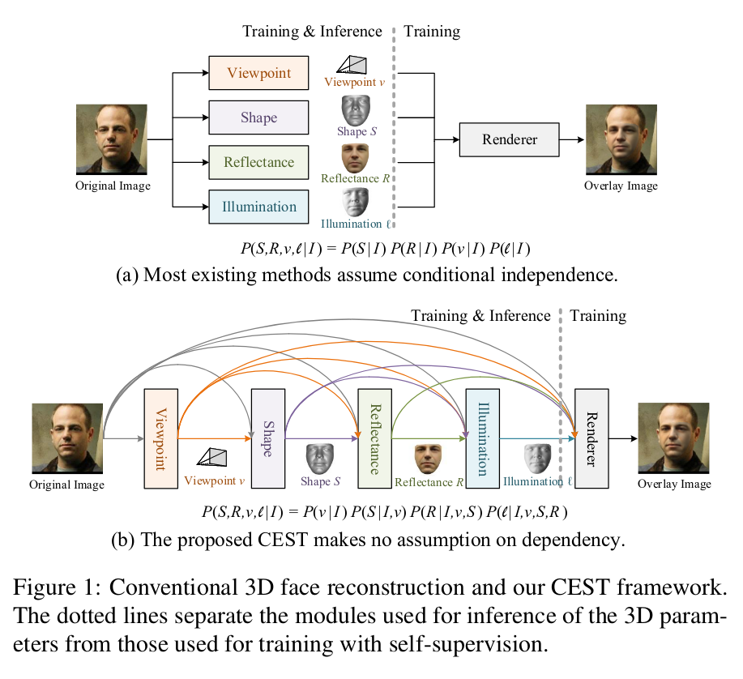

一般的方法：，一般方法是从2D图像中提取形状、反射率、照明和视点参数。通过自我监督学习提取这些面部参数的回归模型：将提取的面部参数重新组合以渲染原始2D图像，并学习模型参数以最小化重建误差。

不同的参数，可能导致同一个2d图像
之前的工作没没有考虑到参数之间的关系。

本文贡献：
1. 提出CEST，用于人脸重建的条件估计框架，考虑了3d人脸参数之间的统计相关性。
2. 分解了估计过程，把参数按顺序回归
3. 提出了一种随机优化策略，以有效地将反射率对称性，一致性加入CEST(类似deca的形状一致性损失)，视频帧数增加，计算复杂度线性增加而不是平方次增加
(虽然训练需要多帧，实际应用的时候不一定需要)

# 框架0

基于3dmm
## viewpoint

