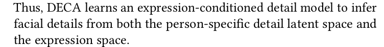
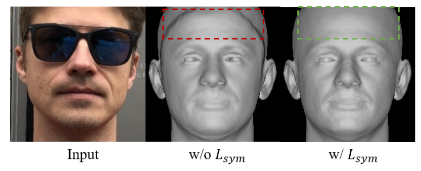

# 贡献

- 改变表情参数，可以合成合理的几何细节

- 使用一种**细节一致性损失**来将**身份相关的细节**和**表情相关的细节**分开

- 因为重建的是几何细节，对于遮挡，光照变化，姿势变化有鲁棒性

- 两个基准上的SOTA(2021年)

- 主要困难：缺乏训练数据，本文不需要3d ground truth

- 开源

# 使用的模型

## 几何模型
- FLAME

- $M(\vec\beta,\vec\theta,\vec\psi)=W(T_P(\vec\beta,\vec\theta,\vec\psi),\mathrm J(\vec\beta),\vec\theta,\mathcal W)$

## 外观模型
- 由于 FLAME 没有外观模型，所以把 BFM 的外观模型搬过来，用在 FLAME 上

- BFM's linear albedo subspace -> FLAME UV layout

- 外观模型输出一个UV 反照率图：$A(\alpha) \in \mathbb R^{d\times d\times 3},\alpha\in \mathbb R^{|\alpha|}$

## 相机模型
- 将 3d mesh 投影到图片空间

- $v = s\Pi(M_i)+t,\quad \Pi\in\mathbb R^{2\times3},\quad M_i\in\mathbb R^3, \quad s\in\mathbb R(scale),\quad t\in\mathbb R^2(translation)$

- 用 $c$ 表示 $s,t$

## 照明模型
- 基于球谐函数 (Spherical Harmonics, SH, [Ramamoorthi and Hanrahan 2001])
  
- 有阴影的面部图像计算方法：$B(\alpha,\mathrm l,N_{uv})_{i,j} = A(\alpha)_{i,j}\odot\sum_{k=1}^9\mathrm l_kH_K(N)_{i,j}$

- $A$ 是外观模型生成的UV反照率图，$N$ 是法线，$B$ 是有阴影的纹理，哈达马积后面的部分是 HS 的东西

## 纹理渲染
- 输入：$\mathrm{(\beta,\theta,\psi),\alpha,l,c}$ 分别是FLAME参数，反照率参数，照明参数，相机参数

- $I_r = \mathcal R(M,B,\mathrm c)$

# 方法

- 发现：一些面部细节(皱纹)取决于表情，但是一些其他属性不随表情变化。

- 将面部细节分为两部分
    - **静态面部细节**因人而异。
    - **动态面部细节**依赖于表情，在同一个人上也会有差异。

## 粗糙重建

首先学习一个粗糙的重建(在flame的模型空间里)

LOSS : $L_{coarse} = +L_{lmk}+L_{eye}+L_{pho}+L_{id}+L_{sc}+L_{reg}$

- 关键点投影损失(landmark re-projection loss)

    - 比较**2D输入图像的关键点坐标**和**3D mesh 投影到图片空间的坐标**，是绝对位置误差

    - $L_{lmk}=\sum_{i=1}^{68}||k_i-s\Pi(M_i)+t||_1$ 

- 眼部闭合损失(eye closure loss)

    - 这部分损失是平移不变的，是一种相对位置误差，不容易受投影3d人脸没有对齐的影响

    - $L_{eye}=\sum_{(i,j)\in E}||k_i-k_j-s\Pi(M_i-M_j)||$

    - $E$ 是眼睛上轮廓，下轮廓的关键点对

- 渲染损失(photometric loss)
    - $L_{pho} = ||V_I\odot(I-I_r)||_{1,1}$ 

    - $V_I$ 是面部的mask

- 身份损失(identity loss)

    - 使用预训练的人脸识别网络,余弦相似度

    - $L_{id} = 1-\dfrac{f(I)f(I_r)}{||f(I)||_2\cdot||f(I_r)||_2}$

- 形状一致性损失(shape consistency loss)

    - 给一个人的两张图，应该输出相同的 FLAME 形状参数，(i.e.$\beta_i=\beta_j$), 之前有一些工作是最小参数$\beta$之间的距离,但是效果不是特别好

    - 新策略：在渲染图像 $i$ 时，将 $\beta_i$ 替换为 $\beta_j$ 

    - 如果模型正确估计了同一个人两幅图像中的面部形状，则交换形状参数，渲染出的图像应当难以区分。所以在渲染图像上，使用渲染损失和身份损失
    - $L_{sc} = L_{coarse}(I_i,I_r(\beta_j,...))$

- 正则化损失?

    - $L_{reg}$ 
        - $E_\beta = ||\beta||_2^2$
        - $E_\psi = ||\psi||_2^2$
        - $E_\alpha = ||\alpha||_2^2$

## 细节重建

通过细节的uv位移图$D\in[-0.01,0.01]^{d\times d}$增强粗糙的flame模型

1. 生成UV位移图

    - 将输入图像编码为128维向量 $\delta$

    - $D = F_d(\delta,\psi,\theta_{jaw})$

    - $D\in[-0.01,0.01]^{d\times d}$

    - $\delta$ 控制静态的人物细节

2. 将mesh投影到UV空间，叠加细节

    - 将 mesh 和 法线转换到UV空间

    - $M'_{uv} = M_{uv} + D \odot N_{uv}$
    
3. 根据叠加了细节的mesh，计算新的法线 $N'$

4. 渲染图像

    - $I'_r = \mathcal R(M, B(\mathrm{\alpha,l},N'), c)$

Loss : $L_{ detail } = L_{phoD}+L_{mrf}+L_{sym}+L_{dc}+L_{regD}$

- 细节渲染损失

    - $L_{phoD} = ||V_I\odot(I-I_r)||_{1,1}$ 

    - $V_I$ 是面部的mask

- ID-MRF 损失

    - Implicit Diversified Markov Random Field (ID-MRF) loss [Wang et al. 2018]

    - $L_{mrf} = 2L_M(conv4\_2)+L_M(conv3\_2)$

- 软对称损失(soft symmetry loss)

    - 为了增加对自遮挡问题的鲁棒性，有助于解决在边界的伪影问题？

    - $L_{sym}= ||V_{uv}\odot(D-flip(D))||_{1,1}$

    - $V_{uv}$ 是在UV空间的面部mask

- 正则化损失
  
    - $L_{regD} = ||D||_{1,1}$

- 细节一致性损失(detail consistency loss)
  
    - 为了控制人脸，要将静态细节(毛孔，眉毛等与表情无关)和动态细节(因表情而产生的皱纹)

    - 静态细节受 $\delta$ 控制，动态细节受 $\psi,\theta_{jaw}$ 控制

    - 类似粗重建过程中的形状一致性损失，利用同一个人的不同照片，其静态细节应该是一致的。

    - 对于同一个人的不同照片，交换$\delta$参数

    - $L_{dc} = L_{detail}(I_i,I_r(\delta_j...))$

## 框架

# 实现细节

- 三个公开数据集：VGGFace2，BUPT-Balancedface, VoxCeleb2
- 总共训练了200万张图像
- 使用FAN来预测68个2d 标志点
- 使用Pytorch3D的工具进行渲染
- 输入图像大小：224x224
- uv空间大小：d=256

# 消融实验

## 细节一致性损失

## ID-MRF loss

## 软对称损失

