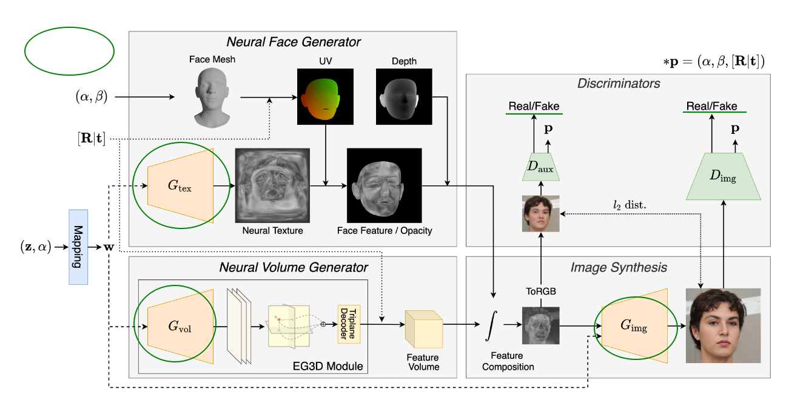

- 人脸图像生成器
- 显式控制面部表情
- 与之前的 3D aware GANs不同
- 支持面部形状和表情的细粒度控制(形状和表情是从姿态(pose)中分离出来的)

- 提出了一种新的混合方法，

- 采用具有神经纹理的三维可变模型作为面部区域
    a 3D morphablble model (3DMM) with neural textures for the facial region
- 采用具有多视角一致性的神经辐射场作为费面部区域
    a neural radiance field (NeRF) for non-facial regions with multi-view consistency.
- NeRF包含非面部区域的提及特征
- 两种特征单独生成，在之后融合
- 我们还提出了一种训练方案，鼓励生成的图像如实反映对形状和表情的控制。实验结果表明，该方法成功地合成了具有细粒度控制的真实视图一致的人脸图像。

- Exp GAN学习合成从身份和相机姿势中分离出来的各种面部表情

近年来，基于生成模型（如生成对抗网络）的合成图像的照片真实感显著增加。为了更直观地控制包括面部形状和表情在内的语义属性，提出了几种将面部的3D可变形模型（3DMM）应用于2D GAN框架的方法[10、13、16]。在[13，16]中，渲染3D人脸网格，将人脸形状和表情的各种信息（RGB、法线、神经特征）注入生成器。然而，尽管使用了3D人脸网格模型，但由于2D GAN框架缺乏多视图一致性，他们的结果显示面部表情和其他属性（如相机姿势和身份）之间存在纠缠。

已经提出了3D感知GAN来合成具有多视图一致性的高保真人脸图像[17-22]。一般来说，3D感知GAN学习生成隐式体积特征场，该特征场可以通过体绘制实现为图像。由于隐式体积特征已经包含3D信息，因此可以成功训练3Daware GAN以生成具有多视图一致性的人脸图像。然而，据我们所知，尚未考虑在3D感知GANs中对面部形状和表情的控制。

本文提出了Exp-GAN，这是一种3D感知人脸图像生成器，它为我们提供了对具有多视图一致性的人脸形状和表情的显式控制。具体来说，Exp-GAN学习合成从身份和摄像机姿势中分离出来的各种面部表情，如图1所示。为了实现这一点，Exp-GAN采用了一种混合方法，将人脸的3D可变形模型（3DMM）和3D感知GAN结合到单个条件GAN框架中，该框架可以使用2D人脸图像集合进行训练。3DMM允许我们对面部形状和表情进行细粒度和直观的控制，而3D感知GAN支持多视图一致的照片真实感图像合成。

具体来说，Exp-GAN分别使用神经面部生成器和神经体积生成器来合成面部和非面部部分。神经人脸生成器采用具有神经纹理的3DMM来合成真实且多视图一致的人脸的特征，该特征充分反映了用户对混合形状系数给出的面部表情和形状的控制。神经体积生成器采用3D感知的GAN方法来生成体积特征，支持具有多视图一致性的多样化和逼真的图像合成。为了无缝集成两个单独生成的特征，我们还介绍了一种基于NeRF的体绘制过程的特征集成方法[23]。最后，我们提出了一种基于混合形状系数与鉴别器回归的训练方案，用于根据用户控制参数进行可靠的图像合成。

我们的经验表明，Exp-GAN可以生成各种表情、姿势和人脸形状。我们还表明，与以前使用2D样式提供表达控制的工作相比，该方法定量地改进了结果。我们的贡献可以总结如下：–我们提出了Exp-GAN，第一个3D感知人脸图像生成器，以实现多视图一致性和对面部表情的细粒度控制我们提出了基于3DMMs的具有面部表情控制的3D感知GAN的几何显式调节我们的混合方法结合了3DMM和体积特征来合成面部和非面部区域，并采用了一种新的深度集成方法来无缝集成单独合成的特征我们还提出了一种新的训练方案，利用具有回归分支的鉴别器来训练我们的网络，以忠实地反映用户控制。

网络结构-四部分：
1. 神经脸部生成器
2. 神经体积生成器
3. 图像合成模块
4. 判别模块

对于框架的合成部分，使用了基于StyleGAN2的生成器

