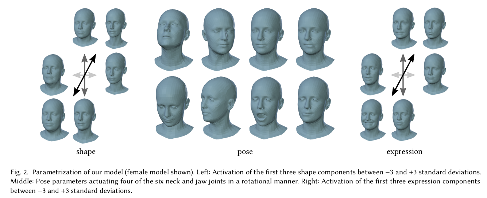
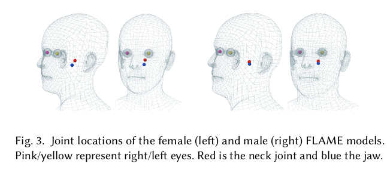

主要贡献： 提出了一个头部模型，比现有的头部模型和面部模型更精确，更有表现力。

## Flame and SMPL

- 将SMPL模型扩展到头部
    - SMPL中，几何变形是由于个体固有的形态变化或者姿势变化。
    - 对于人脸，变形多是由肌肉激活的，而不是有关节的姿势变化
- 与现有的游戏引擎兼容

## Flame

- 包含N=5023个顶点
- K=4个关节点(颈部，下巴，眼球x2)
- blendshapes
$
M(\vec\beta,\vec\theta,\vec\psi):\mathbb R^{|\vec\beta|\times|\vec\theta|\times|\vec\psi|}\rightarrow\mathbb R^{3N} 
$ (return N vertices, dim = 3)

$
M(\vec\beta,\vec\theta,\vec\psi)=W(T_P(\vec\beta,\vec\theta,\vec\psi),\mathrm J(\vec\beta),\vec\theta,\mathcal W)
$

$
T_P(\vec\beta,\vec\theta,\vec\psi) =  \mathrm{\overline T} + B_S(\vec\beta;\mathcal S) + B_P(\vec\theta;\mathcal P) + B_E(\vec\psi;\mathcal E)
$

$
\mathrm J(\vec\beta;\mathcal J,\overline{\mathrm T},\mathcal S) = \mathcal J(\overline{\mathrm T}+B_S(\vec\beta;\mathcal S))
$

$\mathcal J$ is a sparse matrix defining how to compute joint locations from mesh vertices

| blendshape | 公式                                     | 原空间     | 映射后的空间 |
|------------|------------------------------------------|------------|--------------|
| shape      | $B_S(\vec\beta;\mathcal S)=\sum_{n=1}^{\| \vec\beta\| }\beta_nS_n$ | $\mathbb R^{\| \vec\beta\| }$ | $\mathbb R^{3N}$ |
| pose       | $B_P(\vec\theta;\mathcal P) = \sum_{n=1}^{9K}(R_n(\vec\theta)-R_n(\vec\theta^*))P_n$                                       | $\mathbb R^{\|\vec\theta\|}  =\mathbb R^{3K+1} \space (rotation)$      | $\mathbb R^{3N}$           |
| expression | $B_E(\vec\psi;\mathcal E) =\sum_{n=1}^{\|\vec\psi\|}\psi_nE_n$                                       | $\mathbb R^{\|\vec\psi\|}$         | $\mathbb R^{3N}$           |

所有的blendshape都是关于模板mesh：$\overline{\mathrm T}$的偏移
