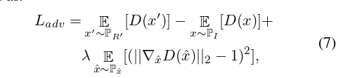

# CVPR2020

# introduction

问题：
- 基于3DMM的方法在面部纹理的重建上缺乏缺乏细节，这是因为从3DMM计算的纹理无法捕捉输入图像的面部细节。
- 基于高分辨率UV图的方法需要数据库难以获得

本文：第一个使用图卷积网络从单个图像生成高保真人脸纹理的工作,在3DMM的基础之上，单视图重建具有高保真纹理的三维人脸，无需捕获大规模人脸人脸数据库

主要思想：
利用输入图像中的面部细节，将其他方法得到的3DMM模型输入到GCN进行细化，重建3DMM网格顶点颜色(detailed colors)， 而不是重建UV图。

网络结构：由粗糙到精细，结合了3DMM和GCN

- 一个CNN用于从2D图像回归出3DMM的参数。将参数输入到PCA模型，计算形状和纹理，随后送入GCN
- 使用预训练的CNN从图像中提取人脸特征，随后送入GCN

- 使用3个GCN模型来细化面部纹理

- 采用了**可微渲染层**来实现自监督训练，并在使用**GAN损失**的情况下进一步改进了结果

    - 3D重建结果投影到2D，与原图比较。

    > Unsupervised training for 3d morphable model regression. In Proceedings of the IEEE Conference on Computer Vision and Pattern Recognition, pages 8377–8386, 2018.

    > Improved training of wasserstein gans. In Advances in neural information processing systems, pages 5767–5777, 2017.

# approach

## Regressor and FaceNet

是预训练好的模型，其中

- *Regressor*: 
    > Accurate 3d face reconstruction with weakly-supervised learning: From single image to image set. In IEEE Computer Vision and Pattern Recognition Workshops, 2019.

    - 用于回归`3DMM系数`(送入GCN)，`面部姿势，照明参数`(用于渲染2D图片)

    - 回归出一个257维向量 $(c_i^{80},c_e^{64},c_t^{64},p^{6},l^{27}) \in  \mathbb{R}^{257}$

    - 分别表示3DMM的shape, expression, texture; pose, lighting
    - 使用公式生成S和T(点集)：
        $$
        S = S_{mean} + c_iI_{base} + c_eE_{base} \\
        T = T_{mean} + c_tT_{base} \\ 
        \quad \\
        S_{mean}, T_{mean}, I_{base}, T_{base} \in BFM \\
        E_{base} \in FaceWarehouse
        $$
        其中$S_{mean},T_{mean}$是数据库中人脸的平均形状和平均纹理，$I_{base}, E_{base}, T_{base}$是人脸数据库中的人脸基(类似向量空间的基)，理论上通过这些人脸基的加权和可以得到任何人脸。

        > A 3d face model for pose and illumination invariant face recognition. In 2009 Sixth IEEE International Conference on Advanced Video and Signal Based Surveillance, pages 296–301. Ieee, 2009

        > Facewarehouse: A 3d facial expression database for visual computing. IEEE Transactions on Visualization and Computer Graphics, 20(3):413–425, 2013.
 

- *FaceNet*: 

    > A unified embedding for face recognition and clustering. In Proceedings of the IEEE conference on computer vision and pattern recognition, pages 815–823, 2015.

    - 提取图像的特征向量

    - 作用：
        1. 作为embedding输入到后面的GCN Decoder中，生成网格顶点的反射率颜色

        2. 用来构成一个LOSS项

## PCA

不可学习，用于将3DMM参数转化为面部形状S和粗糙的面部纹理T

## Texture Refinement (GCN)
与使用UV作为面部纹理表示的工作不同，本文直接操作网格顶点上的反射率RGB值

$$
M = (V,A),\\
V \in \mathbb{R}^{n \times 3}, \\
A \in \{0,1\}^{n\times n} \\
$$

**GCN Refiner GCN Decoder**
- Refiner就是一个图卷积，输入的是图结构，输出也是图结构
- Decoder中，输入是FaceNet得到的特征向量，输出时每个顶点的RGB值。
     > feature怎么转化成图的结构？
- 都用了残差块

**Combine Net**

把Refiner 和 Decoder的两个图结构在channel维度上拼起来，送到一个新的图卷积中。

## Rendering

- 输入S，T，姿态，反射率颜色，光照。渲染出2D图像。

## Discriminator

- 使用了对抗训练。判别器有6个卷积层

# LOSS

- Pixel-wise Loss: 最小化输入图像和渲染图像之间的差异，由于可能有遮挡问题，所以只计算部分面部区域$M_{face}$的欧氏距离。这个面部区域是由预训练的面部分割网络获得的。
    > (Face-to-parameter translation for game character auto-creation; Interactive facial feature localization.)

- Identity-Preserving Loss: 重建的3D人脸可能**看起来不像**输入的2D人脸，特别是在某些**极端**情况下。因此定义了面部特征级别下的 LOSS。
    - 使用FaceNet，获得输入图像和渲染的2D图像的$feature$，计算余弦距离。

- Vertex-wise Loss: 
    - 训练GCN时，由于遮挡，可能无法正确的学习到顶点上的RGB值。
    - 在GCN模块训练的早期阶段，构造顶点级别的损失函数，然后逐渐减少这个这个损失项的权重
    - 包含两组：
        1. regressor+pca生成的T，和GCN生成的T'
        2. regressor+pca生成的T，映射回输入图像的颜色Tp，和GCN生成的T'在光照渲染下的颜色 $\tilde{T'}$(为了获得更多的面部细节)

- Adversarial LOSS
    > Improved training of wasserstein gans. In Advances in neural information processing systems, pages 5767–5777, 2017

    

- 最终的损失函数

    $$
    L = \sigma_1 (L_{pix}(I,R') + \sigma_2L_{id}(I,R')+ \sigma_3L_{adv}) \\  
    \quad \\
    + \sigma_4(L_{vert}(T,T') + L_{vert}(T_p,\tilde{T}'))\\
    \quad \\
    fixed:\quad \sigma_2 = 0.2, \sigma_3 = 0.001 \\
    Initially:\quad \sigma_1 =0, \sigma_4=1  \\
    gradually:\quad \sigma_1 =1, \sigma_4=0 
    $$

# Result

