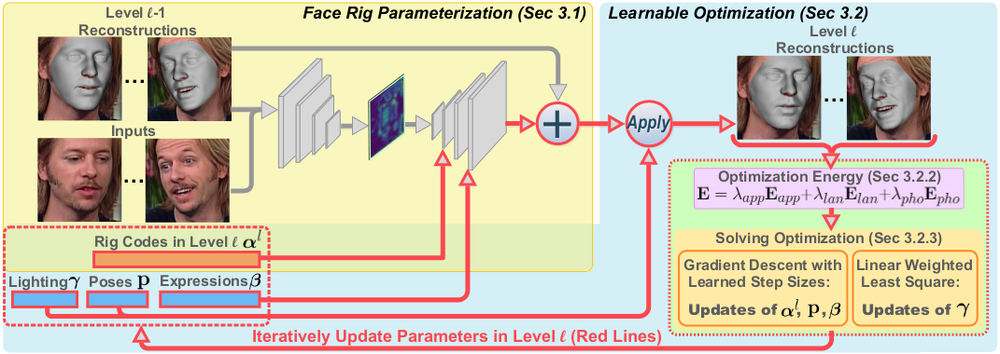

# CVPR 2021

# Introduction

## 什么是face rig
- 在动画制作中，rigging是将不同身体部分绑定起来，从而更好地控制动画人物的运动。

- 这里的riggable，应该是可控制的意思，区别于静态重建(只考虑输入图像的重建)，一个riggable 3d face 可以被其他变量控制，如其他人脸，声音等等

- 该face rig可以用于角色动画，如人脸重定目标(retarget)和语音木偶(voice puppertry)。也可以用于3D人脸跟踪，作为个性化的先验知识，以缓解跟踪难度。

- face rig是一个个性化的参数模型，可以生成一个特定人物在不同表情下的face

- face rig: 一个参数化模型，输入表情参数 $\beta$,输出一个相应的3D mesh
    - $(V,A)=Rig(\beta)$,V代表网格顶点，A代表反射率颜色。

## 什么是适定性问题

适定性问题，满足：
1. 解存在
2. 解唯一
3. 解稳定

通过2D人脸生成3D人脸，和2dpose->3dpose一样，解不唯一，是不适定性问题。

## 先前工作存在的问题

- 由于问题的不适定性，face rig 模型通常难以优化

- 基于三维数据的方法：严重依赖于专用设备（如密集摄像机/照明阵列和深度传感器）提供的3D数据，这限制了应用领域。

- 基于传统方法：这类算法通常使用低维参数面部模型作为先验，使用面部模型(3dmm,multi-linear)来约束这个不适定性问题。通过优化器来求解这些模型的参数。但无法捕捉到精确的面部特征，在此基础上的改进需要很多额外的部件，模型比较脆弱，效率相对较低。

- 基于深度学习：大部分专注于静态重建而不是个性化的 face rig。

## 本文贡献

- 将深度学习，optimization 和 face rig结合。

- 提出了一种基于单目图像的face rig重建方法。(支持视频输入)

- 通过估计个性化的face rig，使得本方法比静态重建(static reconstructions)表现要好，并且实现了下游应用，如视频重定向。

- 与之前直接回归Rig参数的方法不同，本文的in-network optimization 迭代求解rig参数，并受到第一原则(first-principles) 的约束(e.g. multi-view consistency, landmark alignment, and photo-metric reconstruction)。获得了更好的几何精度和泛化能力

## 本文思路

- 联合估计具有个性化的个性化的 "人脸 rig" 和每幅图图像的参数（包括表情，姿势，照明），有监督

- 设计了一个端到端网络，嵌入了一个可微的网络优化器

    - decoder, Face Rig Parameterization 基于输入图像，将face rig 参数化为 rig code，来control the person-specific aspects (面貌？)

    - learnable optimization，用于估计rig code 和 每幅图的参数

- 在网络优化中，显式地强制来自第一原理的约束，引入了比基于回归的方法更多的先验知识。最后，利用深度学习中的数据驱动先验约束不适定单目设置，缓解优化难度。

- 本文的方法：不是直接回归，而是使用'in-network optimization governed by the first-principles'这个额外的约束，加上深度学习学到的东西，提供了提高几何精度和泛化能力的潜力，同时解决了线性人脸模型表达能力有限的缺点

# Method

网络有三级，这是一级的示意图，重复三次就是本文的网络结构。
- Face Rig Parameterization: 参数化 face rig 为一个可优化的编码$\alpha^l$, to control the person-specific aspects
- Learnable Optimization：迭代更新$\alpha^l$和每幅图的参数(表情，姿态，照明)

在1个阶段中主要有四个参数(共有3个阶段)：
1. Rig Code $\alpha^l$ 
2. lighting $\gamma$ 每幅输入图像都有这个参数
3. pose $P$ 每幅输入图像都有这个参数
4. expression $\beta$ 每幅输入图像都有这个参数

## Face Rig Parameterization
生成mesh的方法：
| face rig                                         | face rig parameterization (本文)                                 |
|--------------------------------------------------|-----------------------------------------------------------|
| $(V,A)=Rig(\beta)$                               | $(V,A) = Rig(\beta;\alpha,\{I_i\},\{\hat{V}^{old}_i\})$   |
| V代表网格顶点，A代表反射率颜色,$\beta$是表情参数 | V代表网格顶点，A代表反射率颜色,$\beta$是表情参数          |
|                                                  | $I_i$为输入图像                                           |
|                                                  | $\hat V_i^{old}$是之前的重建结果，<cr>每一幅图都有一个重建结果,<cr> **目的是将图像映射到UV空间**  |
|                                                  | 同时更新$\alpha^l$  |

在face rig parameterization内部，主要有4个部件，每个部件有3个阶段

- 特征提取：image feature extraction
- 生成中性mesh(静态)：neutral shape decoding
- 生成表情mesh(动态)：expression deformation decoding
- 反射率颜色解码：albedo decoding

### 特征提取

- 输入：

    - N张图片

    - N个上一级重建结果(这个是从哪来的？)

- 过程：用N个共享权重的网络提取特征，最大池化合在一起，经过残差块，得到$F_{uv}$
- 目的： 提取出一个UV特征图 $F_{uv}$, 对输入图像进行编码，用于后面的解码

### 中性mesh

- 输入：
    - UV特征图
    - netural shape code $\alpha_{ns}$, 是$\alpha$ 中的一部分

- 过程： CNN

- 目的：

    - 计算一个neutral shape $V_{ns}$: 3D face mesh in neutral expression

- 公式定义：

    $$
    V_{ns} = \overline V + B_{bfm}\alpha_{ns}^1 + \sum_{l=1}^3F_{ns}^l(\alpha_{ns}^l; F_{uv}^l)
    $$

    在第一个阶段，使用了BFM模型。$\overline V , B_{bfm}$ 分别是平均人脸mesh和PCA中的基
    
    > A 3d face model for pose and illumination invariant face recognition. In 2009 Sixth IEEE International Conference on Advanced Video and Signal Based Surveillance, pages 296–301, 2009. 4, 5

### 表情mesh

- 输入：
    - UV特征图 $F_{uv}^{l}$
    - $\alpha_{exp}^{l} \in \alpha^l$
    - $\beta$

- 过程：使用三个子网络来获取 $D_{exp}$

- 目的：
    计算在中性mesh上点的位移 $D_{exp}$

- 公式：
    $$
    D_{exp} = F_{exp\_cnn}(F_{exp\_mlp}(\beta;\theta_{mlp}))\\
    
    \theta_{mlp} = F_{exp}(\alpha_{exp};F_{uv})
    $$

    在第一个阶段，使用了Facewarehouse模型，所以最终公式变为：

    $$
    D_{exp} = B_{exp}F_{exp\_mlp}^1(\beta;\theta_{mlp}^1) + \sum_{l=2}^3 F_{exp\_cnn}(F_{exp\_mlp}(\beta;\theta_{mlp}))\\
    $$
    > Facewarehouse: A 3d facial expression database for visual computing. IEEE Trans. Vis. Comput. Graph., 20(3):413–425, 2013. 1, 2, 4

- 最终mesh的表达方式：$V = V_{ns} + D_{exp}$

### 反射率颜色

- 输入：

    - UV图$F_{uv}$

    - 反射率编码 albedo code: $\alpha_{alb}$

- 过程：

    - 由于只有少量的高频细节会随着表情变化，首先在前两个阶段估计静态反射率，在第三阶段添加一个额外组件

- 公式：

    
    
    > bfm

## Learnable Optimization

### Reconstruction from parameters
经过$(V,A) = Rig(\beta;\alpha,\{I_i\},\{\hat{V}^{old}_i\})$后，得到了一个mesh，将这个mesh投影到图片上，用**现有的模型**渲染光照效果
> A signal-processing framework for inverse rendering. In Proceedings of the 28th annual conference on Computer graphics and interactive techniques, pages 117–128, 2001. 5

### Energy Formulation

### optimization
1. 去掉所有rig decoders，得到一个初始的重建结果。p参数由预训练的模型回归出来,$\gamma$由公式计算出来
> Deep facial non-rigid multi-view stereo. In IEEE Conf. Comput. Vis. Pattern Recog., pages 5850–5860, 2020. 2, 3, 4, 5, 6, 7

2. 多阶段中的一个阶段
    1. input images and per-image meshes
    2. extract UV feature
    3. 

## LOSS

## Dataset
- Stirling/ESRC 3D
    - 100+ subjects
    - 8 expression
