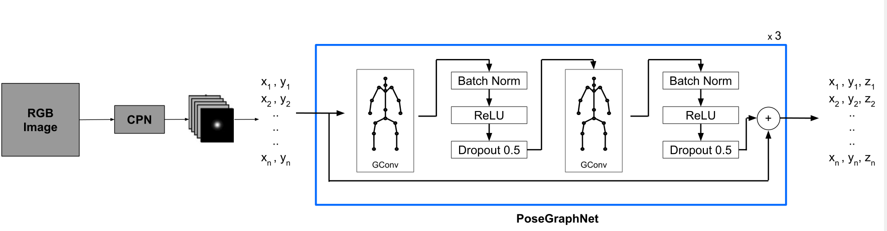

# ABSTRACT

图卷积网络以邻接矩阵的形式对人体骨骼结构信息进行编码，有利于更好的进行姿态估计

- 网络：PoseGraphNet
  - 使用了一个适应性的邻接矩阵 ( an adaptive adjacency matrix ) 和特定于邻居组的核 (kernels specific to neighbor groups)
  - 学习关节之间有趣的邻接关系 (adjacency relations ) ，这些关节没有物理连接，但是行为相似
- 方法：2D → 3D
- 数据集：Human3.6M
- 性能：接近目前水平
- 参数：少得多

# INTRODUCTION

- 骨架的结构约束等附加信息进一步提高了性能。一些早期的工作中，结构信息由一个单独的统计模型，或一个基本姿势字典提供给系统。这些类型的结构模型需要分别学习
  - 限制：由于学习的结构模型依赖于训练数据集，因此也限制了可能的三维姿态的数量。

- GCNs 提供了一个轻量级的解决方案表示人体的结构，不需要额外开销。
- PoseGraphNet 模型类似于[6]，但参数少得多。在human3.6m 数据及上的性能优于[6]，与[5]接近
- 相关论文：
  - [5] Yujun Cai, Liuhao Ge, Jun Liu, Jianfei Cai, Tat-Jen Cham, Junsong Y uan, and Nadia Magnenat Thalmann, “Exploiting Spatial-temporal Relationships for 3D Pose Estimation via Graph Convolutional Networks,” in
    ICCV, 2019
  - [6] Julieta Martinez, Rayat Hossain, Javier Romero, and James J Little, “A simple yet effective baseline for 3d human pose estimation,” inICCV, 2017.
  - [8] Long Zhao, Xi Peng, Y u Tian, Mubbasir Kapadia, and Dimitris N Metaxas, “Semantic Graph Convolutional Networks for 3D Human Pose Regression,” inCVPR, 2019.
  - [9] Bardia Doosti, Shujon Naha, Majid Mirbagheri, and David J. Crandall, “Hope-Net: A graph-based model for hand-Object pose estimation,”CVPR, 2020.

# POSEGRAPHNET

- 人体骨骼表示：$G = (V,E)$，
-  $V$表示关节点的集合，
- $E$ 表示关节之间连接的边集，这些边用邻接矩阵 $A\in\mathbb{R}^{N \times N}$表示，
- 该图由节点级的特征和邻接矩阵 $A$ 表示

## 架构

- 基于[6]，而不是[5,9]，因为该网络复杂度低，不利用骨架结构信息的情况下性能良好。与[6]相比，增加了结构信息和图卷积
- 除了训练图卷积层的可训练权值，还训练邻接矩阵（adaptive adjacency matrix），预定义的邻接矩阵代表默认的人体结构。
- 躯干相对四肢是稳定的，邻接矩阵可以学习对于不同邻居的不同贡献率，也学习没有物理上相连但行为相似的连接？

### 隐藏层计算

