# 图神经网络

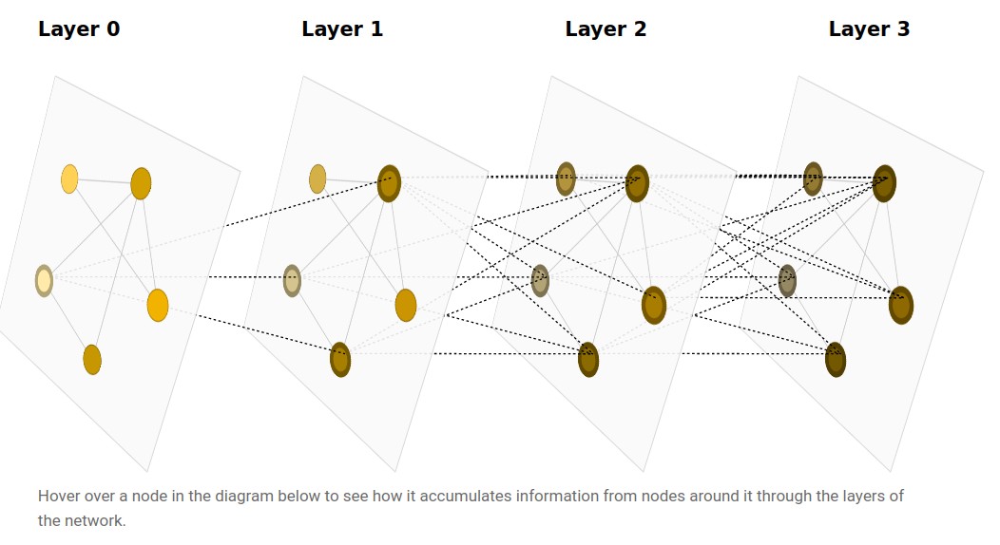

- 什么样的数据可以表示成一张图
- 图跟其他数据有什么不同
- GNN 的各个模块
- GNN playground

# 什么样的数据可以表示成一张图

## 图是什么

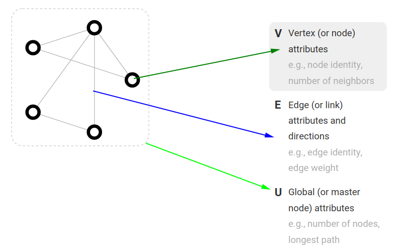

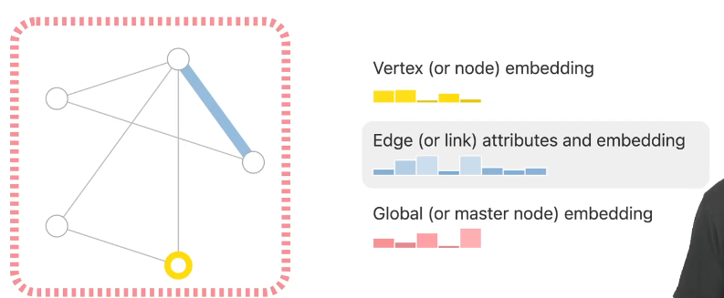

## 数据如何表示成图

### 图片

- 一般情况下：三维的 tensor (e.g., $244 \times 244 \times 3$)

- 表示成图：
  
  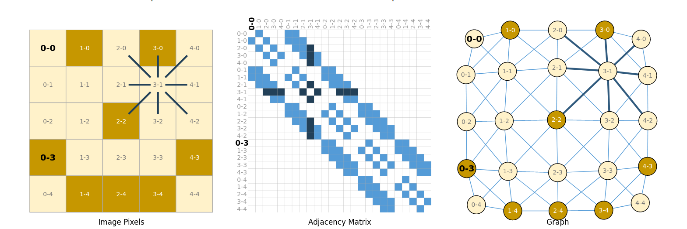

### 文本

- 表示成图：

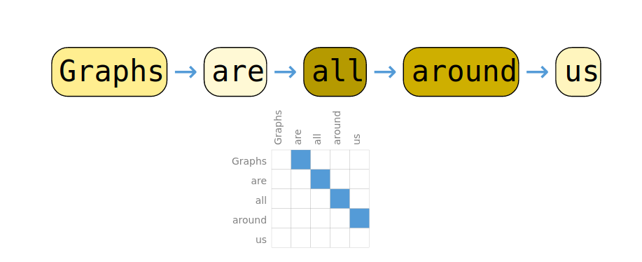

## 什么样的数据可以表示成图

- 图层面
- 顶点层面
- 边层面

### 图层面

- 预测整个图的属性
- 如图像分类，情绪分析

### 顶点层面

- 与每个节点的身份或角色有关
- 如图像分割，语义分割，预测文本中单词的词性

### 边层面

- 预测顶点间的关系

## 图用到神经网络上的挑战

- 怎样表示图，使图与神经网络是兼容的
- 表示连接性的邻接矩阵，可能会有的问题：
  - 顶点多，矩阵很大，稀疏矩阵难以高效计算
  - 一个图可以有多种邻接矩阵（顶点的排序不同），不能保证这些不同的矩阵在神经网络中产生相同的结果

### 邻接表

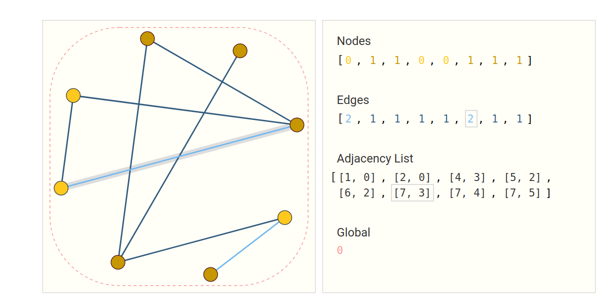

# GNN

- GNN 是对图上所有的属性进行**可以优化的变换**（置换不变）

- 输入是图，输出是图

- 不会改变图的连接性，只改变顶点和边的属性 

## 最简单的 GNN 模型

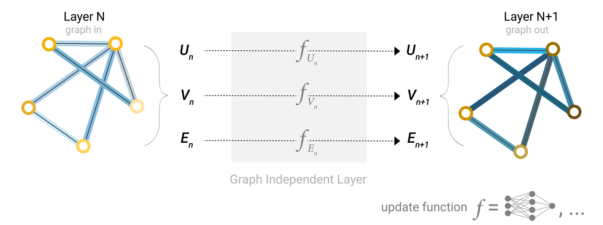

### GNN 输出

- 已知节点（边缘），预测节点（边缘）
  
  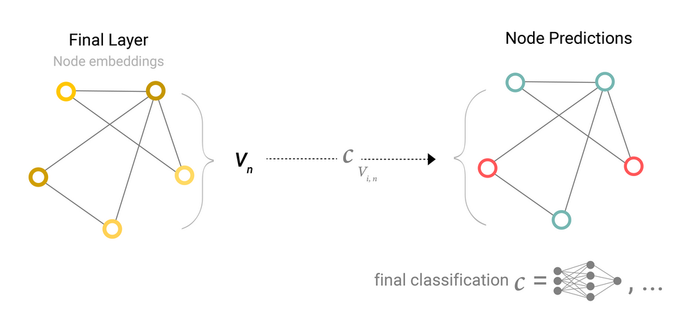

- 节点中没有信息，通过边缘信息预测节点
  
  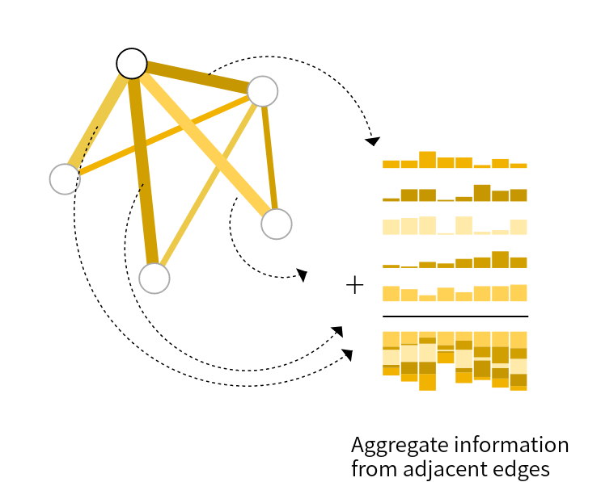
  
  - 只有边信息，预测顶点

- 只有节点信息，预测边
  
  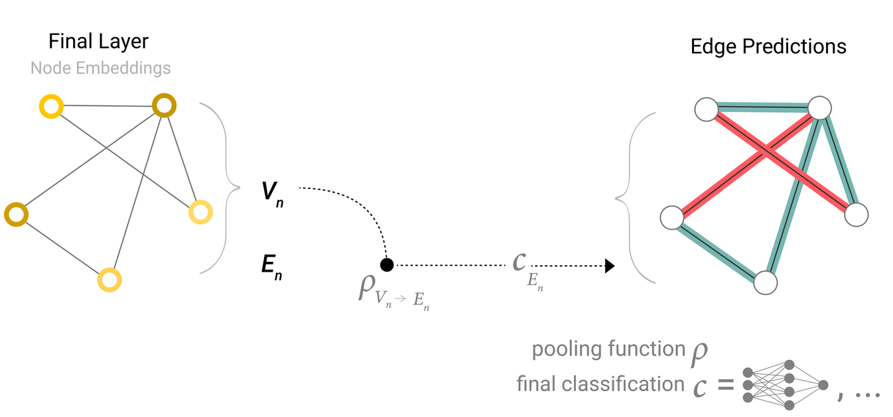

- 预测全局，类似于 CNN 的全局池化层

### 模型结构

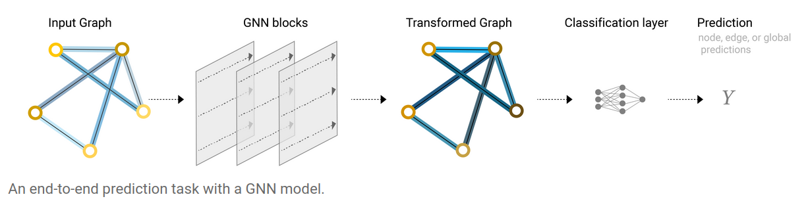

## 信息传递

### 最简单的方法

顶点向量或边向量单独输入到 MLP 

### 信息传递的方法

一个顶点的向量和邻居向量加和，类似于卷积（卷积核的权重都一样），卷积过程中的多通道对应于一个顶点向量的维度

- 节点之间的信息汇聚
  
  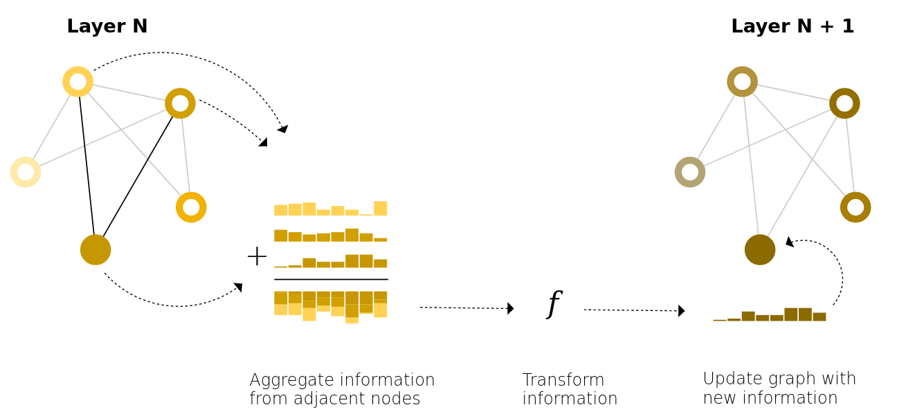
  
  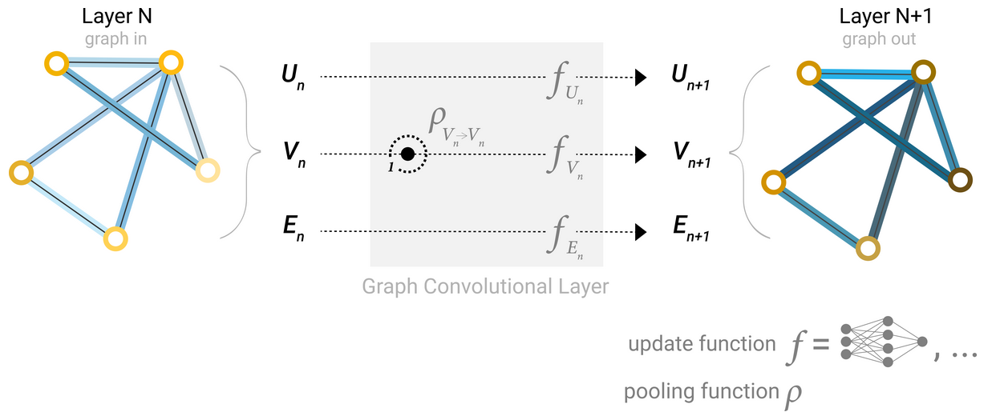

- 节点和边之间的信息汇聚
  
  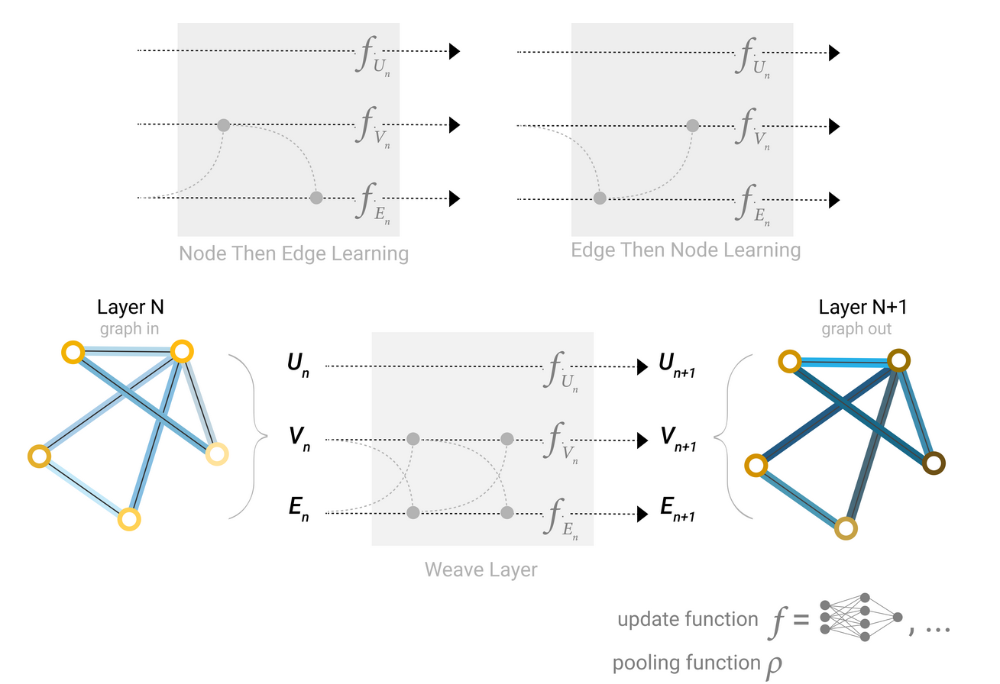

### 全局信息

全局信息 $U$ 和所有的顶点、边相连。在汇聚顶点和边的时候都会用到全局信息。

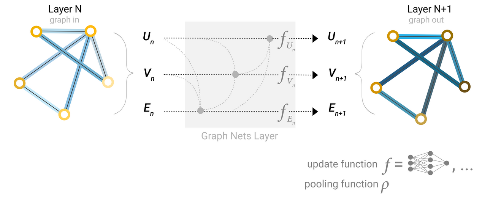

# 超参数对模型的影响

# GNN 相关话题

## mutigraph

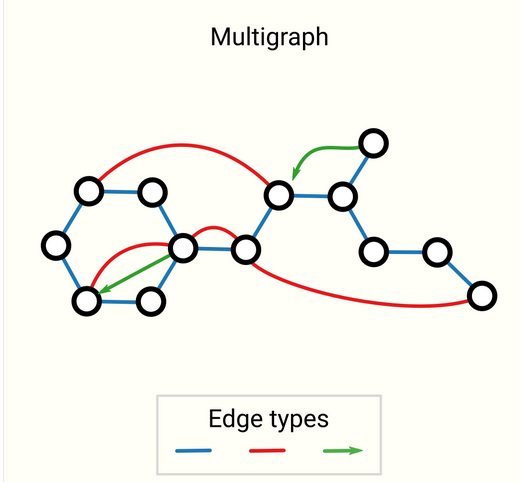

## hypergraph

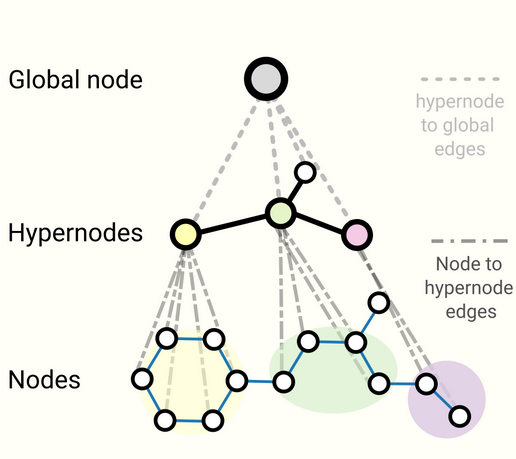

## 对图进行采样

- 网络和比较深，图比较大的时候，最后一层做信息汇聚的时候保存的中间变量很多，计算量可能无法承受

- 采样方法（有点像dropout）：
  
  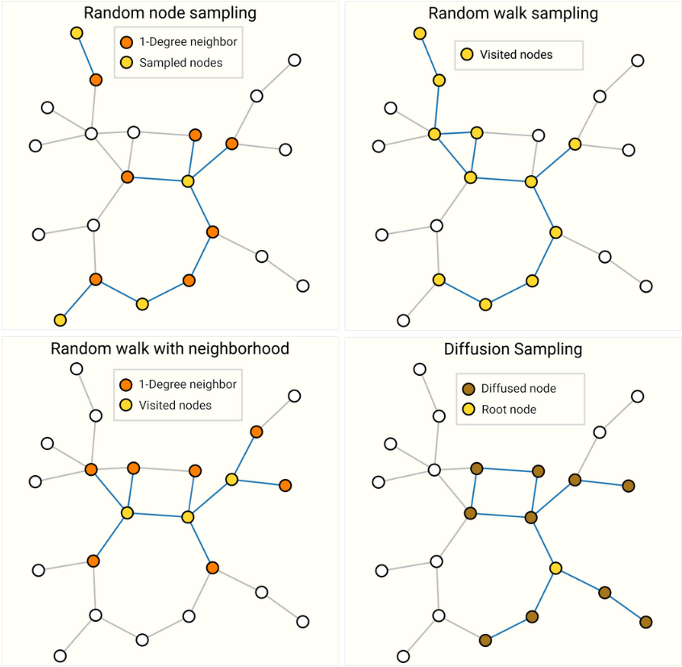

## batching

- 每一个顶点的邻居个数不一样，怎么合并成一个规则的张量？

## 图神经网络的假设

- 图的对称性：交换顶点的顺序，GNN 对它的作用保持不变

## 汇聚操作

- min, max, mean 都差不多

## 

