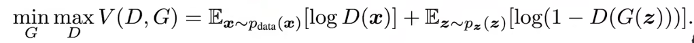
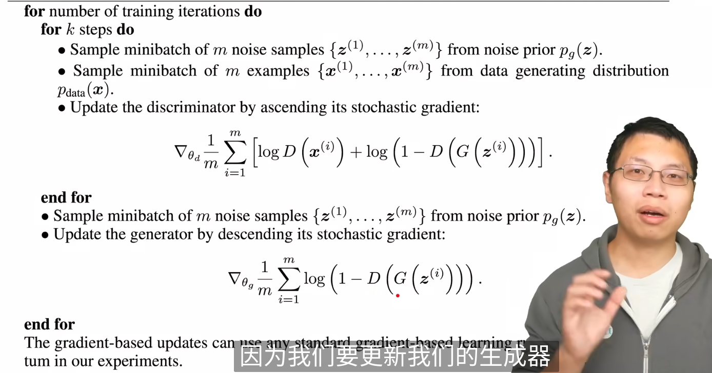

G: 生成模型，用于捕获数据分布，输入随机噪声
D: 判别模型，判断样本的来源（G或者真实样本）

生成器：以图片为例，学习一个*pg*的分布。给一个随机噪声pz(z)作为输入，映射到真实的图片x。G(z;$\theta$)

D(x;$\theta d$)输出一个标量，表示x来自真实数据还是生成器。

先更新判别模型，再更新生成器

## KL散度，JS散度

### KL散度(相对熵，是两个概率分部的差异)

对于分类问题：
| (a cat image)     | cat | dog |
|-------|-----|-----|
| predict | 0.9 | 0.1 |
| label  | 1.0 | 0.0 |

