<!-- vim-markdown-toc Redcarpet -->

* [1.基本概念和术语](#1-基本概念和术语)
    * [1.1.基本元件](#1-1-基本元件)
    * [1.2.术语](#1-2-术语)
    * [1.3.自动控制的基本原理](#1-3-自动控制的基本原理)
    * [1.4.控制系统的分类](#1-4-控制系统的分类)
    * [1.5.控制系统的基本要求](#1-5-控制系统的基本要求)
    * [1.6. 影响系统响应的因素](#1-6-影响系统响应的因素)
* [2.控制系统的输入-输出模型](#2-控制系统的输入-输出模型)
    * [2.1.微分方程（时域）](#2-1-微分方程（时域）)
        * [2.1.1.四种系统的建模](#2-1-1-四种系统的建模)
    * [2.2.传递函数$(s)$](#2-2-传递函数-s)
        * [2.2.1.传递函数定义](#2-2-1-传递函数定义)
        * [2.2.2.表示系统的方法](#2-2-2-表示系统的方法)
            * [方框图](#方框图)
            * [信号流图](#信号流图)
            * [梅森公式](#梅森公式)
    * [2.3.频域特性函数$(j\omega)$](#2-3-频域特性函数-j-omega)
        * [2.3.1.频域特性函数定义](#2-3-1-频域特性函数定义)
        * [2.3.2.频域特性的图示方法](#2-3-2-频域特性的图示方法)
            * [奈奎斯特图](#奈奎斯特图)
            * [伯德图](#伯德图)
        * [2.3.3.典型环节的频域特性](#2-3-3-典型环节的频域特性)
            * [振荡环节的频率特性](#振荡环节的频率特性)
        * [2.3.4 最小相位系统](#2-3-4-最小相位系统)
    * [2.4.采样控制系统](#2-4-采样控制系统)
        * [2.4.2.采样器](#2-4-2-采样器)
        * [2.4.3.零阶保持器（ZOH）](#2-4-3-零阶保持器（zoh）)
        * [2.4.4.差分方程](#2-4-4-差分方程)
        * [2.4.5.脉冲传递函数](#2-4-5-脉冲传递函数)
            * [采样系统的联接](#采样系统的联接)
* [3.控制系统的状态空间模型](#3-控制系统的状态空间模型)
    * [3.1.状态方程和输出方程](#3-1-状态方程和输出方程)
    * [3.2. 连续状态空间模型](#3-2-连续状态空间模型)
        * [3.2.1. 状态空间模型 => IO模型（传递函数矩阵）](#3-2-1-状态空间模型->-io模型（传递函数矩阵）)
        * [3.2.2. IO模型（传递函数矩阵）=> 状态空间模型](#3-2-2-io模型（传递函数矩阵）->-状态空间模型)
    * [3.3.连续状态空间求解(假设D为0)](#3-3-连续状态空间求解-假设d为0)
        * [3.3.1.状态转移矩阵](#3-3-1-状态转移矩阵)
        * [3.3.2.线性定常系统的全响应](#3-3-2-线性定常系统的全响应)
    * [3.4.离散状态空间模型](#3-4-离散状态空间模型)
        * [3.4.1. 连续状态空间模型=>离散状态空间模型](#3-4-1-连续状态空间模型->离散状态空间模型)
        * [3.4.2. 输入输出模型（脉冲传递函数）=>离散状态空间模型](#3-4-2-输入输出模型（脉冲传递函数）->离散状态空间模型)
    * [3.5. 离散状态空间求解](#3-5-离散状态空间求解)
        * [3.5.1. 离散系统的状态转移矩阵](#3-5-1-离散系统的状态转移矩阵)
        * [3.5.2. 求解线性离散系统](#3-5-2-求解线性离散系统)
* [4.控制系统的稳定性分析](#4-控制系统的稳定性分析)
    * [4.1.李雅普诺夫稳定性的概念](#4-1-李雅普诺夫稳定性的概念)
    * [4.2.线性定常系统稳定的充要条件](#4-2-线性定常系统稳定的充要条件)
    * [4.3.系统稳定性的代数判据](#4-3-系统稳定性的代数判据)
    * [4.4.根轨迹](#4-4-根轨迹)
        * [4.4.1.两个根本约束条件：幅值条件和相角条件](#4-4-1-两个根本约束条件：幅值条件和相角条件)
        * [4.4.2.根轨迹绘制规则](#4-4-2-根轨迹绘制规则)
    * [4.5.奈奎斯特稳定性判据](#4-5-奈奎斯特稳定性判据)
        * [4.5.1. 稳定裕度](#4-5-1-稳定裕度)
    * [4.6. 李雅普诺夫第二法](#4-6-李雅普诺夫第二法)
* [5.控制系统的时域运动分析](#5-控制系统的时域运动分析)
    * [5.1.时域响应求解](#5-1-时域响应求解)
        * [5.1.1.连续系统](#5-1-1-连续系统)
        * [5.1.2.离散系统](#5-1-2-离散系统)
    * [5.2.瞬态性能指标](#5-2-瞬态性能指标)
    * [5.3.一阶系统瞬态性能](#5-3-一阶系统瞬态性能)
        * [5.3.1.极点分布](#5-3-1-极点分布)
        * [5.3.2.阶跃响应](#5-3-2-阶跃响应)
    * [5.4.二阶系统瞬态性能](#5-4-二阶系统瞬态性能)
        * [5.4.1.极点分布](#5-4-1-极点分布)
        * [5.4.2. 阶跃响应](#5-4-2-阶跃响应)
        * [5.4.3. 二阶系统性能改善](#5-4-3-二阶系统性能改善)
    * [5.5 高阶系统](#5-5-高阶系统)
    * [5.6.稳态误差分析](#5-6-稳态误差分析)
* [7. 校正](#7-校正)
    * [7.1 附加零极点对系统性能的影响](#7-1-附加零极点对系统性能的影响)
        * [开环零极点](#开环零极点)
        * [闭环零极点](#闭环零极点)
        * [原点附近开环偶极子](#原点附近开环偶极子)
    * [7.2.根轨迹校正](#7-2-根轨迹校正)
* [附录](#附录)
    * [拉氏变换几个重要定理](#拉氏变换几个重要定理)
    * [Z变换几个重要定理](#z变换几个重要定理)
    * [常见函数拉氏变换和Z变换](#常见函数拉氏变换和z变换)
    * [典型环节传递函数和频率特性](#典型环节传递函数和频率特性)

<!-- vim-markdown-toc -->

# 1.基本概念和术语

## 1.1.基本元件

- 给定：给出被控量应取的值

- 测量：检测被控量大小

- 比较：得到给定值与被控量之间的误差。常用差动放大器、电桥等。计算机控制系统中直接进行数值计算。

- 放大：放大误差信号，驱动执行机构。可以是电子元件网络，也可以是电机放大器等。

- 执行：执行控制命令，驱动被控对象。

- 校正：改善系统的性能。使用电路系统、计算机程序实现

- 能源：提供能源

## 1.2.术语

- 被控量：被测量和被控制的量

- 控制量：由控制器改变的量

- 对象：一个设备

- 系统：一些部件的组合

- 扰动：一种对系统的输出量产生不利影响的因素或信号。分为内部扰动和外部扰动
  
    外部扰动：增加扰动输入
  
    内部扰动：传递函数不稳定

- 系统的型别：v表示开环传递函数积分环节的个数，v=几,就是几型系统。

## 1.3.自动控制的基本原理

- 反馈控制

- 前馈控制（顺馈控制）
  
    介绍一下前馈控制:  
    测量扰动后经过补偿装置直接接到系统输入端。

对比闭环控制和开环控制:  

| 开环     | 闭环     |
| ------ | ------ |
| 结构简单   | 结构复杂   |
| 抗干扰能力弱 | 抗干扰能力强 |

## 1.4.控制系统的分类

- 恒值调节系统和随动系统

- 线性系统和非线性系统
  
    线性和非线性的区别:  

| 线性            | 非线性     |
| ------------- | ------- |
| 满足叠加定理        | 不满足叠加定理 |
| 稳定性只和系统结构参数有关 |         |
| 正弦信号的输入，输出同频  |         |
| 会产生自激振荡       |         |

- 定常系统和时变系统

- 连续系统和离散系统

## 1.5.控制系统的基本要求

- 稳定性
- 瞬态性能
- 稳态性能

## 1.6. 影响系统响应的因素

- 输入         $\to 1(t)$
- 初始条件     $\to$ 0初始 (传递函数是在0初始条件下（0状态）)
- 系统的结构参数

# 2.控制系统的输入-输出模型

控制系统的数学模型有:  

| 域   | 连续   | 离散     |
| --- | ---- | ------ |
| t   | 微分方程 | 差分方程   |
| t   | 状态方程 | 状态方程   |
| s/z | 传递函数 | 脉冲传递函数 |
| s/z | 方框图  | 方框图    |
| j   | 频率特性 | 频率特性   |

1. 微分方程
2. 传递函数

## 2.1.微分方程（时域）

### 2.1.1.四种系统的建模

- 机械系统

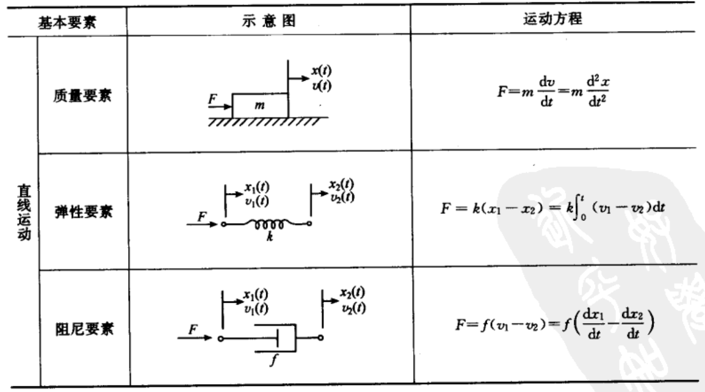

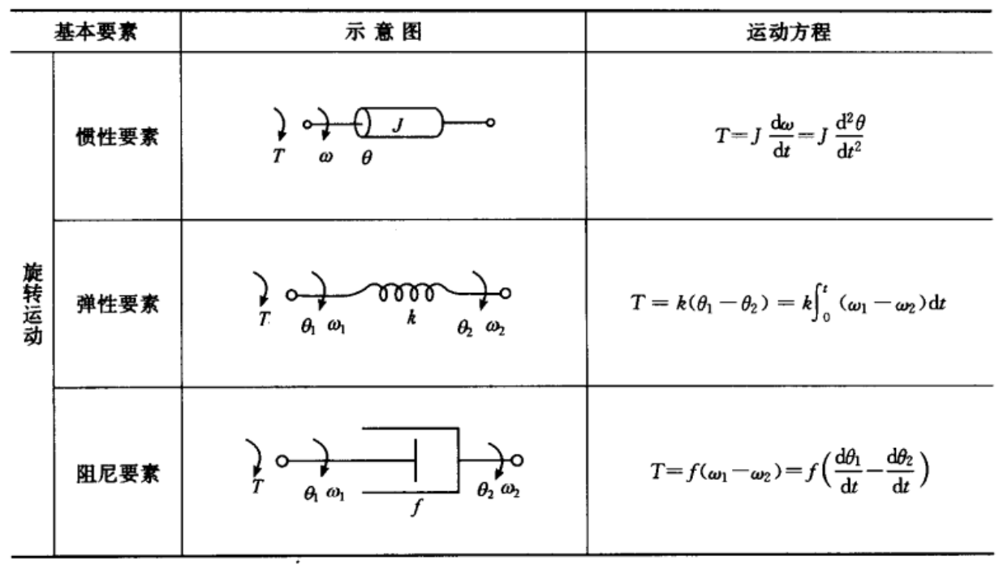

- 电路系统
  
    基尔霍夫定律

- 机电系统
  
    电机就是一个典型的机电系统，从三个方面列方程：
  
  1. 机械部分
  
  2. 电磁部分
  
  3. 机电耦合部分

- 液位系统
  
    液面高度与流量看做线性关系（层流为线性关系，紊流近似为线性关系）
  
    设$q_i$和$q_o$分别为输入和输出流量，$C$为容器横截面积，$h$为当前页面高度，$R$为液阻
  
    $$Cdh = (q_i-q_o)dt$$
    $$q_o = \dfrac hR$$
  
    液位系统的运动方程：
  
    $$RC\dfrac{dh}{dt}+h=Rq_i$$

## 2.2.传递函数$(s)$

### 2.2.1.传递函数定义

$$ G(s) = \dfrac {Y(s)}{U(s)} = K_g \dfrac{\prod_{i=1}^m(s+z_i)}{\prod_{j=1}^n(s+p_j)} $$

- $K_g$ 称为 **传递函数的传递系数** 或 **根轨迹增益** (首1)

- 开环增益（尾1）

- 反馈：$W(s) = \dfrac{G(s)}{1+G(s)F(s)}$ 
  
    其中 $1+G(s)F(s)=0$ 称为闭环系统的特征方程
  
    反馈系统对于扰动有较好的抑制作用

### 2.2.2.表示系统的方法

#### 方框图

#### 信号流图

#### 梅森公式

$$ G(s) = \dfrac1{\Delta(s)}\sum_iQ_i(s)\Delta_i(s)$$

- $\Delta(s) = 1$ - 所有不同回路的传递函数之和 + 每两个不接触回路的传递函数乘积之和 - 每三个不接触回路的传递函数乘积之和 + ... 

- $Q_i(s)$ 从该输入到该输出的某前向通道的传递函数

- $\Delta_i(s)$ 对$\Delta(s)$操作，将其中与$Q_i$接触的回路传递函数置0

- $\Delta(s)$ 是系统的特征式 

## 2.3.频域特性函数$(j\omega)$

### 2.3.1.频域特性函数定义

输入为正弦量 $u(t) = Asin\omega t \to A\angle0$ 

$$G(j\omega) = \dfrac{\dot Y}{\dot U}$$

- $G(j\omega)   = X(\omega) + jY(\omega) = |G(j\omega)|\angle G(j\omega)  = F(\omega)e^{j\varphi(\omega)}$

- 幅频特性：
  $F(\omega) = |G(j\omega)| = \dfrac{|\dot Y|}{|\dot U|}$

- 相频特性：
  $\varphi = \angle G(\omega) = \angle \dot Y - \angle \dot U$

### 2.3.2.频域特性的图示方法

#### 奈奎斯特图

#### 伯德图

- 幅频特性
  
  - 横坐标：$lg \omega$
  - 纵坐标：$20 lg |G(j \omega)|$

- 相频特性
  
  - 横坐标：$lg \omega$
  - 纵坐标：$\angle G(j \omega)$

### 2.3.3.典型环节的频域特性

#### 振荡环节的频率特性

$\omega_r$称为振荡环节的谐振频率，此时$\dfrac{dA(\omega)}{d\omega} = 0$

$$\omega_r = \omega_n \sqrt{1-2\zeta ^2}$$

$$M_r = A(\omega_r) = \dfrac1{2\zeta\sqrt{1-\zeta ^2}}$$

$$\varphi(\omega_r) = -arctan\dfrac{\zeta}{2\zeta\sqrt{1-\zeta ^2}}$$

### 2.3.4 最小相位系统

- 如果系统开环传递函数在右半s平面没有零点和极点，该系统称为 **最小相位系统**
- 有延迟环节的系统属于 **非最小相位系统**
- 两个开环稳定的系统有相同的幅频特性，对任意$\omega \geq 0$, **最小相位系统** 的相位总滞后于 **非最小相位系统**

## 2.4.采样控制系统

### 2.4.2.采样器

- 采样前的连续信号： $x(t)$)

- 理想采样后所得的脉冲序列：$x^*(t) = \sum_{n=0}^\infty x(nT)\delta(t-nT)$

- 采样前的连续信号的频谱： $F_x(j\omega)$

- 理想采样后所得的脉冲序列的频谱：$F_x^*(j\omega) = \dfrac1T\sum_{n=-\infty}^\infty F_x(j(\omega-n\omega_s))$

其中, $\omega_s$ 为采样角频率，$\omega_m$ 为连续信号的最大频率。离散信号的频谱可以看做连续信号频谱经过无穷次平移后叠加而成的。

- **香农采样定理** : $\omega_s > \omega_m$ 时，能够通过采样信号恢复原信号（必要条件）。
- 实际上满足香农采样定理后，还需要一个理想的低通滤波器（物理上不可实现）才能不失真地获得原信号。

### 2.4.3.零阶保持器（ZOH）

ZOH 相当于一个近似于带宽为 $\omega_s$ 的低通滤波器

T 为采样脉冲信号的周期

- 脉冲响应函数 $g_h(t) = 1(t) - 1(t-T)$

- 传递函数 $G_h(s) = \dfrac{1-e^{-Ts}}{s}$

### 2.4.4.差分方程

- 前向差分 
  
  $$y(k+n) + a_1y(k+n-1) + \dots + a_ny(k) = b_0u(k+n) + b_1u(k+n-1)+ \dots +b_mu(k)$$

- 后向差分（时间平移n个周期）
  
  $$y(k) + a_1y(k-1) + \dots + a_ny(k-n) = b_0u(k) + b_1u(k-1)+ \dots +b_mu(k-m)$$

### 2.4.5.脉冲传递函数

- 由差分方程
  
    $$G(z) = \dfrac{Y(z)}{U(z)} = \dfrac{b_0+b_1z^{-1} + \dots + b_mz^{-m}}{1+a_1z^{-1} + \dots + a_nz^{-n}}$$

- 由传递函数
    $$G(z) =\mathscr{Z}[ \mathscr{L}^{-1}[G(s)]]$$

#### 采样系统的联接

- 串联

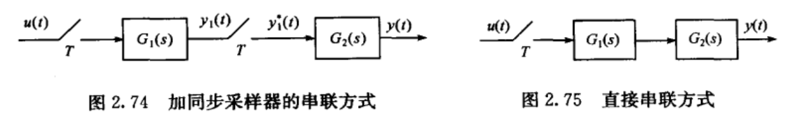

加采样同步器:
$G(z) = G_1(z)G_2(z)$

不加采样同步器:
$G(z) = \mathscr{Z}[\mathscr{L}^{-1}[G_1(s)G_2(s)]] = G_1G_2(z)$

- 并联：求和

- 闭环系统的脉冲传递函数

- 两种情况可用梅森公式

# 3.控制系统的状态空间模型

## 3.1.状态方程和输出方程

- 向量形式 ($\boldsymbol {A_{nn} , B_{nm}, C_{ln}, D_{lm}, x_{n1}, y_{l1}, u_{m1}}$)

$$\begin{cases}
\boldsymbol{\dot x(t) = Ax(t) + Bu(t)} \\
\boldsymbol{\dot y(t) = Cx(t) + Du(t)} \\
\end{cases}$$

- 对同一系统而言，状态选取不唯一，有**n阶可逆矩阵P**， 则 $\boldsymbol{x' = Px}$ 构成新的状态向量
  $$\boldsymbol{A' = PAP^{-1},\qquad B' = PB}$$
  $$\boldsymbol{C' = CP^{-1}, \qquad D' = D}$$

- 状态空间模型方块图：

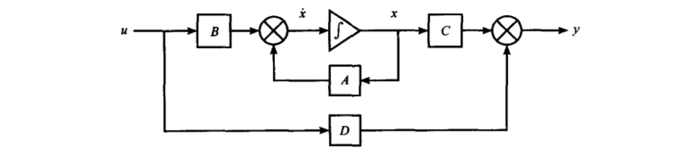

## 3.2. 连续状态空间模型

### 3.2.1. 状态空间模型 => IO模型（传递函数矩阵）

$$\boldsymbol {G(s) = C(sI-A)^{-1}B+D} $$

### 3.2.2. IO模型（传递函数矩阵）=> 状态空间模型

这个过程称之为实现，系统的实现不唯一，最小实现指维数最低的实现。

- **虚拟输出法（能控规范型）**
  
    $$G(s) = d+\dfrac{b_ms^m+...}{a_ns^n+...} \quad (m<n)$$
  
    $$\begin{bmatrix}
    A & B\\\\
    C & D 
  
  \end{bmatrix}
  =
  
    \begin{bmatrix}
    0 & 1 & 0 & \dots\dots & 0  & \quad 0\\
    0 & 0 & 1 & \dots\dots & 0  & \quad 0\\
    \vdots & \vdots & \vdots &  \ddots & \vdots & \quad 0\\
    0 & 0 & 0 & \dots\dots & 1 \\
    -\dfrac{a_0}{a_n} & -\dfrac{a_1}{a_n} & -\dfrac{a_2}{a_n} & \dots\dots & -\dfrac{a_{n-1}}{a_n} & \quad \dfrac1{a_n}\\
    \\
    \\
    b_0 & b_1 & b_2 &...b_m...&0 & \quad d\\
    \end{bmatrix}$$

- **部分分式法**
  
  - 极点互异时(对角线规范型)
    
      $$G(s) = d + \sum_{i=1}^n\dfrac{c_i}{s+p_i}$$
    
      $$\begin{bmatrix}
      A & B\\\\
      C & D 
    
    \end{bmatrix}
    =
    
      \begin{bmatrix}
      -p_i & \dots & 0  & \quad 1  \\
      \vdots &  \ddots & \vdots & \quad \vdots  \\
      0 & \dots & -p_n  & \quad 1  \\
      \\
      c_1 & \dots & c_n & \quad d  \\
    
      \end{bmatrix}$$
  
  - 当极点为2重根时（若尔当规范性）
    
    $$Y(s) = dU(s) + \sum_{i=3}^nc_i\dfrac{U(s)}{s+p_i} + c_{g2} \dfrac{U(s)}{s+p_1}+c_{g1}\dfrac{U(s)}{(s+p_1)^2}$$
    
    $$\begin{bmatrix}
    A & B\\\\
    C & D 
    
    \end{bmatrix}
    =
    
    \begin{bmatrix}
    -p_1 & 1 & 0 & \dots & 0  & \quad 0  \\ 
    0 & -p_1 & 0 & \dots & 0  & \quad 1  \\ 
    0 & 0 & -p_3 & \dots & 0  & \quad 1  \\ 
    \vdots &\vdots &\vdots &\ddots &\vdots &\quad \vdots  \\ 
    0 & 0 & 0 & \dots & -p_n  & \quad 1  \\ 
    \\ 
    c_{g1} & c_{g2} & c_3 & \dots & c_n & \quad d  \\ 
    
    \end{bmatrix}$$

## 3.3.连续状态空间求解(假设D为0)

### 3.3.1.状态转移矩阵

- **状态转移矩阵的性质**
  
    (1) $\boldsymbol{\dot \varphi(t) = A\varphi(t)}$
  
    (2) $\boldsymbol {\varphi(0) = I}$
  
    (3) $\boldsymbol {\varphi(-t) = \varphi^{-1}(t)}$ 系统的状态转移具有双向性。
  
    (4) $\boldsymbol {\varphi(t_2 - t_1) \varphi(t_1 - t_0) = \varphi(t_2-t_0)}$ 
  
    (5) $\boldsymbol {\varphi(t_1 + t_2) = \varphi(t_1) \varphi(t_2)}$ 
  
    (6) $\boldsymbol {\varphi^k(t) = \varphi(kt)}$ 
  
    (7) $\boldsymbol {A \int_0^t \varphi(\tau)d\tau = \varphi(t) - I}$ 

- **状态转移矩阵的计算**
  
    (1) 展开泰勒级数
    (2) 凯莱-哈密顿定理
    (3) 特征值法
  
    (4) 拉普拉斯变换法
  
    $$\boldsymbol\Phi(s) = (s\boldsymbol I - \boldsymbol A)^{-1}$$
  
    $$\boldsymbol \varphi(t) = \mathscr{L^{-1}}[\boldsymbol\Phi(s)] = \mathscr{L^{-1}}[(s\boldsymbol I - \boldsymbol A)^{-1}]$$

### 3.3.2.线性定常系统的全响应

$$\begin{cases}
 \boldsymbol {x(t) = \varphi(t-t_0)x(t_0) + \int_{t_0}^t\varphi(t-\tau)Bu(\tau)d\tau}, \quad t\geq t_0 \\
 \\
 \boldsymbol {y(t) = Cx(t) = C\varphi(t-t_0)x(t_0) + C\int_{t_0}^t\varphi(t-\tau)Bu(\tau)d\tau}, \quad t\geq t_0 
\end{cases}$$

## 3.4.离散状态空间模型

### 3.4.1. 连续状态空间模型=>离散状态空间模型

采样控制系统：
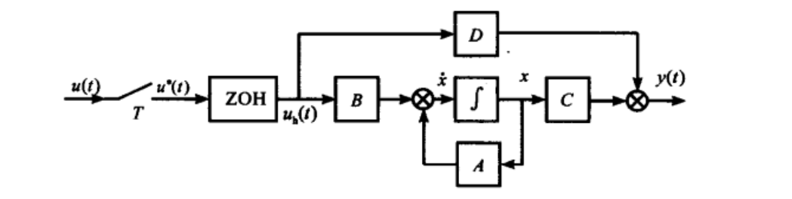

连续部分的状态空间模型：

$$\begin{cases}
\boldsymbol {\dot x = Ax + B}u_h \\
y\boldsymbol { = Cx + D}u_h
\end{cases}$$

离散化：

$$\boldsymbol G = e^{\boldsymbol AT} = \boldsymbol \varphi(T)$$

$$\boldsymbol H = \int_0^T\boldsymbol G(\tau)d\tau \cdot \boldsymbol B= \int_0^T\boldsymbol \varphi(\tau)d\tau \cdot \boldsymbol B= \int_0^T\boldsymbol e^{\boldsymbol A\tau }d\tau \cdot \boldsymbol B$$

离散状态空间模型：

$$\boldsymbol x(k+1) = \boldsymbol{Gx}(k) + \boldsymbol{Hu}(k)$$
$$\boldsymbol y(k) = \boldsymbol{Cx}(k) + \boldsymbol{Du}(k)$$

### 3.4.2. 输入输出模型（脉冲传递函数）=>离散状态空间模型

- **虚拟输出法**
  
    $$G(z) = d+\dfrac{b_mz^m+...}{a_nz^n+...} \quad (m<n)$$
  
    $$\begin{bmatrix}
    G & H\\\\
    C & D 
  
  \end{bmatrix}
  =
  
    \begin{bmatrix}
    0 & 1 & 0 & \dots\dots & 0  & \quad 0\\
    0 & 0 & 1 & \dots\dots & 0  & \quad 0\\
    \vdots & \vdots & \vdots &  \ddots & \vdots & \quad 0\\
    0 & 0 & 0 & \dots\dots & 1 \\
    -\dfrac{a_0}{a_n} & -\dfrac{a_1}{a_n} & -\dfrac{a_2}{a_n} & \dots\dots & -\dfrac{a_{n-1}}{a_n} & \quad \dfrac1{a_n}\\
    \\
    \\
    b_0 & b_1 & b_2 &...b_m...&0 & \quad d\\
    \end{bmatrix}$$

## 3.5. 离散状态空间求解

### 3.5.1. 离散系统的状态转移矩阵

- $\boldsymbol G(k)$ 求解：$\boldsymbol G(k) = \boldsymbol G^k = \mathscr{L^{-1}}\boldsymbol [(z\boldsymbol{I-G})^{-1}z\boldsymbol]$

- $\boldsymbol G(k) 的三个性质$
  
    (1) $\boldsymbol G(0) = \boldsymbol I$
  
    (2) $\boldsymbol G^{-1}(k) = \boldsymbol G(-k)$
  
    (2) $\boldsymbol G(k-h) = \boldsymbol G(k-l)\boldsymbol G(l-h)$

### 3.5.2. 求解线性离散系统

- **Z变换法**

$$\boldsymbol x(k) = \mathscr{Z^{-1}}[(z\boldsymbol{I-G})^{-1}z]\boldsymbol x(0) + \mathscr{Z^{-1}}[(z\boldsymbol{I-G})^{-1}\boldsymbol{HU}(z)]$$

$$\boldsymbol y(k) = \boldsymbol{Cx}(k) + \boldsymbol{Du}(k)$$

- **迭代法**
  
    $\boldsymbol G(k)$ 为离散系统的状态转移矩阵

$$\boldsymbol x(k) = \boldsymbol G(k) \boldsymbol x(0) + \sum_{i=0}^{k-1}\boldsymbol G(k-i-1)\boldsymbol {Hu}(i), \quad  k = 0,1,2...$$

$$\boldsymbol y(k) = \boldsymbol{Cx}(k) + \boldsymbol{Du}(k)$$

# 4.控制系统的稳定性分析

介绍一下反馈控制:  

## 4.1.李雅普诺夫稳定性的概念

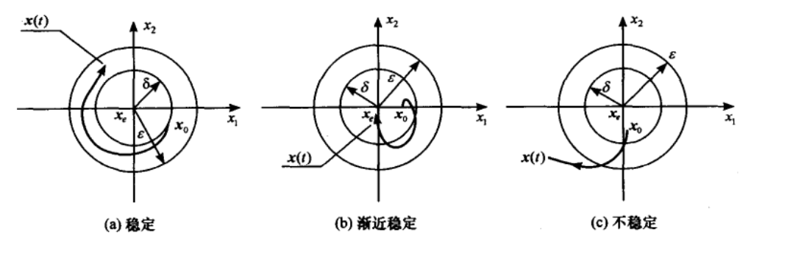

## 4.2.线性定常系统稳定的充要条件

内部渐进稳定的=>输入输出稳定

反之,不一定

当没有极点对消时, 输入输出稳定性<=>内部稳定性

- **连续系统内部渐进稳定**：系数矩阵 $\boldsymbol A$ 的特征值全都复平面的左半平面，不包括虚轴
  
    若系数矩阵 $\boldsymbol A$ 存在实部为零的单重特征值，其动态响应分量会随着时间的增长而趋于常数或等幅振荡，系统李雅普诺夫稳定的。

- **离散系统内部渐进稳定**：系数矩阵 $\boldsymbol G$ 的特征值全都位于Z平面以原点为中心的单位圆

- **连续线性定常系统 I/O 稳定**: 传递函数的极点位于复平面的左半平面

- **离散线性定常系统 I/O 稳定**: 脉冲传递函数的极点位于Z平面以原点为中心的单位圆内

## 4.3.系统稳定性的代数判据

- **连续系统**： 劳斯判据

- **离散系统**： 朱利判据、双线性变换

## 4.4.根轨迹

根据开环传递函数零极点

### 4.4.1.两个根本约束条件：幅值条件和相角条件

$$W(s) = \dfrac{G(s)}{1+G_0(s)}$$

$$G_0(s) = K_g\dfrac{\Pi_{i=1}^m(s+z_i)}{\Pi_{j=1}^n(s+p_i)} = -1$$

$$\to \begin{cases}

|G_0(s)| = 1 \\ 

\angle{G_0(s)} = \pm \pi(2k+1)，\quad k=0,1,2,...

\end{cases}$$

### 4.4.2.根轨迹绘制规则

现有n个开环极点，m个开环零点

1. 起点：开环极点
   
    终点：开环零点或无穷远处

2. 对称于实轴

3. 实轴上根轨迹相间隔

4. 根之和：$n-m \geq 2$ 时，闭环根之和为常数，等于开环根之和。

5. 系统有两个开环极点，一个开环零点，复平面存在根轨迹，则复平面的根轨迹一定是以该零点为圆心的圆弧

6. 渐近线：

$$\theta = \dfrac{2k+1}{n-m} \pi, \quad k=0,1,...n-m-1$$

$$\sigma = \dfrac{\sum_{j=1}^np_j - \sum_{i=1}^nz_i}{n-m}$$

7. 分离点，汇合点：
    $\sum_{i=1}^n\dfrac1{d-p_i} = \sum_{j=1}^m\dfrac1{d-z_j}$
   
    分离角：$\theta_d = \dfrac{\pi}{k}, k$ 为相分离的根轨迹支数

8. 出射角与入射角：用相角条件

9. 与虚轴交点：$s = j\omega$ 是根的点，代入特征方程

## 4.5.奈奎斯特稳定性判据

$$Z = P-2N$$

$Z:$ 右半S平面中闭环极点个数

$P:$ 右半S平面中开环极点个数

$N: G(j\omega)$ 包围 $(-1, j0)$ 的圈数，逆正顺负。 

- 伯德图中的表现：
    $N = N^+ - N^-$
  
    在对数幅频曲线大于0dB的范围，相频曲线穿越-180° (从下向上为正，从上向下为负)

### 4.5.1. 稳定裕度

相角裕度：$\gamma = 180°+\angle G(j\omega)$

幅值裕度：$h = \dfrac1{|G(j\omega)|} = \dfrac1A = exp{\dfrac{L_g}{20}}$

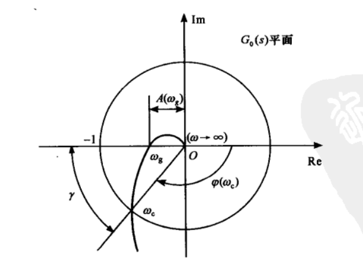
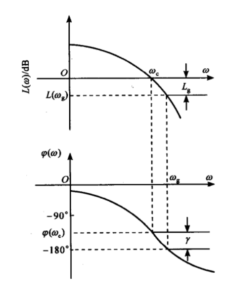

## 4.6. 李雅普诺夫第二法

充分条件，常取 $v = x_1^2 + x_2^2$

- $\boldsymbol {v(x)}$正定
  
    $\boldsymbol {\dot v(x)}$ 负定

- $v$正定

- $\boldsymbol {v(x)}$正定
  
    $\boldsymbol {\dot v(x)}$ 半负定
  
    $\boldsymbol {\dot v(x)}$ 不恒为 0

# 5.控制系统的时域运动分析

## 5.1.时域响应求解

### 5.1.1.连续系统

- 零初始

$$c(t) = \mathscr{L^{-1}}[W(s)R(s)]$$

- 非零初始
  
    (1) 微分方程的通常解法
  
    (2) 运动方程两端拉氏变换,求出响应,再反变换

### 5.1.2.离散系统

- Z变换法 

## 5.2.瞬态性能指标

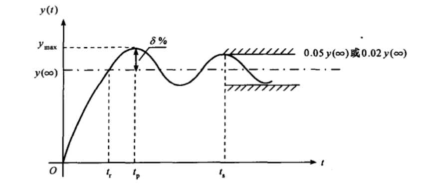

- 上升时间 $t_\tau$

- 峰值时间 $t_p$

- (最大)超调量 $\delta\% = \dfrac{y_{max} - y(\infty)}{y(\infty)} \cdot 100\%$

- 调节时间 / 过渡时间 $t_s$

- 振荡次数 $N$

## 5.3.一阶系统瞬态性能

### 5.3.1.极点分布

- **开环传递函数：**  $W(s) = \dfrac1{Ts}$

- **闭环传递函数：**  $W(s) = \dfrac1{Ts+1}$

### 5.3.2.阶跃响应

- **阶跃响应：** 

$$c(t) = 1-e^{-\tfrac{t}{T}}, \quad t\geq0$$

$$t_s = \begin{cases}
4T, \quad \Delta = 2 \\
3T, \quad \Delta = 5 \\
\end{cases}$$

## 5.4.二阶系统瞬态性能

### 5.4.1.极点分布

- **开环传递函数：** $W(s) = \dfrac{K}{s(Ts+1)}$

- **闭环传递函数：** $W(s) = \dfrac{K}{s(Ts+1)+K}$

- **闭环传递函数：** $W(s) = \dfrac{\omega_n^2}{s^2+ 2\zeta \omega_n s + \omega_n^2}$
  
    $\zeta$ 为阻尼比， $\omega_n$ 称为无阻尼振荡频率或自然频率
  
    $\omega_n = \sqrt{\dfrac KT}, \qquad$
    $\zeta = \dfrac 1{2\sqrt{KT}}$

- **特征方程：** $s^2+ 2\zeta \omega_n s + \omega_n^2 = 0$

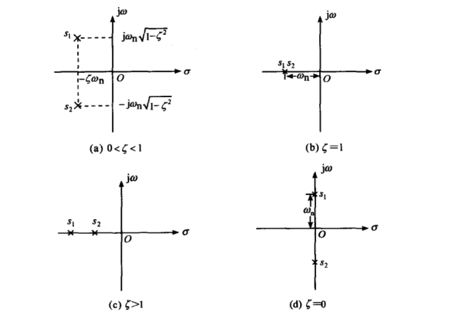

### 5.4.2. 阶跃响应

---

- **欠阻尼**
  
    一般情况下,希望阻尼比再0.4-0.8之间, 0.707是最佳阻尼系数
  
    $c(t) = 1-\dfrac{e^{-\zeta \omega_n t}}{\sqrt{1-\zeta^2}}sin(\omega_dt + \varphi), \quad t\geq 0$
  
    $\varphi = arctan\dfrac{\sqrt{1-\zeta^2}}{\zeta}$
  
    阻尼振荡频率: $\omega_d = \omega_n \sqrt{1-\zeta^2}$
  
    衰减震荡周期: $T_d = \dfrac{2\pi}{\omega_d} = \dfrac{2\pi}{\omega_n \sqrt{1-\zeta^2}}$
  
    $N = \dfrac{t_s}{T_d}$
  
    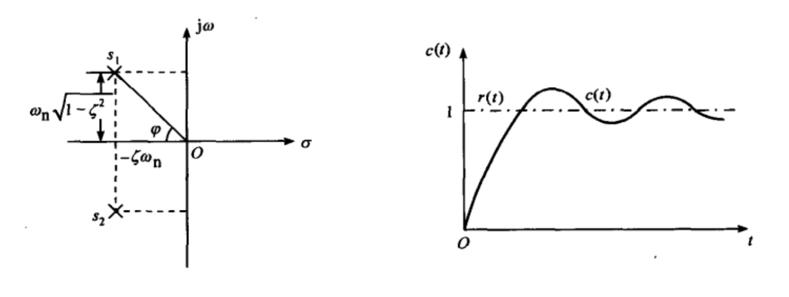
  
    $t_r = \dfrac{\pi-\varphi}{\omega_d}$
  
    $t_p = \dfrac{\pi}{\omega_d}$
  
    $\boldsymbol{\delta\% = e^{-\frac{\zeta \pi}{\sqrt{1-\zeta^2}}}\cdot100\%}$

$$\boldsymbol{包络线近似:\begin{cases}

t_s \approx \dfrac4{\zeta \omega_n}, \quad \Delta = 2 \\
\\
t_s \approx \dfrac3{\zeta \omega_n}, \quad \Delta = 5 \\

\end{cases}}$$

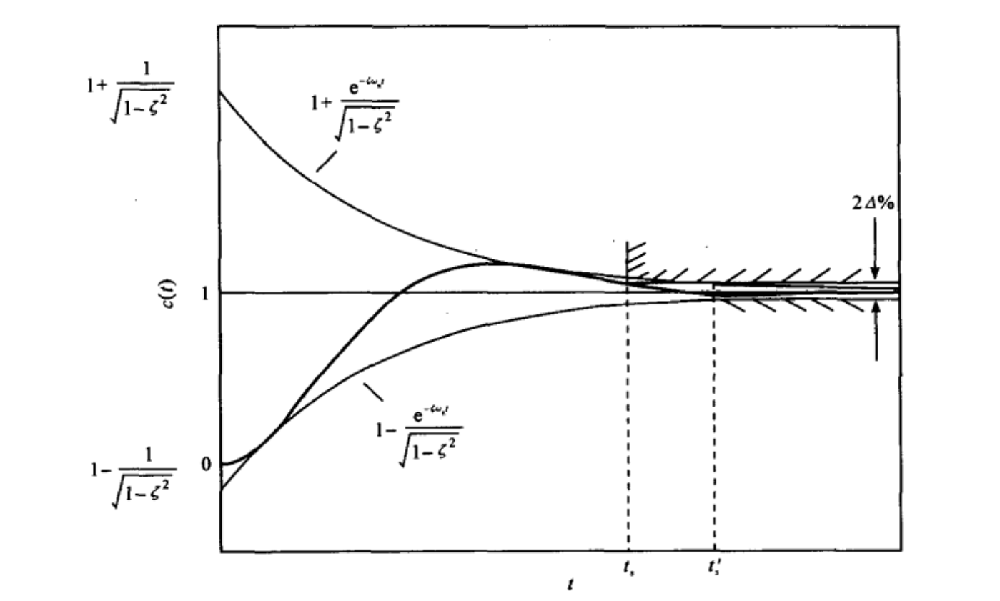

---

- **无阻尼**
  
    欠阻尼的一种特殊情况
  
    $$c(t) = 1-cos\omega_n t, \quad t\geq0$$

---

- **临界阻尼**
  
    $$c(t) = 1-(\omega_nt+1)e^{-\omega_nt}, \quad t\geq0$$

---

- **过阻尼**
  
    $$c(t) = 1+\dfrac{\omega_n}{2\sqrt{\zeta^2-1}}(\dfrac{e^{s_1t}}{-s_1}-\dfrac{e^{s_2t}}{-s_2}), \quad t\geq0$$
  
    近似一阶:
  
    $$c(t) = 1-e^{-(\zeta-\sqrt{\zeta^2-1})\omega_nt}, \quad t\geq0$$

---

### 5.4.3. 二阶系统性能改善

- **KT对性能的影响**
  
    根据公式关系推导

- **附加 速度反馈**
  
    实质：加入微分器，增加系统阻尼
  
    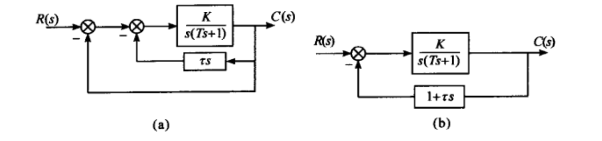
  
    $W(s) = \dfrac{\omega_{n1}^2}{s^2+ 2\zeta_1 \omega_{n1} s + \omega_{n1}^2}$
  
    $\omega_{n1} = \sqrt{\dfrac KT} \qquad$
    $\zeta_1 = \dfrac {1+K\tau}{2\sqrt{KT}}$

- **比例-微分控制** 
  
    实质：附加了零点。是一种超前控制
  
    不改变系统的自然频率，可以增加阻尼比
    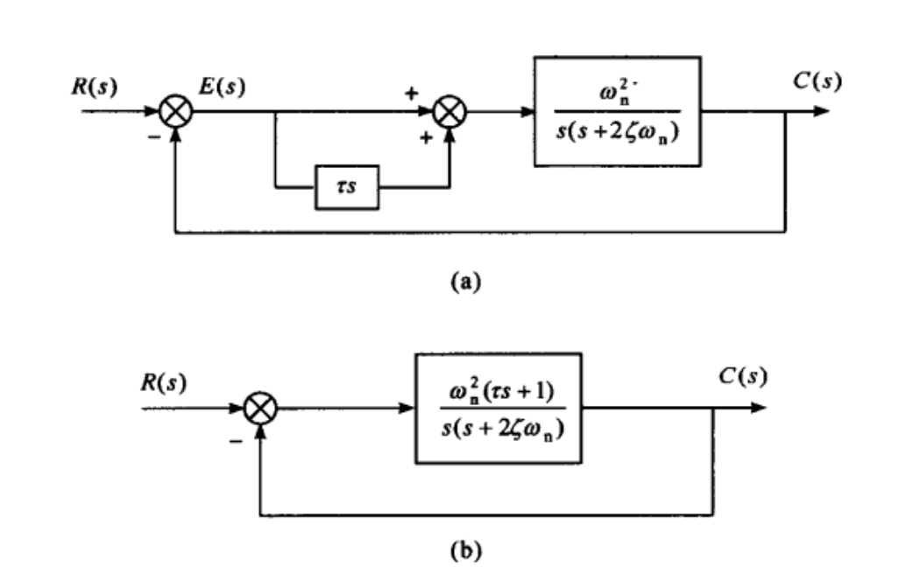

## 5.5 高阶系统

标出所有闭环极点，零点， 注意零极点对消情况。

如果：

1. 其他闭环极点与虚轴之间的距离远大于一对共轭极点(5倍)

2. 这一对共轭极点周围没有零点

可以近似为二阶系统

## 5.6.稳态误差分析

- 定义法 
  
    求出误差传递函数，终值定理

- 查表法
  
  - 连续系统
    
    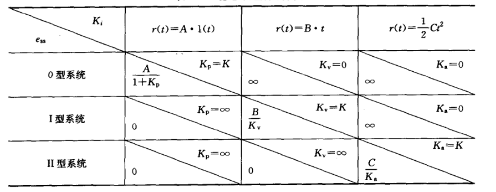
  
  - 离散系统
    $$k_p = \lim_{z\to1}G_o(z)$$
    $$k_v = \dfrac1T\lim_{z\to1}(z-1)G_o(z)$$
    $$k_a = \dfrac1{T^2}\lim_{z\to1}(z-1)^{2}G_o(z)$$

- 减少稳态误差的措施
1. 增加开环增益

2. 扰动前的前向通道的增益

3. 前向通道或主反馈通道增加积分环节

# 7. 校正

给定指标，选择校正方法

## 7.1 附加零极点对系统性能的影响

### 开环零极点

影响根轨迹形状，影响闭环极点位置

- 开环零点：
  根轨迹左移，有利于动态性能指标

- 开环极点：
  根轨迹右移，不利于动态性能指标

### 闭环零极点

- 闭环零点：
  超调量增加，峰值时间靠前

- 闭环极点：
  超调量减少，峰值时间靠后

### 原点附近开环偶极子

对动态性能几乎无影响，可提高系统开环增益，改善静态特性

## 7.2.根轨迹校正

1. 根据动态性能指标确定主导极点的位置

2. 绘制未校正系统的根轨迹，若希望的主导极点位置不在根轨迹上（不满足相角条件），需要增加校正装置。

3. 校正后的根轨迹通过希望的主导极点时，检验开环比例系数是否满足静态性要求。

4. 若不满足，在原点附近增加开环偶极子，调节开环比例系数。

---

# 附录

## 拉氏变换几个重要定理

| 性质    | 时域                              | 频域                                              |
| ----- | ------------------------------- | ----------------------------------------------- |
| 线性性质  | $af_1(t) \pm bf_2(t)$           | $aF_1(s) \pm bF_2(s)$                           |
| 微分定理  | $f'(t)$                         | $s{\cdot}F(s)-f(0^-)$                           |
| 微分定理  | $f^{(n)}(t)$                    | $s^{n}F(s)-\sum_{i=0}^{n-1}s^{n-1-i}f^{(i)}(0)$ |
| 积分定理  | $\int_{0^-}^t f(\xi)d\xi$       | $\dfrac1s F(s)$                                 |
| 实位移定理 | $f(t-\tau_0)$                   | $e^{-s\tau_0}F(s)$                              |
| 复位移定理 | $e^{At}f(t)$                    | $F(s-A)$                                        |
| 初值定理  | $f(0) = \lim_{s\to\infty}sF(s)$ |                                                 |
| 终值定理  | $f(\infty) = \lim_{s\to0}sF(s)$ | 终值确定存在时才能用                                      |

## Z变换几个重要定理

| 性质   | $x(k)$                              | $X(z)$                                    |
| ---- | ----------------------------------- | ----------------------------------------- |
| 线性性质 | $ax_1(t) \pm bx_2(t)$               | $aX_1(z) \pm bX_2(z)$                     |
| 位移定理 | $x(k+n)$                            | $z^nX(z)-\sum_{i=0}^{n-1}z^{n-1}x(i)$     |
| 位移定理 | $x(k-n)$                            | $z^{-n}X(z)+\sum_{i=0}^{n-1}z^{-i}x(i-n)$ |
| 初值定理 | $x(0)= \lim_{z\to\infty}X(z)$       |                                           |
| 终值定理 | $x(\infty) = \lim_{z\to1}(z-1)X(z)$ | 终值确定存在时才能用                                |

## 常见函数拉氏变换和Z变换

| $x(t)$          | $X(s)$                         | $x(k)$                | $X(z)$                       |
| --------------- | ------------------------------ | --------------------- | ---------------------------- |
| $\delta(t)$     | $1$                            | $\delta(k)$           | $1$                          |
| $1(t)$          | $\dfrac1s$                     | $x(k)=1\\ k=0,1,2...$ | $\dfrac z{z-1}$              |
| $t$             | $\dfrac1{s^2}$                 | $kT$                  | $\dfrac{Tz}{(z-1)^2}$        |
| $t^2$           | $\dfrac2{s^3}$                 | $(kT)^2$              | $\dfrac{T^2z(z+1)}{(z-1)^3}$ |
| -               | -                              | $a^k$                 | $\dfrac z{z-a}$              |
| -               | -                              | $ka^k$                | $\dfrac {az}{(z-a)^2}$       |
| $e^{-at}$       | $\dfrac1{s+a}$                 | $e^{-akT}$            |                              |
| $te^{-at}$      | $\dfrac1{(s+a)^2}$             | $kTe^{-akT}$          |                              |
| $sin(\omega t)$ | $\dfrac{\omega}{s^2+\omega^2}$ | $sin(\omega kT)$      |                              |
| $cos(\omega t)$ | $\dfrac{s}{s^2+\omega^2}$      | $cos(\omega kT)$      |                              |

## 典型环节传递函数和频率特性

|        | 传递函数                                                  | 频率特性                                                                                                                                                                                     |
| ------ | ----------------------------------------------------- | ---------------------------------------------------------------------------------------------------------------------------------------------------------------------------------------- |
| 放大环节   | $K$                                                   | $A = k \quad \varphi = 0$                                                                                                                                                                |
| 惯性环节   | $\dfrac1{Ts+1}$                                       | $A = \dfrac1{\sqrt{1+\omega^2 T^2}} \quad \varphi = -arctan(\omega T)$                                                                                                                   |
| 振荡环节   | $\dfrac{\omega_n^2}{s^2+2\zeta\omega_ns +\omega_n^2}$ | $A = \dfrac1{\sqrt{[1-(\dfrac{\omega}{\omega_n})^2]^2+(2\zeta \dfrac{\omega}{\omega_n})^2}} \\ \varphi = -arctan\dfrac{1-(\dfrac{\omega}{\omega_n})^2}{2\zeta \dfrac{\omega}{\omega_n}}$ |
| 积分环节   | $\dfrac1s$                                            | $A = \dfrac1{\omega} \quad \varphi = -90$                                                                                                                                                |
| 微分环节   | $s$                                                   | $A = \omega \quad \varphi = 90$                                                                                                                                                          |
| 延时环节   | $e^{-\tau s}$                                         | $A=1 \quad \varphi = -\omega \tau$                                                                                                                                                       |
| 一阶微分环节 | $Ts+1$                                                | $A = \sqrt{\omega^2T^2+1} \quad \varphi = arctan\omega T$                                                                                                                                |
| 二阶微分环节 | $s^2+2\zeta \omega_ns+\omega_n^2$                     | $A = {\sqrt{[1-(\dfrac{\omega}{\omega_n})^2]^2+(2\zeta \dfrac{\omega}{\omega_n})^2}} \\ \varphi = arctan\dfrac{1-(\dfrac{\omega}{\omega_n})^2}{2\zeta \dfrac{\omega}{\omega_n}}$         |
