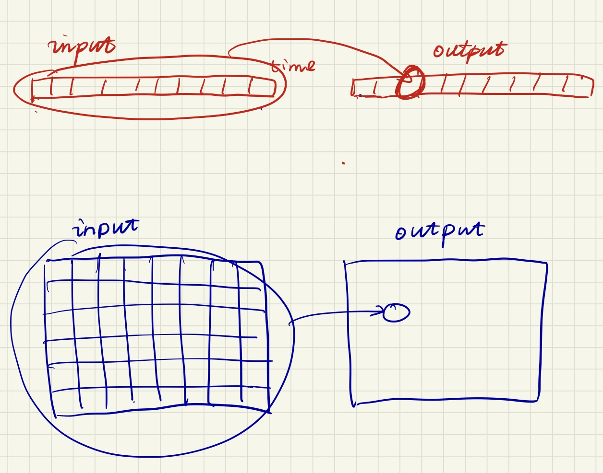

# 卷积定义

$$(f*g)(x) = \int_{-\infty}^{+\infty}f(\tau)g(x-\tau)d\tau$$

卷积理解为加权积分，一个输出和多个输入有关，这些输入对输出的贡献程度不同。

$f$ 是被积函数（系统输入）

$g$ 是满足一定约束条件的权重函数（反应系统的结构参数）, 其自变量为**某种距离**，如时间距离，或坐标距离。

卷积的运算过程：翻转平移 $\to$ 加权积分 $\to$ 滑动 $\to$ 加权积分 $\to$ 滑动 $\to \cdots$ 

- 由于权重函数需要满足一定约束条件，需要将 $g$ 进行翻转和平移

- 将 $x$ 看做常数，求积分

- 卷积后的结果为关于 $x$ 的函数，随着 $x$ 的增加，表现为 $g$ 函数在图像上滑动

数学定义的积分范围是无穷区间，但由于应用对象的不同，可以简化为有限区间内的积分。

# 卷积应用

## 在信号分析中

$$(f*g)(T) = \int_{0}^{T}f(\tau)g(T-\tau)d\tau$$

- 本质：对不同时刻的输入所引起的响应进行加权积分。

- $f(\tau)$ 是 $\tau$ 时刻系统的输入信号

- $g(t)$ 是系统的单位冲激响应，反映了系统的结构参数

- $f(\tau)g(T-\tau)$：$\tau$ 时刻的输入对 $T$ 时刻输出的影响

- 将 $g$ 函数进行翻转平移的原因：$\tau$ 时刻系统的输入，经历了时间：$T-\tau$ ，影响到了输出 $T$ 时刻的状态。也就是单位冲激响应时间上经历了 $T-\tau$ 的衰减，表现在卷积公式上就是 $g$ 函数满足 **时间距离** 上的约束。
  
    蓝色图像为翻转后的单位冲激响应：
  
    

- 将 $g$ 函数进行滑动的原因： $T$ 的增长
  
    滑动过程：
  
    

- 积分区间简化：
  
  - 由于因果系统在一个时刻的响应只与该时刻以前的输入有关，当 $\tau>T$ 时，$g(T-\tau) = 0$ , 所以积分上限可改为 $T$。
  
  - 人为规定在零时刻以前没有输入，当 $\tau < 0$ 时，$f(\tau) = 0$， 所以积分下限可改为 $0$

### 证明动态电路卷积定理

**已知：** $h(t)$为单位冲激响应，$e(t)$为任意激励。

**零状态响应：** $c(T) = \int_{t_0}^Te(T-\tau)h(\tau)d\tau$

**证明：**

- 前提：电路系统满足 **线性原理** 和 **叠加原理** 。

- 假设 $e(t)$ 从 $t_0$ 时刻开始作用，要求 $T$ 时刻零状态响应。

- 将 $e(t)$ 分割为数个长条，每个长条宽度为$\Delta t$ 。
    

- 改写激励函数，用阶梯函数 $e(\zeta)$ 近似代表原激励函数
  
    $e(\zeta) = \sum_{k=0}^{n-1}e(t_k)\delta(\zeta-t_k)\Delta t$
  
    当 $\zeta = t_0$ 时，
  
    $e(\zeta) = e(t_0) = e(t_0)\delta(t_0 - t_0)\Delta t$
  
    其他项由于冲激函数的存在，全部变成了零。

- 一个矩形脉冲下的零状态响应：
  
    激励在 $t_k$ 时刻开始作用, 到 $T$ 时刻, 经历了 $T-t_k$
  
    激励： $e(t_k) = e(t_k)\delta(t_k - t_k)\Delta t$
  
    $T$ 时刻对应的冲激响应： $c_k(T) = e(t_k)\Delta t \cdot h(T-t_k)$

- 所有矩形脉冲下的零状态响应：
  
    $T$ 时刻对应的冲激响应： $c(T) = \sum_{k=0}^{n-1}e(t_k)\Delta t \cdot h(T-t_k)$

- $\Delta t$ 取无穷小，**求和** 变为 **积分**
  
    $t_k$ 的范围是 $k=0 \to n-1$
  
    令 $\tau = t_k$
  
    $\tau$ 的范围是 $\tau=t_0 \to t_{n-1}(T)$
  
    $T$ 时刻对应的冲激响应： $c(T) = \int_{t_0}^{T} e(\tau) h(T-\tau) d\tau$
  
    定积分换元后：
  
    $c(T) = \int_{t_0}^{T} e(T - \tau) h(\tau) d\tau$

## 在图像处理中

离散形式的二维卷积：

$$(f*g)(x,y) = \sum_{i=-\infty}^{+\infty}\sum_{j=-\infty}^{+\infty}f(i,j)g(x-i,y-j)$$

一维与二维：

图像处理中的卷积：

- 本质：二维卷积，对所有的像素点进行加权求和。

- $f(i,j)$ 是原图像在 $(i, j)$ 点的像素值

- $g(u,v)$ 输入图像的一个像素点（单位值）对输出图像的一个像素点的影响，不同于信号分析（一维卷积）中 $g$, 这里的权重不随时间变化，而是随着两个像素点之间的坐标距离变化。这个函数包含了对原图像处理的目的（系统的结构参数），如锐化或模糊，不同的目的有不同的 $g$ 。

- $f(i, j)g(x-i,y-j)$：原图坐标为 $(i, j)$ 的像素点对时刻的输入对输出图像坐标为 $(x,y)$ 的像素点的影响

- 将 $g$ 函数进行翻转平移的原因：类似于一维卷积， $(i,j)$ 点的输入，经历了距离：$(x-i, y-j)$ ，影响到了输出 $(x,y)$ 点的状态。表现在卷积公式上就是 $g$ 函数满足 **坐标距离** 上的约束。

- 将 $g$ 函数进行滑动的原因： $(x,y)$ 的增长

- 求和区间简化： 图像是有界的，所以求和的上下限变为图形的界限

- $g$ 的简化：在一定范围内有权值，大于一定范围（比如3\*3, 5\*5）权值为0，这样可以把原本很大的权值函数简化为小的卷积核。

简化后的公式，（ $g$ 在一定范围内有权值 ）：

$$(f*g)(x,y) = \sum_{i=0}^{width}\sum_{j=0}^{height}f(i,j)g(x-i,y-j)$$

等效变换（ 3\*3 ）:

$$ output(x,y) = \sum_{i=-1}^{1}\sum_{j=-1}^{1}f(x-i,x-j)g(i,j)$$

滑动过程：

参考知乎：如何通俗易懂地理解卷积？ palet和1335的回答：https://www.zhihu.com/question/22298352
