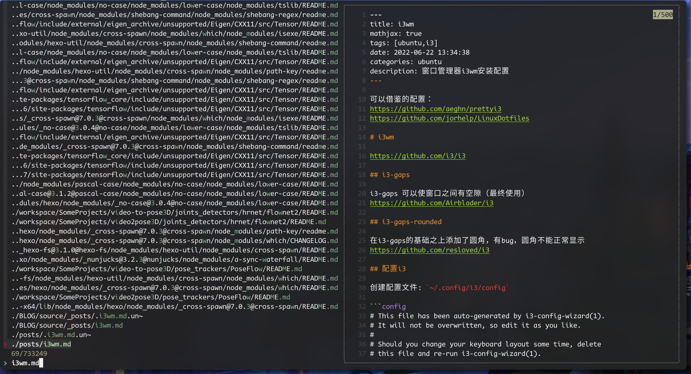

# 安装 fzf


https://github.com/junegunn/fzf#preview-window


# 更改 `\` 为触发器

`~/.zshrc` 中添加：

```
export FZF_COMPLETION_TRIGGER='\'
```

# 预览功能

## 安装bat
https://github.com/sharkdp/bat

## 添加配置
`~/.zshrc` 中添加：
```
export FZF_DEFAULT_OPTS='--preview "bat --style=numbers --color=always --line-range :500 {}"'
```



# 搜索隐藏文件

## 安装fd
https://github.com/sharkdp/fd

## 添加配置

`~/.zshrc` 中添加：

```
export FZF_DEFAULT_COMMAND='fd --type f --hidden --follow --exclude .git'
```

