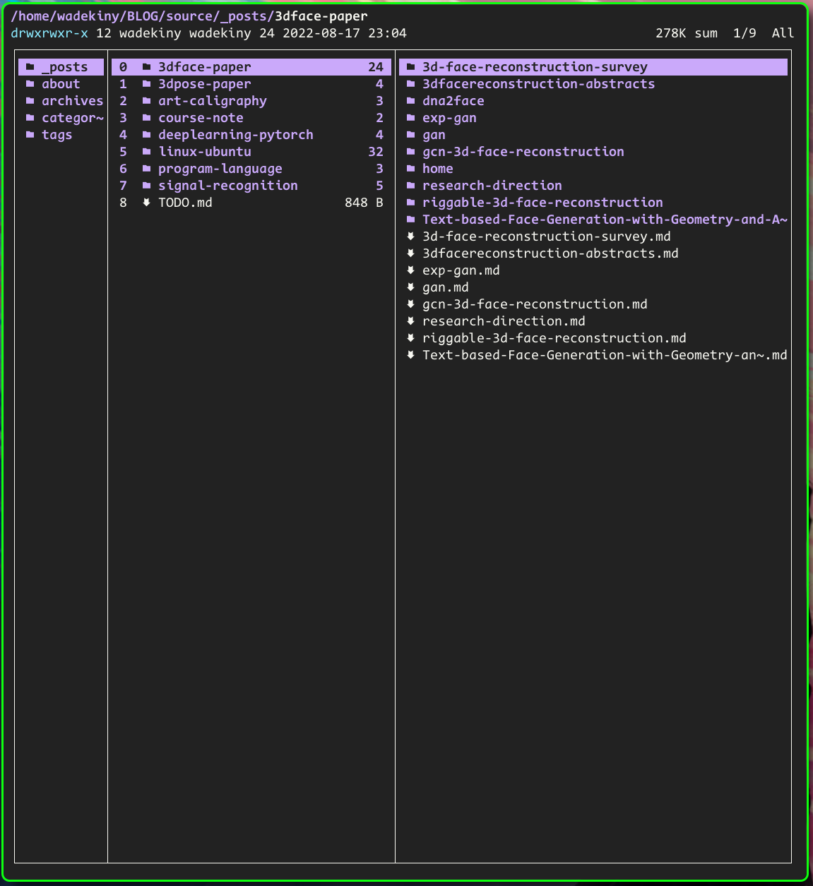
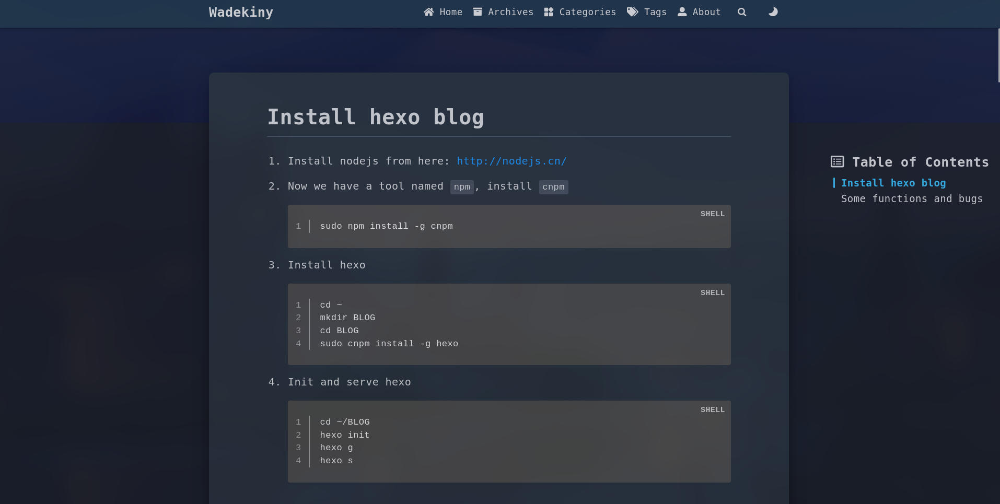
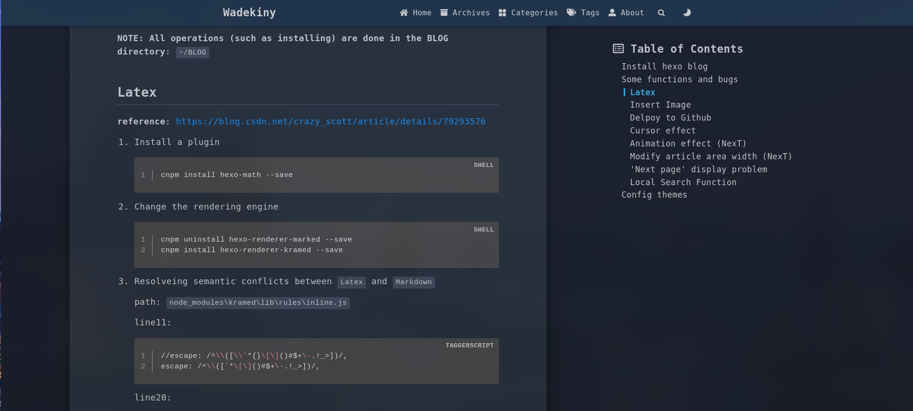

# Install hexo blog

1. Install nodejs from here: http://nodejs.cn/

2. Now we have a tool named `npm`, install `cnpm`
   
   ```shell
   sudo npm install -g cnpm
   ```

3. Install hexo
   
   ```shell
   cd ~
   mkdir BLOG
   cd BLOG
   sudo cnpm install -g hexo
   ```

4. Init and serve hexo
   
   ```shell
   cd ~/BLOG
   hexo init 
   hexo g
   hexo s
   ```

# Some functions and bugs

**NOTE: All operations (such as installing) are done in the BLOG directory**: `~/BLOG`

## Multi folder in '_post'


## Latex

**reference**: https://blog.csdn.net/crazy_scott/article/details/79293576

1. Install a plugin
   
   ```shell
   cnpm install hexo-math --save
   ```

2. Change the rendering engine
   
   ```shell
   cnpm uninstall hexo-renderer-marked --save
   cnpm install hexo-renderer-kramed --save
   ```

3. Resolveing semantic conflicts between `Latex` and `Markdown`
   
    path: `node_modules\kramed\lib\rules\inline.js`
   
    line11:
   
   ```
   //escape: /^\\([\\`*{}\[\]()#$+\-.!_>])/,
   escape: /^\\([`*\[\]()#$+\-.!_>])/,
   ```
   
    line20:
   
   ```
   //em: /^\b_((?:__|[\s\S])+?)_\b|^\*((?:\*\*|[\s\S])+?)\*(?!\*)/,
   em: /^\*((?:\*\*|[\s\S])+?)\*(?!\*)/,
   ```

4. Edit config file
   
    Edit **theme's** `_congfig.yml`, modify or append it:
   
   ```
   # MathJax Support
   mathjax:
   enable: true
   per_page: true
   #cdn: //cdn.bootcss.com/mathjax/2.7.1/latest.js?config=TeX-AMS-MML_HTMLorMML
   cdn: //cdnjs.cloudflare.com/ajax/libs/mathjax/2.7.1/MathJax.js?config=TeX-AMS-MML_HTMLorMML
   ```
   
    In addition: I have append a piece of code in `~/BLOG/_config.yml`, it may be useful
   
   ```
   # MathJax Support
   mathjax:
   enable: true
   per_page: true
   ```

5. Write an article
   
    remember to set `true` in the front-matter
   
    for example:
   
   ```
   ---
   title: hexo-blog
   date: 2021-04-13 18:50:33
   tags: [hexo]
   mathjax: true
   ---
   ```

## Insert Image

**reference**: https://www.jianshu.com/p/f72aaad7b852

1. Install a plugin

```
cnpm install hexo-asset-image --save
```

2. Edit config file
   
    Modify **hexo's** `_config.yml` 
   
    set `post_asset_folder` to `true`

3. Modify a piece of code
   
    path: `node_modules/hexo-asset-image/index.js`
   
    Replace the content with the following code
   
   ```javas
   'use strict';
   var cheerio = require('cheerio');
   
   // http://stackoverflow.com/questions/14480345/how-to-get-the-nth-occurrence-in-a-string
   function getPosition(str, m, i) {
     return str.split(m, i).join(m).length;
   }
   
   var version = String(hexo.version).split('.');
   hexo.extend.filter.register('after_post_render', function(data){
     var config = hexo.config;
     if(config.post_asset_folder){
           var link = data.permalink;
       if(version.length > 0 && Number(version[0]) == 3)
          var beginPos = getPosition(link, '/', 1) + 1;
       else
          var beginPos = getPosition(link, '/', 3) + 1;
       // In hexo 3.1.1, the permalink of "about" page is like ".../about/index.html".
       var endPos = link.lastIndexOf('/') + 1;
       link = link.substring(beginPos, endPos);
   
       var toprocess = ['excerpt', 'more', 'content'];
       for(var i = 0; i < toprocess.length; i++){
         var key = toprocess[i];
   
         var $ = cheerio.load(data[key], {
           ignoreWhitespace: false,
           xmlMode: false,
           lowerCaseTags: false,
           decodeEntities: false
         });
   
         $('img').each(function(){
           if ($(this).attr('src')){
               // For windows style path, we replace '\' to '/'.
               var src = $(this).attr('src').replace('\\', '/');
               if(!/http[s]*.*|\/\/.*/.test(src) &&
                  !/^\s*\//.test(src)) {
                 // For "about" page, the first part of "src" can't be removed.
                 // In addition, to support multi-level local directory.
                 var linkArray = link.split('/').filter(function(elem){
                   return elem != '';
                 });
                 var srcArray = src.split('/').filter(function(elem){
                   return elem != '' && elem != '.';
                 });
                 if(srcArray.length > 1)
                   srcArray.shift();
                 src = srcArray.join('/');
                 $(this).attr('src', config.root + link + src);
                 console.info&&console.info("update link as:-->"+config.root + link + src);
               }
           }else{
               console.info&&console.info("no src attr, skipped...");
               console.info&&console.info($(this));
           }
         });
         data[key] = $.html();
       }
     }
   });
   ```

## Delpoy to Github

**reference**: https://www.jianshu.com/p/e70b4ca63115

1. Create a repository: `username.github.io`

2. Modify the config file
   
    **hexo's** `_config.yml`, append this piece of code:
   
   ```
   deploy:
       type: git
       #repo: https://gitee.com/wadekiny/wadekiny.gitee.io.git
       repo: https://github.com/wadekiny/wadekiny.github.io.git
       branch: master
   ```

3. Install a plugin
   
   ```
   cnpm install hexo-deployer-git --save
   ```

4. Config git (username and email)

5. Run it
   
   ```
   hexo d
   ```

## Cursor effect

**reference**: https://blog.csdn.net/qq_42889280/article/details/103087564

In order to improve the response speed without using it.

## Animation effect (NexT)

In order to improve the response speed without using it.

Modify **NexT's** `_config.yml`

```
motion:
    enable: false
```

## Modify article area width (NexT)

**reference**: https://blog.csdn.net/csdnSR/article/details/78300820

Append to `~/BLOG/themes/next/source/css/_schemes/Pisces/_layout.styl`

```
header{ width: 90% !important; }
header.post-header {
  width: auto !important;
}
.container .main-inner { width: 90%; }
.content-wrap { width: calc(100% - 260px); }

.header {
  +tablet() {
    width: auto !important;
  }
  +mobile() {
    width: auto !important;
  }
}

.container .main-inner {
  +tablet() {
    width: auto !important;
  }
  +mobile() {
    width: auto !important;
  }
}

.content-wrap {
  +tablet() {
    width: 100% !important;
  }
  +mobile() {
    width: 100% !important;
  }
}
```

## 'Next page' display problem

Modify `~/BLOG/themes/next/layout/_partials/pagination.swig`

Change to:

```

  <nav class="pagination">
    {{
      paginator({
        prev_text: '<',
        next_text: '>',
        mid_size: 1
      })
    }}
  </nav>

```

## Local Search Function

1. install the plugin

   ```
   cd ~/BLOG
   cnpm install hexo-generator-searchdb --save
   ```

2. modify the `_config.yml`

   append:

   ```yml
    search:
         path: search.xml
         field: post
         format: html
         limit: 10000
   ```

3. modify the theme `_config.yml`

   find the `local search`, and set `enable` to `true`

   ```yml
   local_search:
     enable: true
     # if auto, trigger search by changing input
     # if manual, trigger search by pressing enter key or search button
     trigger: auto
     # show top n results per article, show all results by setting to -1
     top_n_per_article: 1
   ```


# Config themes
## Fluid layout

open the blog website, press `F12` to see more details 

delete the left-side-blank-bar:

`BLOG/themes/hexo-theme-fluid/layout/post.ejs`line 9:
change `col-lg-2` to `col-lg-0`
```ejs
    <div class="side-col d-none d-lg-block col-lg-0">
```

`BLOG/themes/hexo-theme-fluid/layout/post.ejs`line 88:
change `col-lg-2` to `col-lg-4`
```ejs
    <div class="side-col d-none d-lg-block col-lg-4">
```

before:


after:

