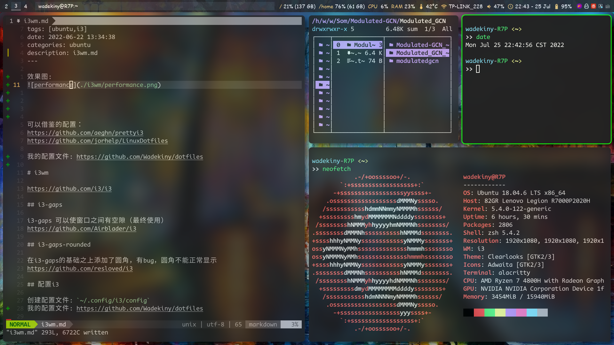

效果图:



可以借鉴的配置：
https://github.com/aeghn/prettyi3
https://github.com/jorhelp/LinuxDotfiles

我的配置文件: https://github.com/Wadekiny/dotfiles

# i3wm

https://github.com/i3/i3

## i3-gaps

i3-gaps 可以使窗口之间有空隙（最终使用）
https://github.com/Airblader/i3

## i3-gaps-rounded

在i3-gaps的基础之上添加了圆角，有bug，圆角不能正常显示
https://github.com/resloved/i3

## 配置i3

创建配置文件: `~/.config/i3/config`
我的配置文件: https://github.com/Wadekiny/dotfiles


# compton & picom

使用picom实现阴影，透明，高斯模糊，圆角效果

## 安装picom

- 原生picom，功能少，bug少
https://github.com/yshui/picom

- 增加了透明、高斯模糊、圆角
但是有一个问题，同时使用圆角，透明+高斯模糊，阴影时，圆角处不透明而是模糊效果
https://github.com/ibhagwan/picom 

- 修复了圆角处的问题（最终使用）
https://github.com/s0nny7/picom

- 带动画的picom，会报错，动画不流畅
https://github.com/jonaburg/picom
    - 还有一个jonaburg-fix版本

## 配置picom
`~/.config/picom/picom.conf`

我的配置文件: https://github.com/Wadekiny/dotfiles

# polybar

https://github.com/polybar/polybar

如果要显示不同模块的信息，需要装上对应的依赖

## 开机启动polybar

1. 在`~/.config/i3/config`中注释掉`i3status`部分
```config
#finds out, if available)
#bar {
#status_command i3status
#}
```

2. 创建脚本`~/.config/i3/polybar.sh`
```shell
killall -q polybar
while pgrep -x >/dev/null; do sleep 1; done
polybar
```

3. 在`~/.config/i3/config`中添加开机启动
```config
exec_always --no-startup-id ~/.config/i3/polybar.sh &
```

## 配置polybar

配置文件位置: `~/.config/polybar/config.ini`
我的配置文件: https://github.com/Wadekiny/dotfiles


# rofi 

## 安装rofi

https://github.com/davatorium/rofi

## 配置rofi

https://github.com/davatorium/rofi/blob/next/CONFIG.md

创建配置文件到`~/.config/rofi/config.rasi`
```cmd
rofi -upgrade-config
```
## 更换主题

https://github.com/davatorium/rofi-themes/tree/master/User%20Themes

下载想用的主题，主题文件放到`~/.config/rofi/`目录下

## rofi代替dmenu

在`~/.config/i3/config`中添加一行：

```config
bindsym $mod+d exec --no-startup-id rofi -theme slate.rasi -show combi -show-icons
```

## rofi配置文件


我的配置文件: https://github.com/Wadekiny/dotfiles

# i3lock

1. 默认的i3lock

2. i3lock-color
https://github.com/Raymo111/i3lock-color

3. betterlockscreen (最终使用)
https://github.com/betterlockscreen/betterlockscreen

- 我的配置文件: https://github.com/Wadekiny/dotfiles

# 壁纸

自动更换壁纸

1. 创建 python 文件

```python
import os
import glob
import time

bg_dir = '/home/wadekiny/Pictures/background/'
time_cycle = 1000
bg_list = glob.glob(bg_dir + '*.jpg') + glob.glob(bg_dir + '*.png')

while True:
    bg_list = glob.glob(bg_dir + '*.jpg') + glob.glob(bg_dir + '*.png')
    for pic_name in bg_list:
        print(pic_name)
        os.system('feh --bg-fill '+ pic_name)
        time.sleep(time_cycle)
```

2. 开机启动 

`~/.config/i3/config`中添加一行

```config
exec_always --no-startup-id python3 ~/.config/i3/wallpic.py
```


# 音量

## 设置默认声卡
在使用amixer设置音量时，报错: `amixer: Unable to find simple control 'Master' 0`

1. 通过`alsamixer`命令可以查看当前声卡，调节音频
2. 查看声卡相关信息：
```cmd
 wadekiny-R7P <~> [16:35:29]
 >> aplay -l
**** List of PLAYBACK Hardware Devices ****
card 0: NVidia [HDA NVidia], device 3: HDMI 0 [HDMI 0]
  Subdevices: 1/1
  Subdevice #0: subdevice #0
card 0: NVidia [HDA NVidia], device 7: HDMI 1 [HDMI 1]
  Subdevices: 1/1
  Subdevice #0: subdevice #0
card 0: NVidia [HDA NVidia], device 8: HDMI 2 [HDMI 2]
  Subdevices: 1/1
  Subdevice #0: subdevice #0
card 0: NVidia [HDA NVidia], device 9: HDMI 3 [HDMI 3]
  Subdevices: 1/1
  Subdevice #0: subdevice #0
card 0: NVidia [HDA NVidia], device 10: HDMI 4 [HDMI 4]
  Subdevices: 1/1
  Subdevice #0: subdevice #0
card 1: Generic [HD-Audio Generic], device 0: ALC257 Analog [ALC257 Analog]
  Subdevices: 1/1
  Subdevice #0: subdevice #0
```
所以，在aplay -l 里面选择声卡1,设备ID为0的声卡。

3. 把下列配置添加到系统级别的 `/etc/asound.conf` 或用户级别的 `~/.asoundrc` 文件。如果文件不存在，可以手动创建。其中的各个ID，请根据实际情况调整：

```config
defaults.pcm.card 1
defaults.pcm.device 0
defaults.ctl.card 1
```

`pcm`选项决定用来播放音频的设备，而`ctl`选项决定那个声卡能够由控制工具（如 alsamixer）使用。

## 配置快捷键

在`~/.config/i3/config`中添加：

```config
bindsym XF86AudioRaiseVolume exec amixer set  Master 1dB+
bindsym XF86AudioLowerVolume exec amixer set  Master 1dB-
bindsym XF86AudioMute exec amixer -D pulse set Master toggle 

```

# 亮度

在`~/.config/i3/config`中添加：

```config
bindsym XF86MonBrightnessUp exec "xbacklight -inc 10; notify-send 'brightness up'"
bindsym XF86MonBrightnessDown exec "xbacklight -dec 10; notify-send 'brightness down'"
```


# 触摸板

## 轻击触摸板实现点击功能

编写脚本文件`~/.config/i3/tap2click.sh`，在i3的配置文件中添加一行：

```config
exec_always --no-startup-id ~/.config/i3/tap2click.sh &
```

```shell
#!/bin/bash

# Get id of touchpad and the id of the field corresponding to
# tapping to click
id=`xinput list | grep "Touchpad" | cut -d'=' -f2 | cut -d'[' -f1`
tap_to_click_id=`xinput list-props $id | \
                      grep "Tapping Enabled (" \
                      | cut -d'(' -f2 | cut -d')' -f1`

# Set the property to true
xinput --set-prop $id $tap_to_click_id 1
```

## 实现反向滚动


编写脚本文件`~/.config/i3/inverse-scroll.sh`，在i3的配置文件中添加一行：

```config
exec_always --no-startup-id ~/.config/i3/inverse-scroll.sh &
```

```shell
#!/bin/bash

# Get id of touchpad and the id of the field corresponding to
# natural scrolling
id=`xinput list | grep "Touchpad" | cut -d'=' -f2 | cut -d'[' -f1`
natural_scrolling_id=`xinput list-props $id | \
                      grep "Natural Scrolling Enabled (" \
                      | cut -d'(' -f2 | cut -d')' -f1`

# Set the property to true
xinput --set-prop $id $natural_scrolling_id 1
```
# 解决边框+圆角冲突

- 使用i3的边框再用picom圆角，会导致四个角的边框被削掉。

用这个: https://github.com/Wadekiny/xborders
