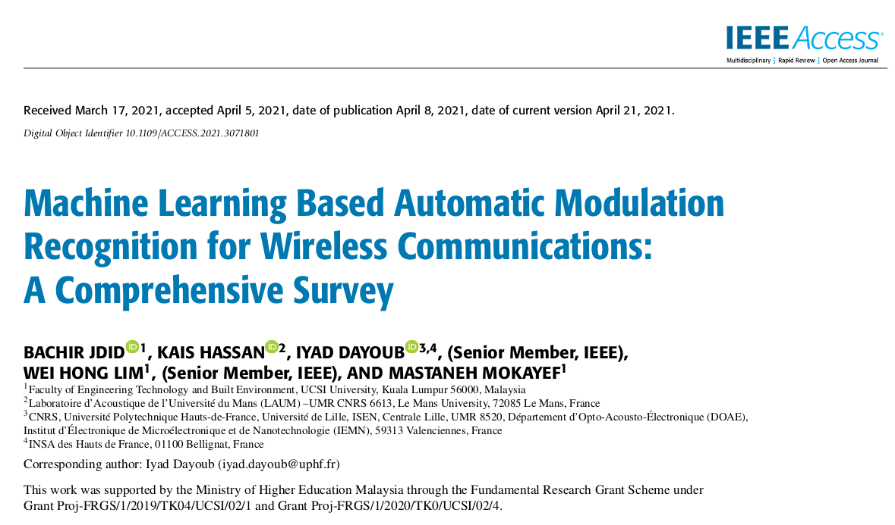
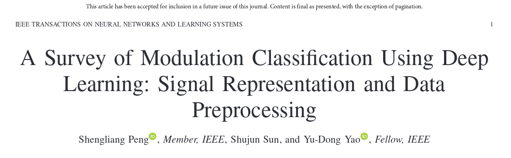

## 识别过程
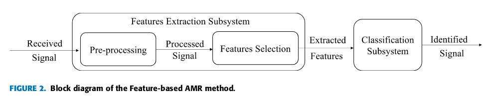

## 信号的表示方法
### I 特征表示
特征表示最初是为调制分类的FB(feature-based)算法开发的。它提取多个特征来表示接收到的信号(提取特征的数量通常小于接收信号的长度)。

优点：
- 通过特征表示对接收到的信号进行压缩，这允许利用具有更少神经元/层的简单DNN

缺点：
- 信号特征的计算会产生额外的计算复杂性
- 需要根据候选调制集选择适当的特征，这需要大量的专业知识和经验
- 在将原始信号转换为特征时，可能会丢失一些关键信息，从而影响调制分类的性能。

#### 累积量特征 Cumulants Features
#### 频谱特征 Spectral Features
#### 圆形特征 Circular Features

### II 图像表示
图像表示的思想是将接收到的信号转换为图像，通过图像识别完成调制分类任务。现有的DNN和DL图像识别框架可以直接用于具有图像表示的调制分类。

优点：
- 易于实现
- 受利于CV的发展
- 避免了手动提取特征

缺点：
- 成图像仍然需要一些计算
- 需要复杂的DNN来学习图像的特征。

#### 星座图 Constellation Diagram
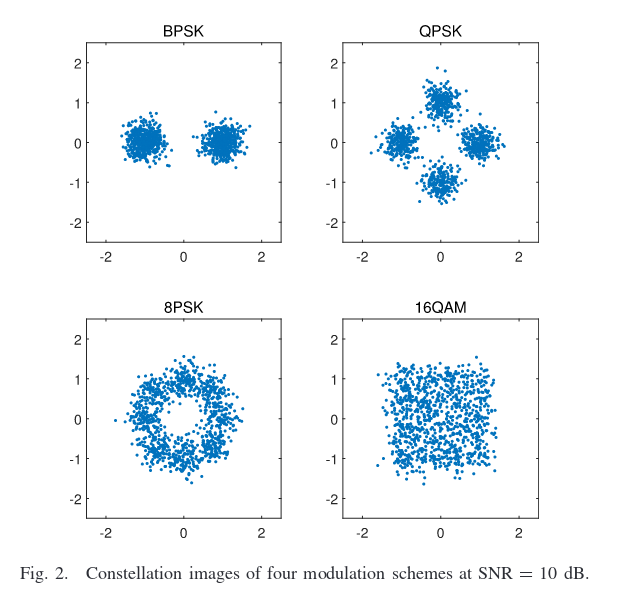
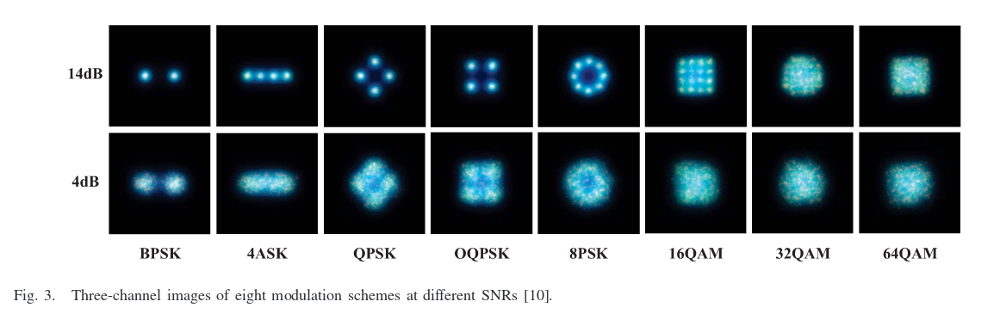
#### 眼图 Eye Diagram
捕获的波形进行叠加得到眼图
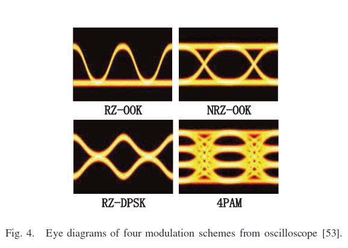
#### 特征点图 Feature Poing Image
由信号特征生成，比如 HOCs(高阶累积量), PAR（峰均比）等
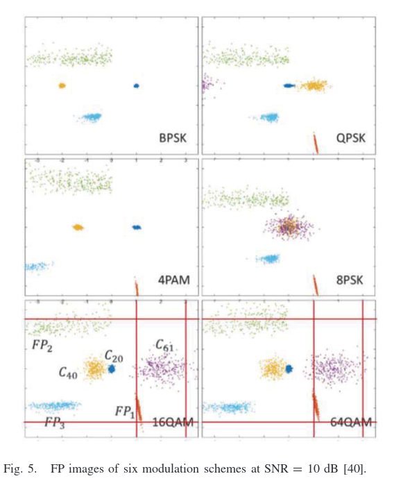
#### 模糊函数图 Ambiguity Function Image
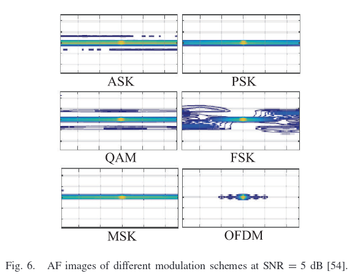
#### 频谱相关函数图 Spectral Correlation Function Image
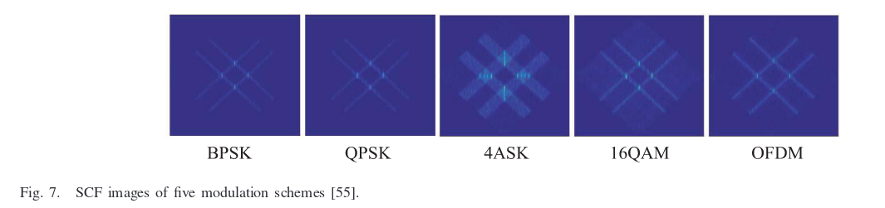
#### 循环相关熵频谱图 Cyclic Correntropy Spectrum Graph
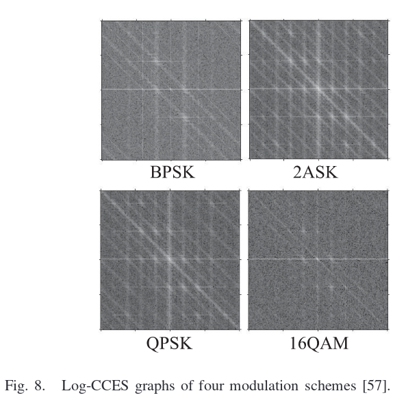
#### 双频谱图 Bispectrum Graph
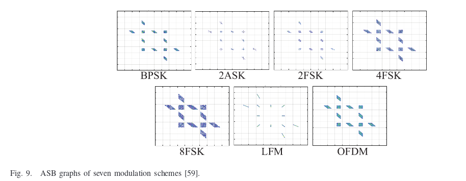

### III 序列表示

#### IQ信号序列 In-Phase and Quadrature Sequences
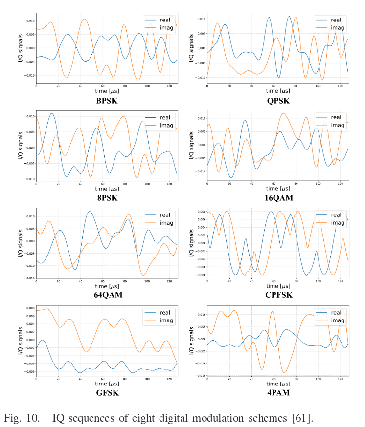
#### 振幅和相位序列 Amplitude and Phase Sequences
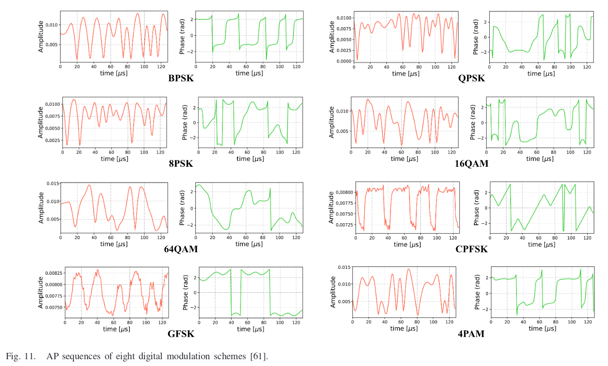
#### 快速傅里叶变换序列 Fast Fourier Transformation Sequences
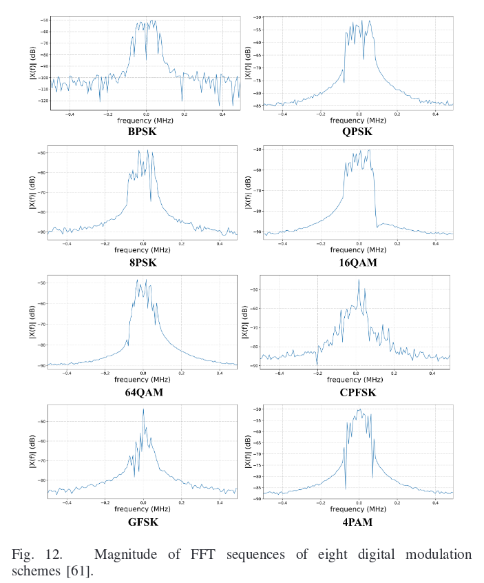
#### 振幅直方图序列 Amplitude Histogram Sequences
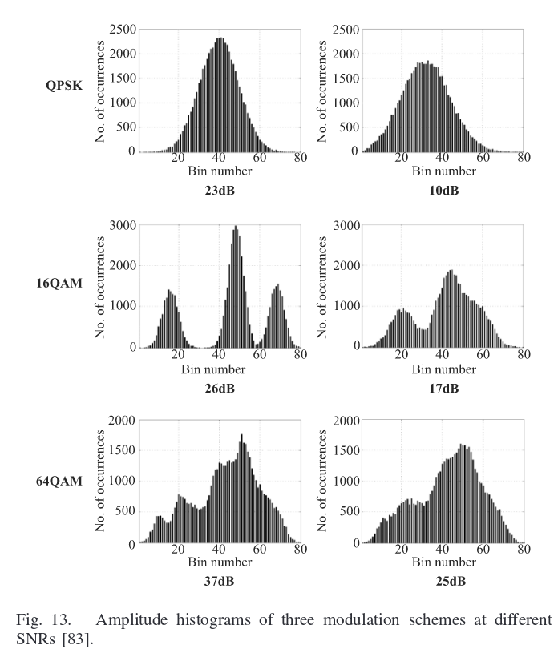

### IV 综合表示
以上表示方法做组合

## 基于机器学习的方法

## 基于深度学习的方法    

SISO系统和MIMO系统

### SISO
数据集，CNN，RNN，DNN，AE...
#### 数据集
##### RadioML 2016.10A DATASET
- 合成数据集：**RadioML 2016.10A** 
- GNU's Not Unix (GNU) Radio生成的
- 包括8中数字调制和3种模拟调制
- 20个不同信噪比的220k信号，20\*11\*1k
- 是**RadioML 2016.04C**的一个更干净，更规范的版本
- 更大的数据集：**RadioML 2016.10B**

##### RadioML 2018.01A DATASET
- 它包括在空中测量的24个数字和模拟调制方案，(在广泛的信噪比值范围内传播)。

- 包含了超过250万个信号with synthetic simulated channel effect。

##### HisarMod2019.1 DATASET
- 通过5种不同的无线信道生成（ideal, static, Rayleigh, Rician, and Nakagami–m）
- MATLAB2017生成
- 包含780K个IQ样本，信噪比范围和**RadioML 2016.10B**一样

#### 基于CNN的方法

##### 使用IQ样本进行分类
##### 使用现有数据集中的IQ样本进行分类
##### 使用图像进行分类
##### 使用其他作为输入

#### 基于RNN的方法
#### 基于DNN的方法
#### 基于自动编码器(AE)

### MIMO

## 挑战和研究方向

存在的局限：
1. 需要先验信息
2. 仅限于少数调制方案
3. 计算复杂性较高，不能用于实时应用
4. 需要较高的信噪比

重点：
- 关键特征提取
- 低信噪比分类

A. 提高分类器在较大**信噪比范围**内的鲁棒性
B. 在信号预处理阶段使用降噪算法
C. 对于不同长度输入的处理
D. 数据集以及数据增广的方法
E. 半监督和无监督
F. 对于未知调制类型的处理
G. 应用于实际硬件设备上，需要更高的精确度和更小的复杂度
H. MIMO系统
