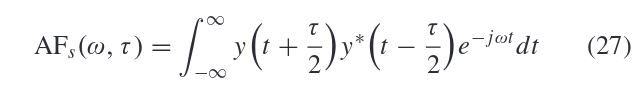
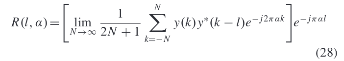
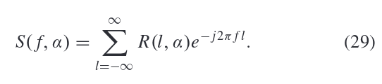

## 识别过程

## 信号的表示方法
### I 特征表示
特征表示最初是为调制分类的FB(feature-based)算法开发的。它提取多个特征来表示接收到的信号(提取特征的数量通常小于接收信号的长度)。

优点：
- 通过特征表示对接收到的信号进行压缩，这允许利用具有更少神经元/层的简单DNN

缺点：
- 信号特征的计算会产生额外的计算复杂性
- 需要根据候选调制集选择适当的特征，这需要大量的专业知识和经验
- 在将原始信号转换为特征时，可能会丢失一些关键信息，从而影响调制分类的性能。

#### 累积量特征 Cumulants Features
#### 频谱特征 Spectral Features
#### 圆形特征 Circular Features

### II 图像表示
图像表示的思想是将接收到的信号转换为图像，通过图像识别完成调制分类任务。现有的DNN和DL图像识别框架可以直接用于具有图像表示的调制分类。

优点：
- 易于实现
- 受利于CV的发展
- 避免了手动提取特征

缺点：
- 成图像仍然需要一些计算
- 需要复杂的DNN来学习图像的特征。

#### 星座图 Constellation Diagram

#### 眼图 Eye Diagram
捕获的波形进行叠加得到眼图，可以反映信号的整体信息。

#### 特征点图 Feature Poing Image
由信号特征生成，比如 HOCs(高阶累积量), PAR（峰均比）等，通过公式转换，画在复平面上。

#### 模糊函数图 Ambiguity Function Image

y是接收到的连续信号，*代表共轭，$\omega$代表频率偏移，$\tau$ 代表时间延迟，不同的调制方式有不同的模糊函数图

#### 频谱相关函数图 Spectral Correlation Function Image
调制信号的周期特征由循环自相关函数(CAF)和谱相关函数(SCF)描述，SCF通过傅里叶变换从CAF导出，SCF是关于数字频率f和循环频率$\alpha$的二元函数，通过(29)导出SCF矩阵，取SCF矩阵的绝对值作为图像，就是SCF图。

#### 循环相关熵频谱图 Cyclic Correntropy Spectrum Graph

#### 双频谱图 Bispectrum Graph

### III 序列表示
序列表示是一种直观的信号表示，因为信号是按顺序接收的。

优点：
- IQ序列、AP序列等序列可以很容易地导出，只需很少的计算。

缺点：
- 如果网络设计不当，训练过程可能很难收敛

#### IQ信号序列 In-Phase and Quadrature Sequences

- 使用IQ信号样本进行分类 
- IQ 表现了信号的幅值和相位变化。

| 方法(2) | 特点                                                                                                          |
|---------|---------------------------------------------------------------------------------------------------------------|
| [41]    | 在正交频分复用系统中消除相位偏移的影响 eliminating the bad effects of PO in uncooperative OFDM systems     |
| [6]     | 从长符号率信号中提取特征，但是要求较高的信噪比                                                                |
| [42]    | 多流结构，增加网络宽度，获取更有价值的特征                                                                    |
| [43]    | **学习盲信道识别和AMR，使用两个CNN来弥补在同一信道上分类的缺陷**，第一个用来识别是LOS还是NLOS，第二个用来分类 |
| [44]    | 对CNN、RNN、inception模块和卷积长短期DNN（CLDNN）进行了比较研究                                               |
| [45]    | 2CNNs & dropout 代替 pooling, 提高分类精度                                                                    |
| [46]    | CNN+LSTM                                                                                                      |
| [47]    | 消耗内存少，对信噪比的变化有更高的鲁棒性                                                                      |
| [48]    | 试用于不同的噪声体系，计算复杂度较低，模型比较小，减少了计算时间，可接受的性能损失下减少了所需的设备存储器    |
| [49]    | 解决CNN输入大小不一样的问题，并充分利用完整的信号**突发**。探索了三种容和方法：基于投票、基于置信度、基于特征 |
| [50]    | 图映射CNN转换接收到的信号为图形，CNN提取特征，GCN分类                                                         |

#### 振幅和相位序列 Amplitude and Phase Sequences

#### 快速傅里叶变换序列 Fast Fourier Transformation Sequences

#### 振幅直方图序列 Amplitude Histogram Sequences

### IV 综合表示

- 组合表示使用多个特征、图像或序列的组合来表示接收到的信号。它能够综合多种表示的优点，获得更好的分类性能。
- 多个表示应该尽可能不相关。
- 多个表示方法的缺陷可能会累积并发挥主导作用，反而会削弱分类性能。

## 数据集
### RadioML 2016.10A DATASET
- 合成数据集：**RadioML 2016.10A** 
- GNU's Not Unix (GNU) Radio生成的
- 包括8种数字调制和3种模拟调制
- 20个不同信噪比的220k信号，20\*11\*1k
- 是**RadioML 2016.04C**的一个更干净，更规范的版本
- 更大的数据集：**RadioML 2016.10B**

### RadioML 2018.01A DATASET
- 它包括在空中测量的24个数字和模拟调制方案，(在广泛的信噪比值范围内传播)。

- 包含了超过250万个信号

### HisarMod2019.1 DATASET
- 通过5种不同的无线信道生成（ideal, static, Rayleigh, Rician, and Nakagami–m）
- MATLAB2017生成
- 包含780K个IQ样本，信噪比范围和**RadioML 2016.10B**一样

## 基于机器学习的方法

## 基于深度学习的方法    

### 基于CNN的方法
### 基于RNN,LSTM的方法
### 基于DNN的方法
### 基于自动编码器(AE)

## 挑战和研究方向

存在的局限：
1. 需要先验信息
2. 仅限于少数调制方案
3. 计算复杂性较高，不能用于实时应用
4. 需要较高的**信噪比**

方向：
- 提高分类器在较大**信噪比范围**内的鲁棒性
- 在信号预处理阶段使用降噪算法
- 对于不同长度输入的处理
- 数据集以及数据增广的方法
- 半监督和无监督
- 对于未知调制类型的处理
- 应用于实际硬件设备上，需要更高的精确度和更小的复杂度
