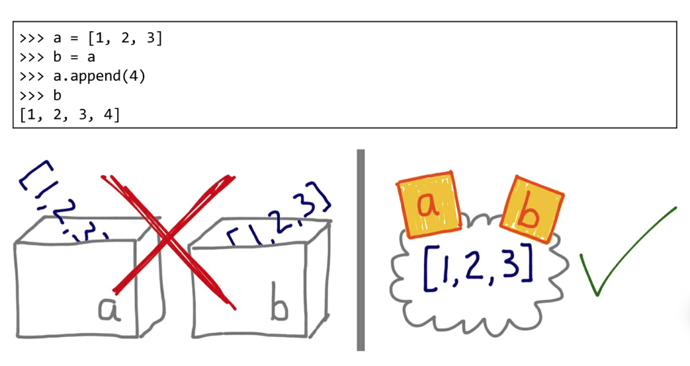
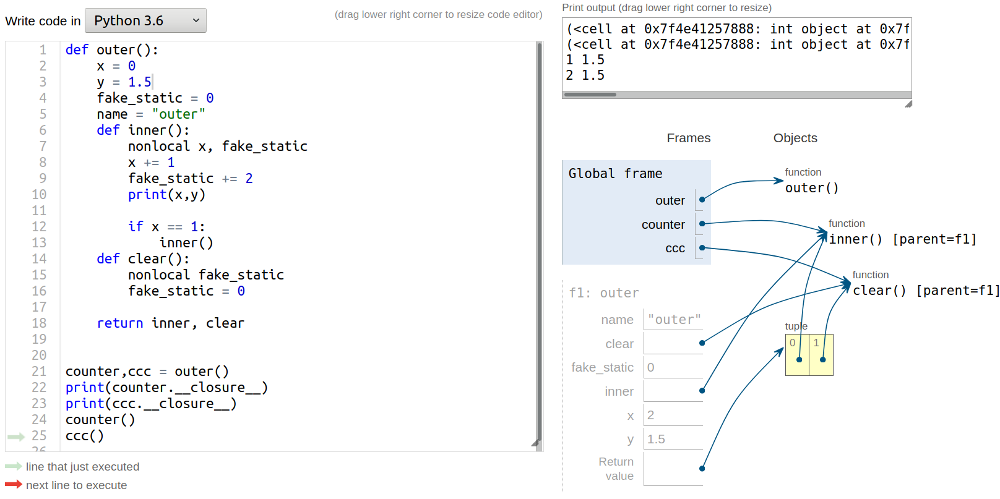

# 第一章 python数据模型

官方文档：https://docs.python.org/zh-cn/3.8/reference/datamodel.html
python 的一切数据类型都是类

## 变量

Python 变量是引用式变量，创建对象之后才会把变量分配给对象。


### 可变类型和不可变类型

- 可变：列表、字典、集合

- 不可变：数字、字符串、元组

### is 和 ==

== 运算符比较两个对象的值，is 比较对象的标识。

### 深复制和浅复制

| ↓与源容器相比↓ | copy.copy   | copy.deepcopy | =    |
| -------- | ----------- | ------------- | ---- |
| **id**   | 不同          | 不同            | 相同   |
| **内容**   | 复制源容器中元素的引用 | 创建完全独立的对象     | 完全相同 |

## 特殊方法

为保证行为的一致性，python 解释器碰到特殊的句法时，会使用**特殊方法(special method)**激活一些基本的对象操作，这些方法以双下划线开头结尾，例如：`__getitem__()`，解释器会把 `my_collection[key]` 改为调用 `my_collection.__getitem__()`

**special method** 的别名：**magic method**, **dunder method**

很多时候，特殊方法的调用是隐式的，是为了被 Python 解释器调用的，比如: `for i in x`, 其背后用的是 `iter(x)`, 再背后是`x.__iter__()`。前提是这个方法在 x 中被实现了。

通过内置函数 (len, iter, str, ...) 来使用特殊方法是最好的选择

官方文档给出了众多特殊方法，利用这些特殊方法，可以构建自己的数据（对象）模型，而能够使用python的内置方法、算术运算、位运算和比较操作等等

## 增量赋值

运算符 += 和 *= 的效果取决于第一个操作对象。

对于 += :
如果操作对象实现了 \_\_iadd\_\_ (用于就地加法), 就会调用他。如果没有实现，Python 会退一步调用 \_\_add\_\_ (先计算出结果，得到一个新的对象，然后再赋值)
(可变序列一般都实现了\_\_iadd\_\_)

---

# 第二章 序列 (sequences)

序列：有序，可索引

Python 标准库用 C 实现了丰富的序列类型：

|                                | 容器序列(Container sequences)<br>存放引用，类型可不同 | 扁平序列(Flat sequences)<br>存放数据，内存连续，类型相同 |
| ------------------------------ | --------------------------------------- | -------------------------------------- |
| **可变序列(Mutable sequences)**    | list, collections.deque                 | bytearry, memoryview, array.array      |
| **不可变序列(Immutable sequences)** | tuple                                   | str, bytes                             |

## 列表推导式和生成器表达式

List Comprehensions(listcomps) and Genderator Expressions(genexps)

listcomps 和 genexps 长得极其相似。
listcomps: 用方括号包住表达式，一次生成所有数据
genexps: 用圆括号包住表达式，背后遵守了迭代器协议，一次只生成一个数据

### 列表推导式

列表推导式的作用只有一个作用：生成列表

列表推导式的用法：

```python
string = "I can fly"
new_list = [i for i in string]
new_list1 = [i+"1" for i in string]
new_list2 = [ord(i) for i in string]
print(new_list)
print(new_list1)
print(new_list2)

color = ["black", "white"]
size = ["S", "M", "L"]

shirt = [(i, j) for i in color
                    for j in size]
print(shirt)
```

输出结果：

```text
['I', ' ', 'c', 'a', 'n', ' ', 'f', 'l', 'y']
['I1', ' 1', 'c1', 'a1', 'n1', ' 1', 'f1', 'l1', 'y1']
[73, 32, 99, 97, 110, 32, 102, 108, 121]
[('black', 'S'), ('black', 'M'), ('black', 'L'), ('white', 'S'),
'white', 'M'), ('white', 'L')]
```

### 生成器表达式

用于初始化其他序列类型，可以逐个产出元素。
如果用列表推导初始化元组这些其他的数据类型，会先建立一个完整的列表，再把列表传到某个构造函数里

用生成器表达式初始化元组：

```python
>>> string = "i can fly"
>>> (char for char in string)
<generator object <genexpr> at 0x7f7a5bac17d8>
>>> tuple(ord(char) for char in string)
(105, 32, 99, 97, 110, 32, 102, 108, 121)
```

如果 genexps 是一个函数调用过程中的唯一参数，就不需要再用括号把它围起来

用生成器表达式实现一个笛卡尔积：

```python
for tshirt in ("%s %s"%(c,s) for c in colors for s in sizes):
    print(tshirt)

print("-"*10)

for i in colors:
    for j in sizes:
        print(i, j)
```

输出结果

```text
black S
black M
black L
white S
white M
white L
----------
black S
black M
black L
white S
white M
white L
```

## 元组的相对不可变性

元组中不可变的是元素的标识(id), 而元组的值会随着引用的可变对象的变化而变化

```python
>>> tu = (1,2,[3,4])
>>> tu[0] = 2
Traceback (most recent call last):
  File "<stdin>", line 1, in <module>
TypeError: 'tuple' object does not support item assignment
>>> tu[-1].append(10)
>>> tu
(1, 2, [3, 4, 10])
```

## 元组拆包

元组拆包可以应用到任何可迭代对象上

### '\*' 运算符

1. **用于把可迭代对象拆开作为函数的参数**
   
   ```python
   def SumAndMinus(a,b):
    return a+b, a-b
   ```

para = (1,19)
print(SumAndMinus(*para))

# 输出：

# (20, -18)

```
2. **用于处理拆包剩余的元素**
```python
a,b,*rest = range(10)
print(a,b,rest)

a,b,*rest,c,d = range(10)
print(a,b,rest,c,d)

*rest,a,b = range(10)
print(rest,a,b)

print(type(rest))
```

输出：

```text
0 1 [2, 3, 4, 5, 6, 7, 8, 9]
0 1 [2, 3, 4, 5, 6, 7] 8 9
[0, 1, 2, 3, 4, 5, 6, 7] 8 9
<class 'list'>
```

### 嵌套元组拆包

```python
para = ("China", "HDU", 20, ("Dad", "Mom"))

nationality, university, age, (father, mother) = para

print(nationality, university, age, (father, mother))

# 输出
# China HDU 20 ('Dad', 'Mom')
```

## 具名元组(namedtuple)

collections.namedtuple 是一个工厂函数，可以用来构建一个 **带字段名的元组** 和一个 **有名字的类**

创建一个具名元组需要两个参数:

1. 类名
2. 类的各个字段的名字，可由 数个字符串组成的可迭代对象 或 空格分开的字符串

```python
    >>> Point = namedtuple('Point', ['x', 'y']) # ('Point', 'x y') is ok
    >>> Point.__doc__                   # docstring for the new class
    'Point(x, y)'
    >>> p = Point(11, y=22)             # instantiate with positional args or keywords
    >>> p[0] + p[1]                     # indexable like a plain tuple
    33
    >>> x, y = p                        # unpack like a regular tuple
    >>> x, y
    (11, 22)
    >>> p.x + p.y                       # fields also accessible by name
    33
    >>> d = p._asdict()                 # convert to a dictionary
    >>> d['x']
    11
    >>> Point(**d)                      # convert from a dictionary
    Point(x=11, y=22)
    >>> p._replace(x=100)               # _replace() is like str.replace() but targets named fields
    Point(x=100, y=22)
```

访问信息的方法：

1. var[i]
2. var['key']
3. var.key

具名元组的属性和方法：

1. \_fields 属性是一个包含这个类所有字段名称的元组
2. \_make() 接受一个可迭代对象生成类的实例
3. \_asdict() 返回信息

```python
>>> People = namedtuple('People','name age')
>>> People._fields
('name', 'age')
>>> Dinan = ('SYD',22)
>>> dinan = People._make(Dinan)
>>> dinan
People(name='SYD', age=22)
>>> dinan._asdict()
OrderedDict([('name', 'SYD'), ('age', 22)])
```

## 切片

a:b:c 这种用法只能作为索引或者下标用在 [] 中来返回一个切片对象 slice(a,b,c)
对 seq[start:stop:step] 进行求值时，python 会调用 seq.\_\_getitem\_\_(slice(start, stop, step))

切片也可以命名：

```python
>>> string = 'Can you tell me how much the shirt is? it is 9.15'

>>> asking = slice(0,37)
>>> string[asking]
'Can you tell me how much the shirt is'

>>> anwser = slice(39,len(string))
>>> string[anwser]
'it is 9.15'

>>> asking, anwser
(slice(0, 37, None), slice(39, 49, None))
```

切片也可赋值

## (((对序列使用\+ 和 \*

注意FP ** 第八章**, 可变对象背后的原理和陷阱

## 排序

暂不需要，对应FP 2.7 2.8 

## 一些其他的序列结构

- 数组
  如果需要一个只包含数字的列表，array.array 比 list 更高效

- 内存视图(memoryview)

- NumPy and SciPy

- 双向队列(deque)

---

# 第三章 字典和集合

在python官方术语对照表中：
字典是一个关联数组，其中的任意键都映射到相应的值。键可以是任何具有 \_\_hash\_\_() 和 \_\_eq\_\_() 方法的对象。

## 散列（哈希）

Hash算法可以将一个数据转换为一个标志，这个标志和源数据的每一个字节都有十分紧密的关系。Hash算法还具有一个特点，就是很难找到逆向规律。

Python 标准库里所有的映射类型都是用 dict 实现的，因此有个共同限制：只有可散列的数据类型才能用作这些映射里的键。

### (((何为可散列的数据类型？

## 创建字典

```python
>>> a = dict(one=1, two=2, three=3)
>>> b = {'one': 1, 'two': 2, 'three': 3}
>>> c = dict(zip(['one', 'two', 'three'], [1, 2, 3]))
>>> d = dict([('two', 2), ('one', 1), ('three', 3)])
>>> e = dict({'three': 3, 'one': 1, 'two': 2})
>>> a == b == c == d == e
True
```

### 字典推导式

```python
my_dict = {key:value for key,value in dict.items() if condition}
```

## 处理找不到的键

### get

可以通过 my_dict.get(key) 来获取键对应的值，如果找不到这个键，python 也不会抛出异常

### setdefault

修改键对应的值时，如果有这样的需求：

1. 每个键对应一个列表
2. 键不存在时，创建这个键，对应的值为一个空列表，然后在列表上增加一个元素
3. 键存在时，在对应的列表上增加一个元素

这时不能直接通过`my_dict[key] = value`的方法赋值（键存在则覆盖它的值，不存在则创建）

```python
# 效果一样的两种方法
# 方法1（推荐）
my_dict.setdefault(key, []).append(new_value)

# 方法2
if key not in my_dict:
    my_dict[key] = []
my_dict[key].append(new_value)
```

### \_\_missing\_\_

所有的映射类型在处理找不到的键的时候，都会牵扯到 \_\_missing\_\_ 方法，基类 dict 并没有定义这个方法。如果继承 dict 的类提供了 \_\_missing\_\_ 方法，那么在 \_\_getitem\_\_ 找不到键时，python会自动调用它，\_\_missing\_\_ 只会被 \_\_getitem\_\_ 调用 

另外：k in d 这个操作会调用 \_\_contains\_\_，如果在这个方法中使用 k in my_dict, 会导致 \_\_contains\_\_ 递归调用

### defaultdict

```python
import collections
index = collections.defaultdict(list)
index[word].append(value)
```

作用：把 list 构造方法作为 default_factory 来创建一个 defaultdict. 如果 index 没有 word 键，会调用 default_factory, 返回值（空列表）赋给 index[word]

如果创建 defaultdict 时没有指定 default_factory，找不到键时会出发 KeyError

## 字典的变种

- collections.defaultdict
- collections.OrderdDict
- collections.ChainMap
- collections.Counter
- collections.UserDict

### 继承 UserDict

创造自定义映射类型时，以 UserDict 为基类有一些好处。UserDict 并不是 dict 的子类，但 UserDict 中有一个叫做 data 的属性（最终存储数据的地方），是 dict 的实例。

分别用两种父类，把非字符串的键转换为字符串：

```python
import collections

class StrKeyDict0(dict):
    def __missing__(self, key):
        if isinstance(key, str)
            raise KeyError(key)
        return self[str(key)]

    def get(self, key default=None):
        try:
            return self[key]
        except KeyError:
            return default

    def __contains__(self, key):
        return key in self.keys() or str(key) in self.keys()


class StrKeyDcit(collections.UserDict):
    def __missing__(self, key):
        if isinstance(key, str):
            raise KeyError(key)
        return self[str(key)]

    def __contains__(self, key):
        return str(key) in self.data

    def __setitem__(self, key, item):
        self.data[str(key)] = item
```

## 抽象基类提供的方法

- MutableMapping.update
- Mapping.get

## 不可变映射类型

标准库里所有的映射类型都是可变的，python3.3 开始，type 模块中引入了一个封装类名 MappingProxyType
如果给这个类一个映射，会返回一个只读的映射视图。它是动态的，原映射做出改变时，视图也会跟着改变；但不能通过视图改变原映射。

```python
>>> from types import MappingProxyType
>>> my_dict = {'1':'A'}
>>> my_dict
{'1': 'A'}

>>> my_proxy = MappingProxyType(my_dict)
>>> my_proxy
mappingproxy({'1': 'A'})

>>> my_proxy['1'] = 10
Traceback (most recent call last):
  File "<stdin>", line 1, in <module>
TypeError: 'mappingproxy' object does not support item assignment

>>> my_proxy['1']
'A'

>>> my_dict['1'] = 10
>>> my_proxy
mappingproxy({'1': 10})
```

## 集合

暂不需要，对应FP 3.8

---

# 第四章 函数

python中，函数也可看做一个对象，函数对象本身就是 function 类的实例。

## 可调用对象

除了用户定义的函数，调用运算符（即()）还可应用到其他对象上，可以使用内置的 `callable()` 函数判断。python 数据模型文档列出了 7 种可调用的对象

1. 用户定义的函数：使用 def 或 lambda 表达式创建
2. 内置函数：使用 C 语言实现的函数，如 `len`, `time.strftime`
3. 内置方法：使用 C 语言实现的方法，如 `dict.get`
4. 方法：在类的定义体中定义的函数
5. 类：调用类时， 先运行`__new__`方法创建一个实例，然后用`__init__`方法初始化实例。
6. 类的实例：如果类定义了`__call__`方法
7. 生成器函数：使用 yield 关键字的函数或方法。

## 共享传参

Python中，函数内部的形参是实参的别名。可变类型作为参数时，可能会被函数内部改动

```python
>>> def f(a,b):
...     a += b
...     return a
...
>>> x = 1
>>> y = 2
>>> f(x,y)
3
>>> x,y
(1, 2)

>>> a = [1,2]
>>> b = [3]
>>> f(a,b)
[1, 2, 3]
>>> a,b
([1, 2, 3], [3])

>>> a = (1,2)
>>> b = (3,)
>>> f(a,b)
(1, 2, 3)
>>> a,b
((1, 2), (3,))
```

## 作用域

python中，只有在函数内的变量才是局部变量，其他都是全局变量。要访问外层的变量，可以使用 global 和 nonlocal 关键字，应放在函数最开头。

|        | 无关键字   | global | nonlocal         | 找不到变量   |
| ------ | ------ | ------ | ---------------- | ------- |
| **读取** | 由内向外寻找 | 寻找全局变量 | 由内向外寻找，到最后一层函数为止 | 报错      |
| **修改** | 内部寻找   | 寻找全局变量 | 由内向外寻找，到最后一层函数为止 | 在修改位置创建 |

### global

函数内部想要修改全局变量，需要使用 global 关键字，如果使用在一级函数内使用 nonlocal, CPython会报错

1. 要在函数中使用全局变量，如果只是读取而不做修改，可以不使用 global 关键字
   
   ```python
   g_name = "global"
   def Greet():
    print(g_name)
   Greet()
   # 输出：
   # global
   ```

2. 如果要修改全局变量，需要添加 global 关键字，否则会创建局部变量。
   修改全局变量的正确用法：
   
   ```python
   g_name = "global"
   def Greet():
    global g_name
    g_name = "from global"
    print(g_name)
   Greet()
   ```

# 输出：

# from global

```
3. 如果想先读取全局变量（不使用 global 关键字），再创建局部变量，例如：
```python
g_name = "global"
def Greet():
    #global g_name
    print(g_name)
    g_name = "in funciton"

# CPython报错：
# UnboundLocalError: local variable 'g_name' referenced before assignment
```

### nonlocal

函数嵌套定义时，内部函数想要修改外部函数的变量，需要使用 nonlocal关键字，其大致与 global 使用方法相同。
在内部函数中，如果没用 nonlocal, 用的是 global, 则会从全局变量中寻找

测试代码：

```python
def Greet():
    hi = "hi"
    hello = "hello"
    keep = True
    def One():
        nonlocal hi
        hi = 1
        hello = 1
        print("in One:  ",hi,hello,keep)

    One()
    print("in Greet:", hi,hello,keep)
    return One

Greet()
```

输出：

```text
in One:   1 1 True
in Greet: 1 hello True
```

### 嵌套函数

嵌套函数的内部函数有其生命周期，在其外部函数的内才可以调用

例如：

```python
def A():
    print("A")
    def B():
        print("B")
        def C():
            print("C")
    B()
    C()  # NameError: name 'C' is not defined
A()
```

### 闭包 (closure)

> Fluent Python: a closure is function with an extended scope that encompasses non-global variables referenced in the body of the function but not defined there

闭包是指延伸了作用域的函数，其中包含：在函数定义体中的引用、但是不在定义体中定义的非全局变量

闭包是在**作用域外部**能够访问**作用域内部**的函数

online python tutor:


可以看到虽然 outer() 函数已经运行结束，outer 内部的变量 x,y,fake_static,inner 在 inner() 内引用了，这些局部变量没有被销毁，而被保留了下来(可视化图中的 f1:outer)，在调用 inner() 时能够间接地访问这些值

```python
# 查看函数可用的变量
def outer():
    x = 0
    y = 1.5
    fake_static = 0
    name = "outer"
    def inner():
        nonlocal x, fake_static
        tt = "mytt"
        x += 1
        fake_static += 2
        print("inner():","x y", x, y, tt)
        if x == 1:
            inner()

    return inner


counter = outer()

print(counter.__code__.co_freevars)

for i in counter.__closure__:
    print(i.cell_contents)
```

输出：

```text
('fake_static', 'inner', 'x', 'y')
0
<function outer.<locals>.inner at 0x7f1384fc16a8>
0
1.5
```

**闭包的作用**

1. 在上例中，以 fake_static 为例。使用 inner() 可以修改 fake_static 的值，而fake_static 又不是全局变量，相对比较安全，不会被其他函数修改。类似 C语言中函数内的 static 变量，全局存在，但仅能在函数内修改。

2. 实现一个简单的“类”，外层函数的变量视作属性，内层函数视作方法。
   
   ```python
   def OddClass(number):
    _attribute = number
   
    def SetAttribute(num):
        nonlocal _attribute
        _attribute = num
   
    def GetAttribute():
        return _attribute
   
    return SetAttribute, GetAttribute
   ```

set_odd, get_odd = OddClass(100)

print(get_odd())
set_odd(10.5)
print(get_odd())

```
输出：
```text
100
10.5
```

3. 用于装饰器

## \*args, \*\*kargs

\*args 可以把多个无名参数打包成一个tuple
\*\*kargs 可以把多个关键字参数打包成一个dict
使用时可不全写，但要确保顺序正确： `function(arg_a,arg_b,..., *args, **kargs)`

举例：

```python
def function(a, b, c, *args, **kargs):
    print("=====type=====")
    print(type(a),type(b),type(c))
    print(type(args))
    print(type(kargs))
    print("=====type=====\n")

    print("args:", args)
    print("\nkargs:", kargs)


    print("-"*10)

    print("len(args) =", len(args))
    for i in range(len(args)):
        print(args[i])

    print("-"*10)
    print("len(kargs) =", len(kargs))
    for i in kargs:
        print(i)

    print("-"*10)
    print("kargs.get(\"day\") =", kargs.get("day"))
    print("kargs.get(\"time\") =", kargs.get("time"))


function(1,2,3, 10,27,"how to say", qifei=1,zhuiji=False,time="2021.5.31")
```

运行结果：

```text
=====type=====
<class 'int'> <class 'int'> <class 'int'>
<class 'tuple'>
<class 'dict'>
=====type=====

args: (10, 27, 'how to say')

kargs: {'qifei': 1, 'zhuiji': False, 'time': '2021.5.31'}
----------
len(args) = 3
10
27
how to say
----------
len(kargs) = 3
qifei
zhuiji
time
----------
kargs.get("day") = None
kargs.get("time") = 2021.5.31
```

## 注解

```python
def clip(text:str, max_len:'int > 0'=80) -> str:
    print("a function")
```

Python 对注解做的唯一事情是把他们存储在函数的`__annotations__`属性里
只有`inspect.signature()`函数知道怎么提取注解

---

# 第五章 装饰器

装饰器是可调用的对象，在被装饰函数定义之后立即运行（语法糖）

## 装饰器不传参（两层）

### 装饰器定义

```python
import time 

#装饰器不传参，只用写两层
def TimerDecorator(Func):

    def ImprovedFunction(*args, **kargs): #增强后的函数
        start_time = time.clock()
        print("<wrapper_head is here>, start_time is %f" %start_time)

        ret = Func(*args, **kargs) #原始函数

        end_time = time.clock()
        print("<wrapper_tail is here>, end_time is %f" %end_time)
        print("<cost in time>: ", end_time - start_time)
        return ret

    return ImprovedFunction
```

### 不使用语法糖的用法

```python
#原始函数
def EvenCounter(
        min_num: int = 0,
        max_num: int = 10**6,
        ):

    count = 0
    for i in range(min_num, max_num):
        if i%2 == 0:
            count += 1
    print(" this is OriginalFunction, count is %d" %count)
    return count

#不用语法糖，调用TimerDecorator来增强原始的EvenCounter
Function = TimerDecorator(EvenCounter)

# 调用函数

num = Function(max_num = 10)
print("\nCalled ImprovedFunction")
print("return num is ", num)
```

### 使用语法糖

```python
# 原始函数
# 添加@xxx
@TimerDecorator
def EvenCounter(
        min_num: int = 0,
        max_num: int = 10**6,
        ):

    count = 0
    for i in range(min_num, max_num):
        if i%2 == 0:
            count += 1
    print(" this is OriginalFunction, count is %d" %count)
    return count

# 直接用原始函数的名字就行 
num = EvenCounter(max_num = 10)
print("\nCalled ImprovedFunction")
print("return num is ", num)
```

### 效果

两种使用方法效果一样, 终端输出如下:

```text
<wrapper_head is here>, start_time is 0.022420
 this is OriginalFunction, count is 5
<wrapper_tail is here>, end_time is 0.022449
<cost in time>:  2.9000000000001247e-05

Called ImprovedFunction
return num is  5
```

## 装饰器传参（三层）

### 装饰器定义

```python
# 不用语法糖，可以只写两层
# 用语法糖，写三层
def LogDecorator(
        text: str = "LOG",
        num: int = 1,
        ):

    for i in range(0, num):
        print(text)

    def Decorator(Func):

        def ImprovedFunction(*args, **kargs): #增强后的函数
            print("in ImprovedFunction", text)
            start_time = time.clock()
            print("<wrapper_head is here>, start_time is %f" %start_time)

            ret = Func(*args, **kargs) #原始函数

            end_time = time.clock()
            print("<wrapper_tail is here>, end_time is %f" %end_time)
            print("<cost in time>: ", end_time - start_time)
            return ret

        return ImprovedFunction
    return Decorator
```

### 不使用语法糖的用法

```python
def OddCounter(
        min_num: int = 0,
        max_num: int = 10**5,
        ):
    count = 0
    for i in range(min_num, max_num):
        if i%2 != 0:
            count += 1
    print(" this is OriginalFunction, count is %d" %count)
    return count

#不用语法糖
Function = (LogDecorator("2021.5.30", 2))(OddCounter)
Function()
```

### 使用语法糖

```python
@LogDecorator(text="2021.5.30",num=2)
def OddCounter(
        min_num: int = 0,
        max_num: int = 10**5,
        ):
    count = 0
    for i in range(min_num, max_num):
        if i%2 != 0:
            count += 1
    print(" this is OriginalFunction, count is %d" %count)
    return count

# 同理，直接使用原函数名
OddCounter()
```

### 效果

两种使用方法效果一样, 终端输出如下:

```text
2021.5.30
2021.5.30
in ImprovedFunction 2021.5.30
<wrapper_head is here>, start_time is 0.023687
 this is OriginalFunction, count is 50000
<wrapper_tail is here>, end_time is 0.028648
<cost in time>:  0.004961
```

## 内置装饰器

### functools

#### wraps

@functools.wraps：增强后函数遮盖了被装饰函数的 \_\_name\_\_ 和 \_\_doc\_\_, 这个装饰器把相关属性从被装饰函数复制到增强后函数

```python
def Deco(func):
    # @functools.wraps(func)  去掉注释后，输出为 'MyPrint'
    def ImporvedFunction():
        print("Improving...")
        func()
    return ImporvedFunction

@Deco
def MyPrint():
    print("MyPrint is running")

print(MyPrint.__name__)

# 输出
# ImporvedFunction
```

#### lru_cache

@functools.lru_cache(maxsize=128, typed=False)：把耗时的函数结果保存起来，避免传入相同的参数时重复计算
maxsize: 指定存出多少个调用的结果，为了得到最佳性能，maxsize 应设为 2 的幂
typed: 如果为 True, 把不同参数类型得到的结果分开保存，比如 1(int) 和 1.0(float) 分开保存

```python
import time
# 使用递归================================================================
def Fibonacci(n):
    if n < 2:
        return n
    return Fibonacci(n-1) + Fibonacci(n-2)


start_time = time.clock()
print(Fibonacci(30))
end_time = time.clock()
print("[recursion time]", end_time - start_time)

# 使用循环 + 数组=========================================================
from array import array
def LoopFibonacci(n):
    if n < 2:
        return n
    fibo = array('i')
    fibo.append(0)
    fibo.append(1)
    index = 2
    while index <= n:
        fibo.append(fibo[index-1] + fibo[index-2])
        index += 1
    return fibo[-1]

start_time = time.clock()
print(LoopFibonacci(30))
end_time = time.clock()
print("[loop time]", end_time - start_time)

# 使用装饰器 + 递归=======================================================
@functools.lru_cache()
def DecoFibonacci(n):
    if n < 2:
        return n
    return DecoFibonacci(n-1) + DecoFibonacci(n-2)


start_time = time.clock()
print(DecoFibonacci(30))
end_time = time.clock()
print("[lru_cache + recursion time]", end_time - start_time)
```

输出：

```text
832040
[recursion time] 0.173533
832040
[loop time] 1.7000000000017e-05
832040
[lru_cache + recursion time] 1.4999999999987246e-05
```

#### singledispatch

@functools.singledispatch：把整体方案拆分成多个模块，使用 @singledispatch 装饰的普通函数会变成泛函数 (generic function)：根据第一个参数的类型，以不同方式执行相同操作的一组函数。

```python
from functools import singledispatch

@singledispatch
def MyPrint(obj):
    print("MyPrint")

@MyPrint.register(str)
def _(text):        # 其名称无关紧要
    print("In register-str",text)

@MyPrint.register(tuple)
def _(seq):
    print("In register-tuple",seq)

@MyPrint.register(int)
def _(num):
    print("In register-int",num)

MyPrint(1)
MyPrint((1,2))
MyPrint("dinanwang")
MyPrint([1,2])
MyPrint(1.4)
```

输出结果：

```text
In register-int 1
In register-tuple (1, 2)
In register-str dinanwang
MyPrint
MyPrint
```

### 用于装饰方法的函数

@property @classmethod @staticmethod

先定义一个 Circle 类

```python
class Circle:
    def __init__(
            self, 
            r: float=1.0,
            color: str="black"
            ):
        self._r = r        
        self._color = color
```

#### property

@property 一些特点：

1. 用在类上，能把一个类的方法变成类的属性
2. 用了@property，就不能再当函数调用，只能当做属性
3. 第一个参数是仍然是self
4. 如果无返回值，就是none
5. 实际上偷偷运行了函数，所以能自动更新某些内容

有两种方法使用这个特性, 在Circle类内，分别对 r 和 color 使用：

```python
    ## 1. 分别用三次装饰器
    # 方法和属性不能重名
    @property
    def r(self):
        return self._r

    @r.setter
    def r(self, value):
        self._r = value

    @r.deleter
    def r(self):
        del self._r

    ## 2. 合体
    def GetColor(self):
        return self._color

    def SetColor(self, color):
        self._color = color

    def DelColor(self):
        del self._color 

    color = property(GetColor, SetColor, DelColor)
```

使用：

```python
print("ins.r =", ins.r)
print("ins.S =", ins.S)
print("Let ins.r = 1.5")
ins.r = 1.5
print("ins.r =", ins.r)
print("ins.S =", ins.S)
```

运行结果：

```text
ins.r = 10
ins.S = 314.1592653589793
Let ins.r = 1.5
ins.r = 1.5
ins.S = 7.0685834705770345
```

#### staticmethod 和 classmethod

|                          | instance method | @classmethod | @staticmethod |
| ------------------------ | --------------- | ------------ | ------------- |
| **instance_name.method** | yes             | yes          | yes           |
| **class_name.method**    | no              | yes          | yes           |
| **first parameter**      | self(instance)  | self(class)  | any(no self)  |

在Circle类内定义这几种方法

```python
    # 实例方法（instance method）
    # 只能通过实例调用
    def CalC(self):
        c = 2 * math.pi * self._r
        print("c is ", c, "\n")
        return c

    # 静态方法（static method）
    # 和用普通函数没什么两样，只是调用时要用类名或实例名
    @staticmethod
    def SPrint(text):
        print("staticmethod: %s\n" %text)

    # 类方法（class method）
    # 需要传入类名，可判断是父类还是子类调用的
    @classmethod
    def CPrint(cls, text):
        print(cls, "classmethod: %s\n" %text)
```

调用：

```python
ins = Circle(10,"white")

# instance method
ins.CalC()
# class method
Circle.CPrint("circle call cprint")
ins.CPrint("ins call cprint")
# static method
Circle.SPrint("circle call sprint")
ins.SPrint("ins call sprint")
```

运行结果：

```text
c is  62.83185307179586

<class '__main__.Circle'> classmethod: circle call cprint

<class '__main__.Circle'> classmethod: ins call cprint

staticmethod: circle call sprint

staticmethod: ins call sprint
```

---

# 备忘

module package import

super
tensor or Tensor

python静态变量

子类扩展父类方法（不仅仅是重写）
内置函数，内置属性
特殊函数
特殊属性
isintance, issubclass, type

plt使用
zip
enumerate
for i, (ax, img) in enumerate(zip(axes, imgs)):
反向传播 链式求导过程
__slot__ 动态扩展
python3 -m ipdb xxx.py

# pyi，模块，多文件变成

# 类

```python
# 使用collections模块
import collections
card = collections.namedtuple("card", ["rank", "suit"])
# 可以这样创建一个只有少数属性而无方法的类
```

## 继承

python支持多继承，

## 多态

## 特殊方法（方法前后有双下划线）

雷属性，实例属性
