## Exploring Self-supervised Learning for Radio Signal Recognition

> 2021 IEEE 23rd Int Conf on High Performance Computing & Communications; 7th Int Conf on Data Science & Systems; 19th Int Conf on Smart City; 7th Int Conf on Dependability in Sensor, Cloud & Big Data Systems & Application

- 很少有方法使用大量未标记数据进行无线信号识别

- 提出了一个自监督学习框架Self-RadioNet，包括两个步骤：
    - 预训练(用于提取特征，无标签)
    - 微调(用于无线电信号识别，有标签)。

- 提出了数据增强的方法

### 数据增强

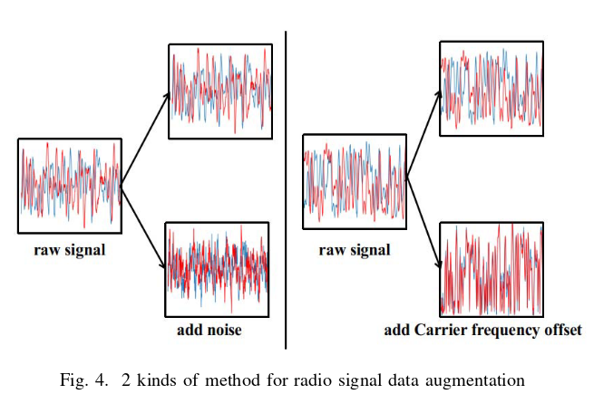 
- 加入高斯噪声

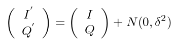

- 加入载波频率偏移

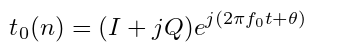

### 网络结构

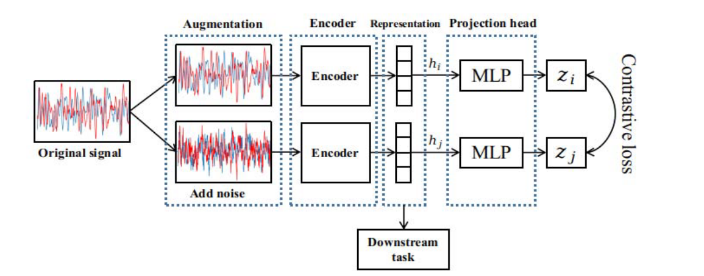

#### Encoder
7个残差层+全局池化层构成一个编码器
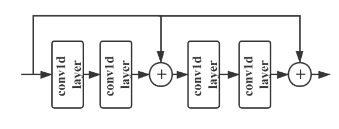

#### 投影头 Projection head
非线性投影头被首次用于 SimCLR, MoCo v2，可以提高表示质量。 使用MLP head，包含了三个全连接层。
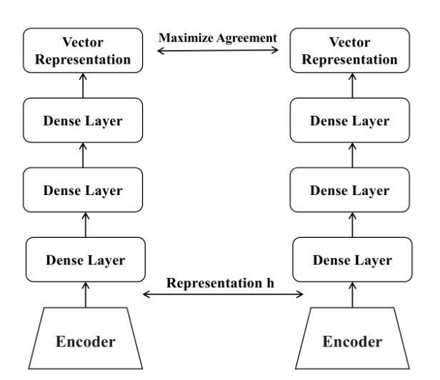

#### 对比损失

- NT-Xent: Normalized Temperature-scaled Cross Entropy Loss
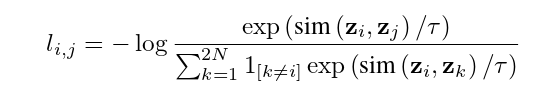
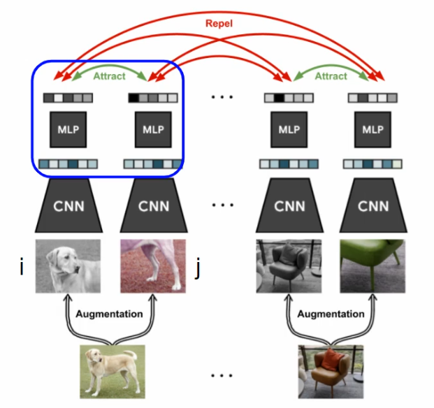

### 实验结果
#### 数据集
- Rayl-0.5

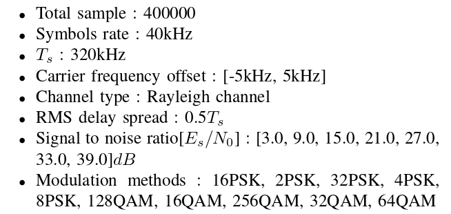

#### 结果对比
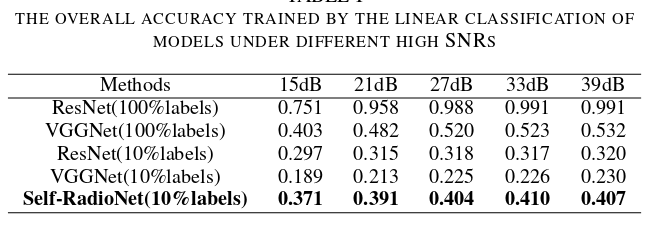

## Real-World ADS-B signal recognition based on Radio Frequency Fingerprinting
> 2020 IEEE 28th International Conference on Network Protocols (ICNP)

- 提出了基于轮廓恒星图和CNN的射频指纹(RFF)识别方案。生成的图像类似于“指纹”图形，因此可以使用图像识别CNN进行识别。

- 提出了一种ADS-B原始信号检测采集和实时标记方法。

- 在不同网络和不同信噪比下具有更好的识别效果

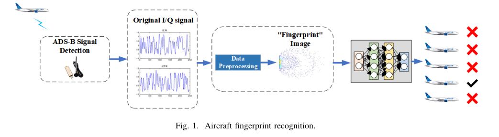

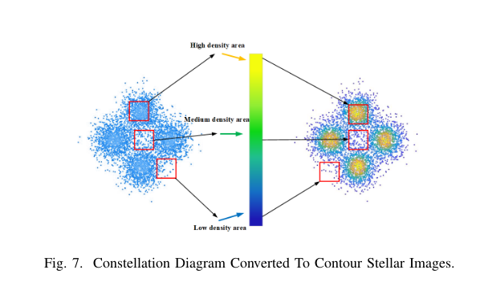

## Iterative Pyramidal Filtering Method for Improved Signal Recognition in Radio Spectrograms

> IEEE WIRELESS COMMUNICATIONS LETTERS, VOL. 11, NO. 6, JUNE 2022

- 大多数基于无线电频谱图处理的现有技术需要相对较高的信噪比，在低/中等信噪比下表现不佳。
- 本文提出了一种基于新型金字塔卷积核的迭代无线电频谱图滤波方法。
- 该方法提高了无线电频谱图中信号成分的可识别性。
