# 神经网络方法

## word
### O'shea 
- 输入：时域 I/Q 采样
- 模型：端到端CNN
- 利用 GnuRadio仿真生成了11 种不同调制方式的信号作为训练和测试数据
- 效果：与传统算法的最佳性能相当

### 分层识别
- CNN1：区分模拟调制和数字调制
- CNN2：识别具体的调制类型
- CNN3：识别调制的阶数

### 添加时序特征
CNN+LSTM

### 传统方法+CNN
- 原始信息+传统循环平稳特征参数作为CNN输入
- 原始信息+FFT
- 计算复杂度较高

### RadioImageDet
[频谱瀑布图] → CNN特征提取 → 目标检测层 → [波形类型、时/频坐标等]
- 目标检测层以 YOLOv2 为基础

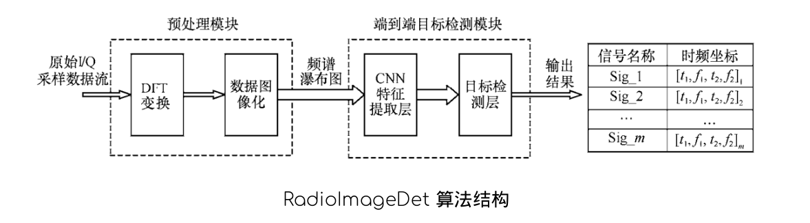

### 多尺度深度卷积神经网络

- 输入：WVDM
- 新的激活函数：SELU

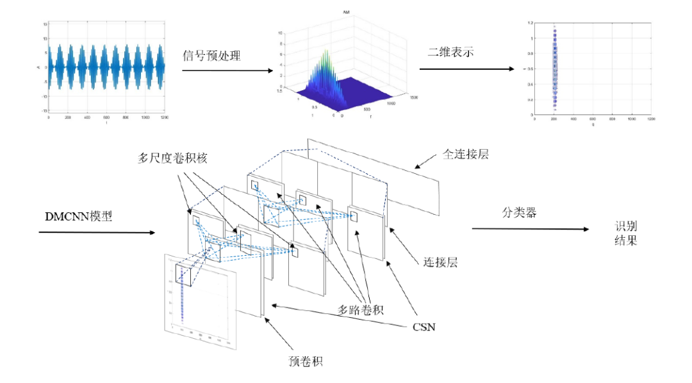

---

# A Survey of Modulation Classification Using Deep Learning: Signal Representatiuon and Data Preprocessing

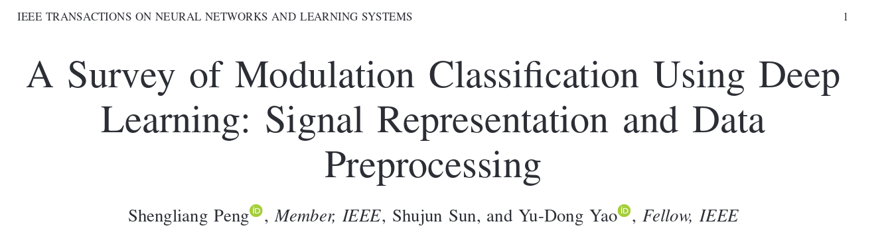
摘要-- 调制分类是通信系统监测、管理和控制的关键任务之一，用于解决技术问题，包括频谱感知、自适应传输和干扰规避。最近，基于深度学习（DL）的调制分类因其在特征提取和分类精度方面的优势而引起了极大的关注。在基于DL的调制分类中，一个主要的挑战是对接收到的信号进行预处理，并在将信号送入深度神经网络之前以适当的格式表示。本文对最先进的基于DL的调制分类算法进行了全面的调查，特别是这些算法中使用的信号表示和数据预处理技术。由于接收到的信号可以由特征、图像、序列或它们的组合来表示，现有的基于DL的调制分类算法可以分为四组，本文将对其进行相应的回顾。此外，还总结和讨论了每种信号表示方法的优点和缺点。

---

# Machine Learning Based Automatic Modulation Recognition for Wireless Communications: A Comprehensive Survey
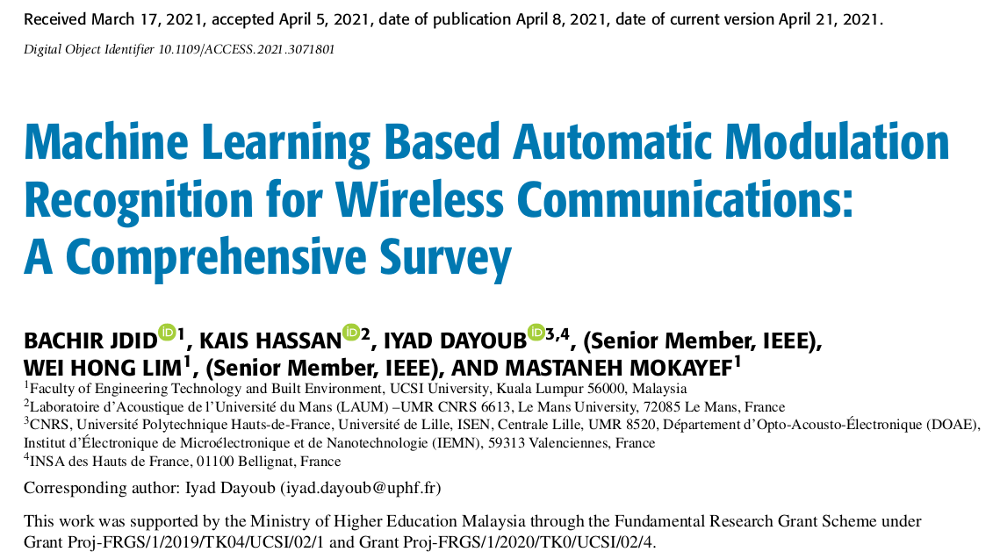

## 识别过程
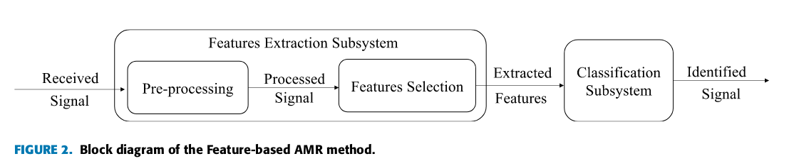

## 基于机器学习的方法

## 基于深度学习的方法    

SISO系统和MIMO系统

### SISO
数据集，CNN，RNN，DNN，AE...
#### 数据集
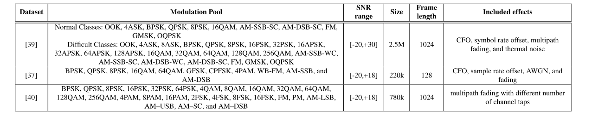
##### RadioML 2016.10A DATASET
- 合成数据集：**RadioML 2016.10A** 
- GNU's Not Unix (GNU) Radio生成的
- 包括8中数字调制和3种模拟调制
- 20个不同信噪比的220k信号，20\*11\*1k
- 是**RadioML 2016.04C**的一个更干净，更规范的版本
- 更大的数据集：**RadioML 2016.10B**

##### RadioML 2018.01A DATASET
- 它包括在空中测量的24个数字和模拟调制方案，(在广泛的信噪比值范围内传播)。

- 包含了超过250万个信号with synthetic simulated channel effect。

##### HisarMod2019.1 DATASET
- 通过5种不同的无线信道生成（ideal, static, Rayleigh, Rician, and Nakagami–m）
- MATLAB2017生成
- 包含780K个IQ样本，信噪比范围和**RadioML 2016.10B**一样

#### 基于CNN的方法

##### 使用IQ样本进行分类
##### 使用现有数据集中的IQ样本进行分类
##### 使用图像进行分类
##### 使用其他作为输入

#### 基于RNN的方法
#### 基于DNN的方法
#### 基于自动编码器(AE)

### MIMO

## 挑战和研究方向

存在的局限：
1. 需要先验信息
2. 仅限于少数调制方案
3. 计算复杂性较高，不能用于实时应用
4. 需要较高的信噪比

重点：
- 关键特征提取
- 低信噪比分类

A. 提高分类器在较大**信噪比范围**内的鲁棒性
B. 在信号预处理阶段使用降噪算法
C. 对于不同长度输入的处理
D. 数据集以及数据增广的方法
E. 半监督和无监督
F. 对于未知调制类型的处理
G. 应用于实际硬件设备上，需要更高的精确度和更小的复杂度
H. MIMO系统

### CLASSIFICATION USING IQ SAMPLES
- IQ 表现了信号的幅值和相位变化。

| 方法 | 特点                                                                                                          |
|------|---------------------------------------------------------------------------------------------------------------|
| [41] | 在正交频分复用系统中消除相位偏移的影响 eliminating the bad effects of PO in uncooperative OFDM systems     |
| [6]  | 从长符号率信号中提取特征，但是要求较高的信噪比                                                                |
| [42] | 多流结构，增加网络宽度，获取更有价值的特征                                                                    |
| [43] | **学习盲信道识别和AMR，使用两个CNN来弥补在同一信道上分类的缺陷**，第一个用来识别是LOS还是NLOS，第二个用来分类 |
| [44] | 对CNN、RNN、inception模块和卷积长短期DNN（CLDNN）进行了比较研究                                               |
| [45] | 2CNNs & dropout 代替 pooling, 提高分类精度                                                                    |
| [46] | CNN+LSTM                                                                                                      |
| [47] | 消耗内存少，对信噪比的变化有更高的鲁棒性                                                                      |
| [48] | 试用于不同的噪声体系，计算复杂度较低，模型比较小，减少了计算时间，可接受的性能损失下减少了所需的设备存储器    |
| [49] | 解决CNN输入大小不一样的问题，并充分利用完整的信号**突发**。探索了三种容和方法：基于投票、基于置信度、基于特征 |
| [50] | 图映射CNN转换接收到的信号为图形，CNN提取特征，GCN分类                                                         |

### CLASSIFICATION USING IQ SAMPLES FROM EXISTING DATASETS
### CLASSIFICATION USING IMAGE REPRESENTATIONS

| 方法       | 特点                      |
|------------|---------------------------|
| [68,64,69] | 信号图谱→(STFT?)→图像→CNN |
| []         |                           |
| []         |                           |
| []         |                           |
| []         |                           |
| []         |                           |
| []         |                           |
| []         |                           |
| []         |                           |
| []         |                           |
| []         |                           |

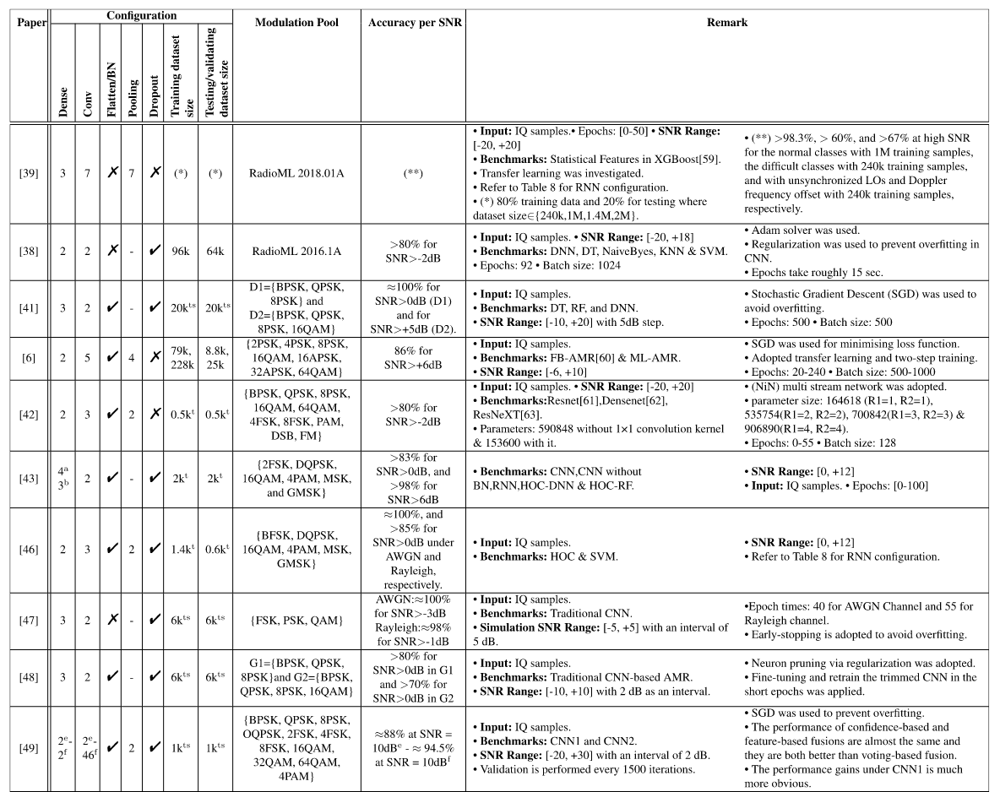
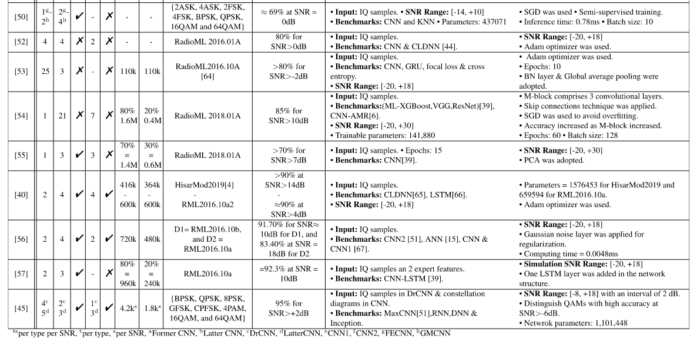
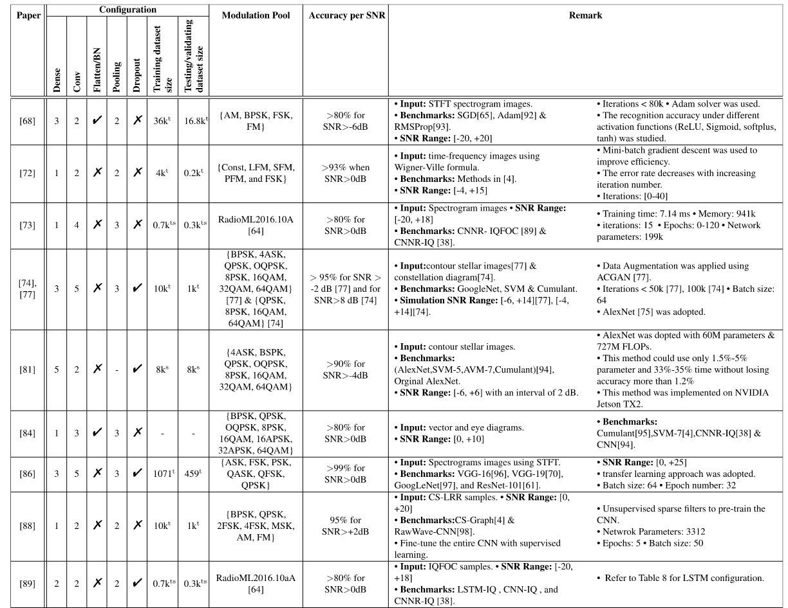
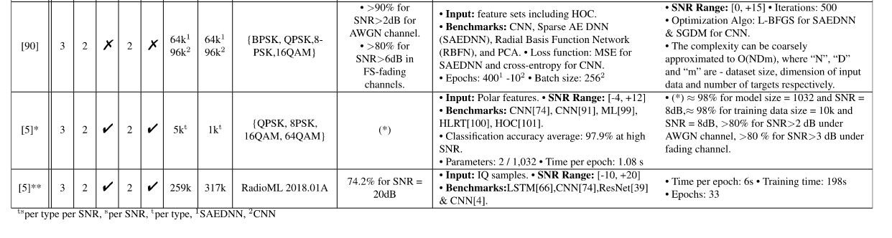
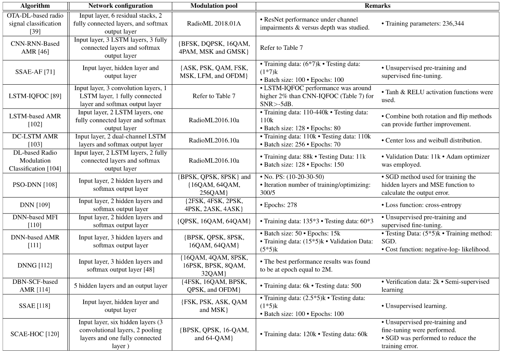

