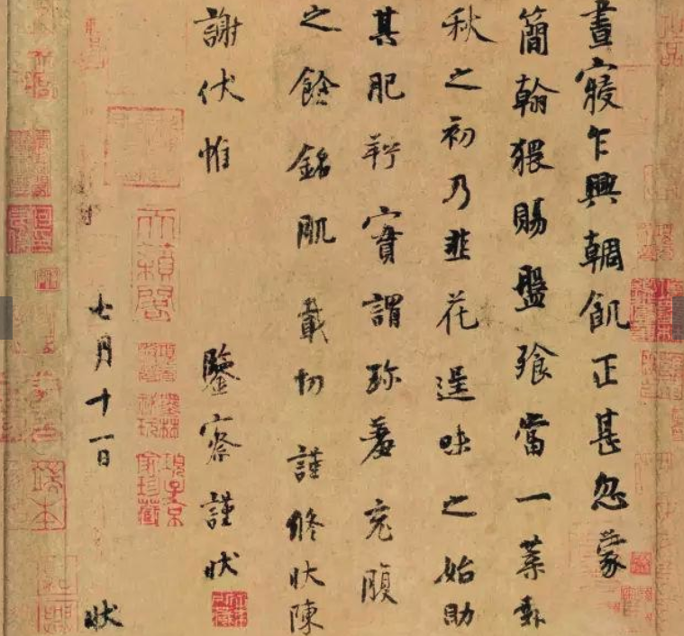

# 什么是章法

1. 诗文布局谋篇的法则
2. 办事的程序和规则
3. 古历法名词

- 在书法中，章法指一件作品中各种视觉因素的组织。

## 章法的重要性

- 王羲之《笔势论十二章》： 方圆大小各不相犯，倘一点失所，若美人之病一目。一画失节，如壮士之折一肱。
- 孙过庭《书谱》： 一点成一字之规，一字乃终篇之准。

## 章法的核心规律

- 文似看山不喜平，书法同样适用
- 单字，逐字，行间的布白关系
- 结体在单字，章法是单字以外的整体问题
- 有变化，变化中有统一
- 文质相称
- 自然而然
- 平中见奇，远山近树
- 变而有度
- 为我所用
 
# 章法与单字

# 名帖

- 杨凝式韭花帖（空灵）

